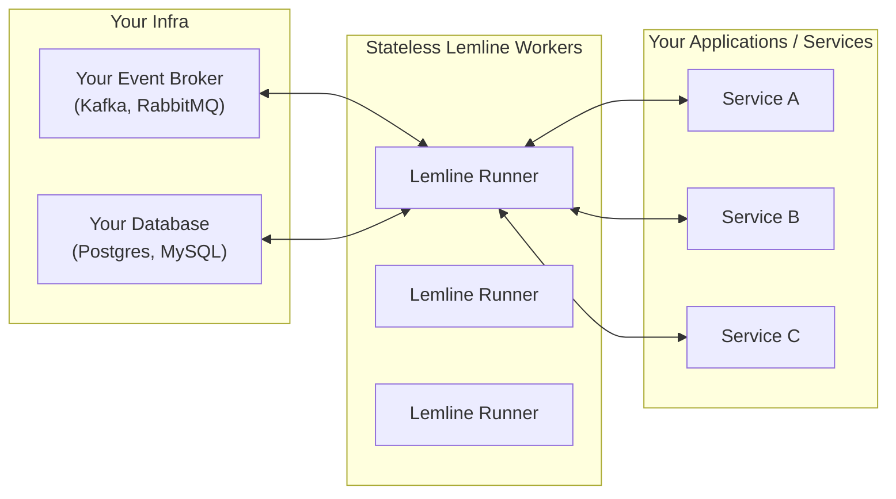

# Lemline

<div align="center">
  
</div>


[](LICENSE.md)

Lemline is a modern runtime for the [Serverless Workflow DSL](https://github.com/serverlessworkflow/specification)
version 1.0,
enabling the execution of complex workflows defined in YAML or JSON **on top of your existing infrastructure**. It
leverages
modern best practices for performance, reliability, and extensibility.

## 🎯 Objectives

Lemline is designed to be an extremely fast and efficient workflow orchestrator.
It uses an event-driven approach, primarily communicating via messages
rather than constantly reading from and writing to a database.
This allows Lemline to orchestrate business processes that would typically be implemented through choreography
(peer-to-peer communication between services) without needing a database for every interaction.

To achieve this, Lemline compresses the workflow's current state and includes it within the event messages.
The database is only used when strictly necessary, such as when dealing with time delays, retrying failed tasks,
or waiting for multiple tasks to complete in parallel.

## ✨ Features

* **Serverless Workflow DSL Execution:** Faithfully implements
  the [Serverless Workflow specification](https://serverlessworkflow.io) for defining and running workflows.
* **Event-Driven Orchestration** State transitions are carried within broker messages, minimizing database load and
  improving throughput.
* **Micrometer Integration** Built-in metrics and health checks, exposed through a dedicated endpoint for observability.
* **Resilient Error Management** Automatic retries, failure tracking, and clear separation between infrastructure and
  business logic errors.
* **Stateless Workers** Horizontal scaling is as simple as starting more Lemline workers. No sticky sessions, no shared
  state.
* **Quarkus Native Binary** Deploy Lemline as a lean, self-contained binary built with GraalVM/Mandrel. Startup in
  milliseconds, reduced memory footprint, perfect for containerized and serverless environments.

## 🏗 Architecture

Lemline runs **on top of your existing infrastructure**.  
All you need to deploy are stateless Lemline Runners that connect to **your event broker** and **your database**.

- **Event Broker** (Kafka, RabbitMQ, …) transports workflow state through messages.
- **Database** (PostgreSQL, MySQL, …) is used only when strictly necessary: timers, retries, and checkpoints.
- **Stateless Lemline Runners** orchestrate workflows, make calls to your services, and scale horizontally with no
  coordination overhead.


```mermaid
flowchart LR
%% Force left/middle/right alignment
    subgraph Infra["Your Infra"]
        direction TB
        Broker["Your Event Broker<br/>(Kafka, RabbitMQ)"]
        DB["Your Database<br/>(Postgres, MySQL)"]
    end

    subgraph Lemline["Stateless Lemline Workers"]
        direction TB
        L1[Lemline Runner]
        L2[Lemline Runner]
        L3[Lemline Runner]
    end

    subgraph Apps["Your Applications / Services"]
        direction TB
        A1[Service A]
        A2[Service B]
        A3[Service C]
    end

%% Connections
    Broker <--> L1
    DB <--> L1
    L1 <--> A1
    L1 <--> A2
    L1 <--> A3
```

Other databases and brokers (e.g. Pulsar, SQS, Pub/Sub, Service Bus) are on the roadmap.

## 📦 Modules

* **`lemline-core`:** Contains the core implementation of the Serverless Workflow DSL types and logic.
* **`lemline-runner`:** Quarkus-based runtime. Handles message I/O, workflow state management, and integration with
  databases/brokers.
* **`lemline-docs`:** (WIP) Documentation for the project.

## 🚀 Getting Started

### Prerequisites

* Java 17+ (for development mode)
* A supported database (PostgreSQL/MySQL)
* A supported broker (Kafka/RabbitMQ)

### Building

```bash
./gradlew :lemline-runner:build
```

### Running the Runner (Development Mode)

Set up a `.lemline.yaml` file with your database and event broker configuration. Then run:

```bash
java  -jar lemline-runner/build/quarkus-app/quarkus-run.jar listen --info
```

The runner connects to your broker and DB, then begins orchestrating workflows.

You can find more information about database and message broker configuration in
the [lemline-runner README](lemline-runner/README.md).

### CLI Commands

The `lemline-runner` provides several command-line interface (CLI) commands to manage and interact with the Lemline
runtime.

* **`listen`**: Starts the Lemline runner, which listens for triggers (e.g., messages) and orchestrates task execution
  according to defined workflows.
    * Usage: `./lemline-runner listen [OPTIONS]`
    * Options:
        * `-p`, `--port <port>`: Specifies the metrics port to use. Overrides the `lemline.metrics.port` configuration.
* **`config`**: Displays the current configuration of the Lemline runner.
    * Usage: `./lemline-runner config [OPTIONS]`
    * Options:
        * `-f`, `--format <format>`: Specifies the output format (e.g., `yaml`, `properties`). Default is `yaml`.
        * `-a`, `--all`: Shows all properties, including Quarkus-specific properties, not just `lemline.*`.
* **`definition`**: Manages workflow definitions.
* **`instance`**: Manages workflow instances.
* **`migrate`**: Handles database migrations.

### Running Tests

```bash
./gradlew test
```

### Native Image

To produce a native image of the runner, you need to have GraalVM installed in your environment.
We recommend using 24.1.2.r23-mandrel.

The binary will be created in `lemline-runner/build/lemline-runner-$version-runner`.

#### Linux native image

On a mac, use the following command to build a Linux native image:

```bash
./gradlew :lemline-runner:assemble -Dquarkus.native.enabled=true -Dquarkus.package.jar.enabled=false -Dquarkus.native.container-build=true 
```

You can skip the container option if you are already on Linux.

#### MacOS native image

On a mac, use the following command to build a macOS native image:

```bash
./gradlew clean :lemline-runner:assemble -Dquarkus.native.enabled=true -Dquarkus.package.jar.enabled=false 
```

#### Windows native image

On Windows, use the following command to build a macOS native image:

```bash
gradlew.bat -p lemline-runner quarkusBuild -Dquarkus.native.enabled=true -Dquarkus.package.jar.enabled=false
```

## 📊 Observability

* Micrometer Metrics: Exposes Prometheus-compatible metrics for workflows, retries, and failures.
* Health Checks: Ready/live endpoints integrated into the Quarkus runtime.

## 📚 Documentation

* **Serverless Workflow DSL Specification:**
  See the [Offficial Specification](https://github.com/serverlessworkflow/specification)
* **Runner Configuration:** See [lemline-runner/README.md](./lemline-runner/README.md)
  for detailed configuration options.

## 🤝 Contributing

Contributions are welcome! Please follow the guidelines in our [CONTRIBUTING.md](CONTRIBUTING.md) file.

## 📜 License

This project is licensed under the [Business Source License 1.1](LICENSE.md).

## 📝 Roadmap

### Databases

- [x] PostgreSQL
- [x] MySQL

### Message Brokers

- [x] Kafka
- [x] RabbitMQ
- [ ] Amazon SQS
- [ ] Google Pub/Sub
- [ ] Azure Service Bus

### Tasks

- [x] Switch
- [x] Set
- [x] Do
- [x] Raise
- [x] For
- [x] Listen
- [x] Emit
- [x] Fork

- Try:
    - [x] Retry
    - [x] Catch
- [x] Raise
- [x] Wait
- Run:
    - [ ] Container
    - [x] Script
    - [x] Shell
    - [x] Workflow
- Call:
    - [x] HTTP
    - [ ] OpenAPI
    - [ ] gRPC
    - [ ] AsyncAPI
- With authentication:
    - [x] Basic
    - [x] Bearer
    - [ ] Certificate
    - [x] Digest
    - [x] OAUTH2
    - [x] OpenIdConnect

### Control & Data Flow

- [x] Status

- [x] Error Management

- Directives:
    - [x] continue
    - [x] exit
    - [x] end
    - [x] goto (named task)

- Schema Validation:
    - [x] Input
    - [x] Output

- Expressions:
    - [x] Input
    - [x] Output
    - [x] Export
    - [x] Scope: runtime, workflow, task...

- Timeouts:
    - [ ] Workflow
    - [ ] Task

- [x] Schedule

### Lifecycle events

- [x] Workflow
- [x] Tasks

### Others

- [x] Namespace
- [ ] Catalog
- [ ] Extensions

## 📬 Contact

Have a feature request, question, or an idea for improvement? We’d love to hear from you.

For custom requests, consulting, or paid contributions, feel free to reach out directly:
👉 Contact [Gilles Barbier](https://gillesbarbier.dev)
