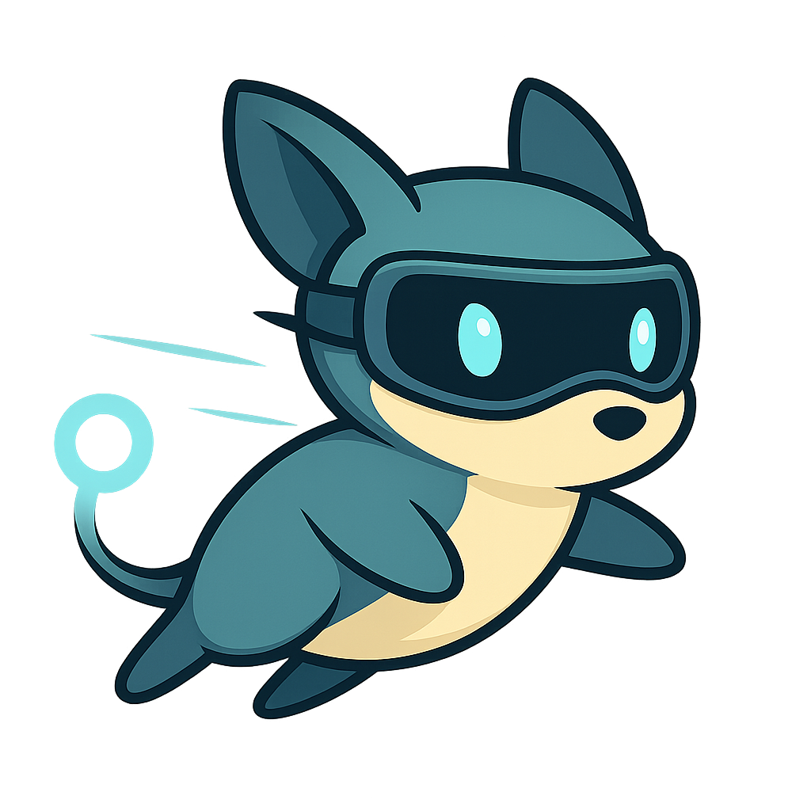

# Lemline

<div align="center">
  
</div>


[](LICENSE.md)

> **⚠️ Active Development**
> Lemline is currently under active development and should be considered alpha software.
> It is **not yet recommended for production use**. APIs and functionality may change without notice.

Lemline is a modern runtime for the [Serverless Workflow DSL](https://github.com/serverlessworkflow/specification)
version 1.0,
enabling the execution of complex workflows defined in YAML or JSON **on top of your existing infrastructure**. It
leverages
modern best practices for performance, reliability, and extensibility.

## 🎯 Objectives

Lemline is designed to be an extremely fast and efficient workflow orchestrator.
It uses an event-driven approach, primarily communicating via messages
rather than constantly reading from and writing to a database.
This allows Lemline to orchestrate business processes that would typically be implemented through choreography
(peer-to-peer communication between services) without needing a database for every interaction.

To achieve this, Lemline compresses the workflow's current state and includes it within the event messages.
The database is only used when necessary, such as when dealing with time delays, retrying failed tasks,
or managing fan-in scenarios (waiting for multiple parallel tasks to complete).

## ✨ Features

* **Serverless Workflow DSL Execution:** Faithfully implements
  the [Serverless Workflow specification](https://serverlessworkflow.io) for defining and running workflows.
* **Modern Tech Stack:** Utilizes Quarkus and SmallRye Reactive Messaging for a robust and efficient
  runtime.
* **Asynchronous Processing:** Leverages reactive principles for high-throughput, non-blocking
  task execution.
* **Database Integration:** Supports persistent workflow data .
    * *Lemline is currently tested with PostgreSQL and MySQL.*
* **Event-Driven:** Built on Quarkus's reactive messaging capabilities (SmallRye Reactive Messaging) for seamless
  integration with event streams.
    * *While SmallRye Reactive Messaging supports various brokers (Kafka, AMQP, MQTT, etc.), Lemline is currently
      tested with Kafka and RabbitMQ.*

## 📦 Modules

* **`lemline-core`:** Contains the core implementation of the Serverless Workflow DSL types and logic.
* **`lemline-runner`:** Provides the Quarkus-based runtime environment. It uses reactive messaging to read and publish
  events, manages workflow state, and interacts with databases.
* **`lemline-docs`:** (Planned/Included) Documentation for the project and potentially the DSL nuances specific to
  Lemline.

## 🚀 Getting Started

### Prerequisites

* Java Development Kit (JDK) 17+
* A running instance of a supported database (e.g., PostgreSQL, MySQL)
* A running instance of a supported message broker (e.g. Kafka, RabbitMQ)

### Building

```bash
./gradlew build
```

### Running the Runner (Development Mode)

Ensure your database and message broker (if needed) are configured in
`lemline-runner/src/main/resources/application.properties`.

```bash
./gradlew :lemline-runner:quarkusDev
```

The runner will start, connect to the database/broker, and begin processing workflows.

You can find more information about database and message broker configuration in
the [lemline-runner README](lemline-runner/README.md).

### Running Tests

```bash
./gradlew test
```

## 📚 Documentation

* **Serverless Workflow DSL Specification:**
  See the [Offficial Specification](https://github.com/serverlessworkflow/specification)
* **Runner Configuration:** See [lemline-runner/README.md](./lemline-runner/README.md)
  for detailed configuration options.

## 🤝 Contributing

Contributions are welcome! Please follow the guidelines in our [CONTRIBUTING.md](CONTRIBUTING.md) file.

## 📜 License

This project is licensed under the [Business Source License 1.1](LICENSE.md).

## 💻 Native Image

To produce a native image of the runner, you need to have GraalVM installed in your environment.
We recommend using 24.1.2.r23-mandrel.

To build a linux native image (on Docker), run the following command:

```bash
./gradlew :lemline-runner:build -Dquarkus.native.enabled=true -Dquarkus.package.jar.enabled=false -Dquarkus.native.container-build=true 
```

On a macOS system, you can use the following command to build a macOS native image:

```bash
./gradlew :lemline-runner:build -Dquarkus.native.enabled=true -Dquarkus.package.jar.enabled=false
```

The binary will be created in `lemline-runner/build/lemline-runner-$version-runner`

## 👨‍Development

Currently implemented features are:

### Databases

- [x] PostgreSQL
- [x] MySQL
- [ ] MariaDB
- [ ] Oracle
- [ ] SQL Server

### Message Brokers

- [x] Kafka
- [x] RabbitMQ
- [ ] Pulsar
- [ ] MQTT
- [ ] Amazon SQS
- [ ] Google Pub/Sub
- [ ] Azure Service Bus

### Tasks

- [x] Switch
- [x] Set
- [x] Do
- [x] Raise
- [ ] Listen
- [ ] Emit
- [ ] Fork
- [x] For
- Try:
    - [x] Retry
    - [x] Catch
- [x] Raise
- [x] Wait
- Run:
    - [ ] Container
    - [x] Script
    - [x] Shell
    - [ ] Workflow
- Call:
    - [x] HTTP
    - [ ] OpenAPI
    - [ ] gRPC
    - [ ] AsyncAPI
- With authentication:
    - [x] Basic
    - [x] Bearer
    - [ ] Certificate
    - [x] Digest
    - [x] OAUTH2
    - [x] OpenIdConnect

### Control & Data Flow

- [x] Status

- [x] Error Management

- Directives:
    - [x] continue
    - [x] exit
    - [x] end
    - [x] goto (named task)

- Schema Validation:
    - [x] Input
    - [x] Output

- Expressions:
    - [x] Input
    - [x] Output
    - [x] Export
    - [x] Scope: runtime, workflow, task...

- Timeouts:
    - [ ] Workflow
    - [ ] Task

- [ ] Schedule

### Lifecycle events

- [ ] Workflow
- [ ] Tasks

### Others

- [ ] Catalog
- [ ] Extensions


