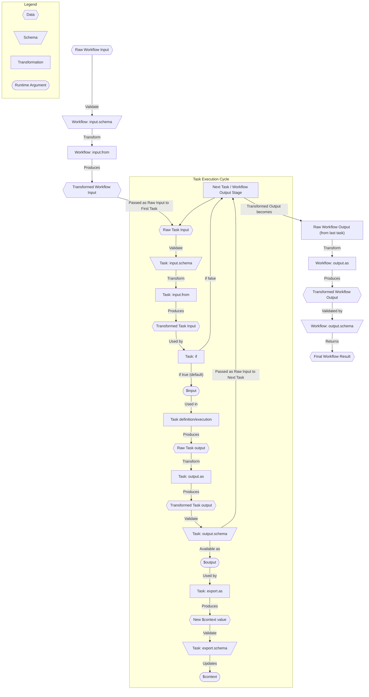

# Data Flow Management

## Purpose

Effective data flow management is crucial for building robust and maintainable workflows. The Serverless Workflow DSL
provides specific constructs (`input`, `output`, `export`) at both the workflow and individual task levels to control
how data is validated, transformed, and passed between steps and into the workflow's shared context.

This allows you to:

* Ensure tasks receive only the data they need in the correct format.
* Validate data structures at key points to prevent errors.
* Shape the final output of tasks and the entire workflow.
* Maintain a shared state (`$context`) across tasks in a controlled manner.

## Key Concepts and Keywords

Data flows through a sequence of validation and transformation steps:

1. **Workflow Input Processing**:
    * `workflow.input.schema`: Validates the initial `raw input` provided when the workflow starts.
    * `workflow.input.from`: Transforms the `raw input` of the workflow.
      The result (workflow's `transformed input`) becomes the initial `raw input` of the *first* task.
2. **Task Input Processing** (for each task):
    * `task.input.schema`: Validates the `raw input` received by the task
      (which is the `transformed output` of the previous task, or the workflow `transformed input` for the first task).
    * `task.input.from`: Transforms the `raw input` of the task.
      The result (task's `transformed input`) is available as `$input` within the task's execution scope
      and is used for evaluating expressions within the task definition.
3. **Task Execution**: The task performs its action (e.g., calls an API, runs a script, sets data).
   The result of this action is the task's `raw output`.
4. **Task Output Processing** (for each task):
    * `task.output.as`: Transforms the `raw output` of the task.
      The result (task's `transformed output`) is available as `$output` in subsequent steps and
      becomes the `raw input` for the *next* task (or the workflow's `raw output` if it's the last task).
    * `task.output.schema`: Validates the task's `transformed output`.
5. **Task Context Export** (for each task):
    * `task.export.as`: Transforms the task's `transformed output` to become the shared
      context (`$context`) ot the workflow.
    * `task.export.schema`: Validates the data produced by `export.as` *before* it replaces the current
      `$context`.
6. **Workflow Output Processing**:
    * `workflow.output.as`: Transforms the workflow `raw output` (`transformed output` of the *last* task executed).
      This defines the workflow's `transformed output`, final result returned by the workflow execution.
    * `workflow.output.schema`: Validates the final `transformed output` of the workflow.

## Workflow Level Data Handling

These properties are defined at the top level of the workflow document.

### `input` (Object, Optional) {#workflow-input}

Controls processing of the initial data the workflow receives.

* **`from`** (String | Object | Array | ..., Optional): A [Runtime Expression](dsl-runtime-expressions.md) or literal
  value defining how to transform the raw workflow input. The result initializes `$context` and is passed as raw input
  to the first task. Defaults to identity (`${. }`).
* **`schema`** (Schema Definition, Optional): A [JSON Schema](https://json-schema.org/) used to validate the *raw*
  workflow input *before* `input.from` is applied. If validation fails, the workflow faults immediately.

```yaml
document:
  dsl: '1.0.0'
  # ... workflow metadata ...
input:
  schema:
    # Ensures raw input has required fields (schema definition omitted)
    ...
  from: "${ { userId: .user.id, orderDetails: .payload } }" # Select and restructure
do:
  - firstTask: # Receives { userId: ..., orderDetails: ... } as raw input
    # ...
```

### `output` (Object, Optional) {#workflow-output}

Controls processing of the final data returned by the workflow.

* **`as`** (String | Object | Array | ..., Optional): A [Runtime Expression](dsl-runtime-expressions.md) or literal
  value defining how to transform the *transformed output* of the *last* task. Defaults to identity (`${. }`).
* **`schema`** (Schema Definition, Optional): A [JSON Schema](https://json-schema.org/) used to validate the *final
  transformed workflow output* (after `output.as` is applied). If validation fails, the workflow faults.

```yaml
document:
# ... workflow definition ...
do:
  - # ... tasks ...
  - lastTask:
      set:
        confirmation: "ABC-123"
        internalStatus: "Complete"
output:
  # Only return the confirmation field from the last task's output
  as: "${ { confirmationId: .confirmation } }"
  schema:
    # Ensure final output has the correct structure (schema definition omitted)
    ...
```

## Task Level Data Handling

These properties can be defined within individual task definitions.

### `input` (Object, Optional) {#task-input}

Controls processing of data entering a specific task.

* **`from`** (String | Object | Array | ..., Optional): Transforms the task's *raw input*. The result is available as
  `$input` within the task's scope. Defaults to identity (`${. }`).
* **`schema`** (Schema Definition, Optional): Validates the task's *raw input* *before* `input.from` is applied.

```yaml
- taskA:
    # Assume previous task output was { "data": { "value": 10 }, "meta": ... }
    input:
      from: "${ .data }" # Pass only the 'data' part to this task
      schema:
        # Validate the structure of '.data' (schema omitted)
        ...
    set:
      doubled: "${ $input.value * 2 }" # Use the transformed input ($input)
```

### `output` (Object, Optional) {#task-output}

Controls processing of data produced by a specific task.

* **`as`** (String | Object | Array | ..., Optional): Transforms the task's *raw output* (the direct result of its
  action, e.g., HTTP response body, script return value). The result becomes the raw input for the next task and is
  available as `$output` for `export.as`. Defaults to identity (`${. }`).
* **`schema`** (Schema Definition, Optional): Validates the *transformed output* (after `output.as` is applied).

```yaml
- callApi:
    call: http
    with:
    # ... call definition ...
    # Assume API returns { "result": { "payload": ..., "debug": ... }, "status": ... }
    output:
      # Select only the payload from the API response
      as: "${ .result.payload }"
      schema:
        # Validate the structure of the payload (schema omitted)
        ...
- nextTask:
  # Raw input here will be the value of 'result.payload' from the API call
  # ...
```

### `export` (Object, Optional)

Controls how the task's results update the shared workflow context (`$context`).

* **`as`** (String | Object | Array | ..., Optional): A [Runtime Expression](dsl-runtime-expressions.md) evaluated
  against the task's *transformed output* (`$output`). The result of this expression **replaces** the current value of
  `$context`. Defaults to an expression returning the existing `$context` (i.e., no change). Use
  `$context + { newField: ... }` (jq syntax) to merge.
* **`schema`** (Schema Definition, Optional): Validates the data structure produced by `export.as` *before* it updates
  `$context`.

```yaml
- updateUser:
    call: http # Assume API call returns user ID { "userId": "user-xyz" }
    # ...
    export:
      # Add/update the lastUserId in the context
      as: "${ $context + { lastUserId: $output.userId } }"
      schema:
        # Ensure context maintains expected structure (schema omitted)
        ...
- subsequentTask:
    # Can now access $context.lastUserId
    set:
      message: "Processed user: ${ $context.lastUserId }"
```

## Visualization

The following diagram illustrates the flow of data through validation and transformation stages for both workflow and
tasks:



## Potential Errors

Several types of errors can occur during data flow processing:

1. **Schema Validation Errors (`ValidationError`)**:
    * **When**: Occurs if data fails validation against an `input.schema`, `output.schema`, `export.schema`, or the
      top-level workflow `input.schema` or `output.schema`.
    * **Type**: `https://serverlessworkflow.io/spec/1.0.0/errors/validation`
    * **Status**: `400` (Bad Request)
    * **Effect**: The workflow faults immediately.

2. **Expression Evaluation Errors (`ExpressionError`)**:
    * **When**: Occurs if a runtime expression within `input.from`, `output.as`, or `export.as` (at task or workflow
      level) fails to evaluate correctly. This could be due to syntax errors in the expression, missing data referenced
      by the expression, or type mismatches during evaluation.
    * **Type**: `https://serverlessworkflow.io/spec/1.0.0/errors/expression`
    * **Status**: `400` (Bad Request)
    * **Effect**: The workflow faults immediately.

These errors are typically critical and, unless caught by a `Try` task, will cause the workflow execution to halt in a
`faulted` state.
