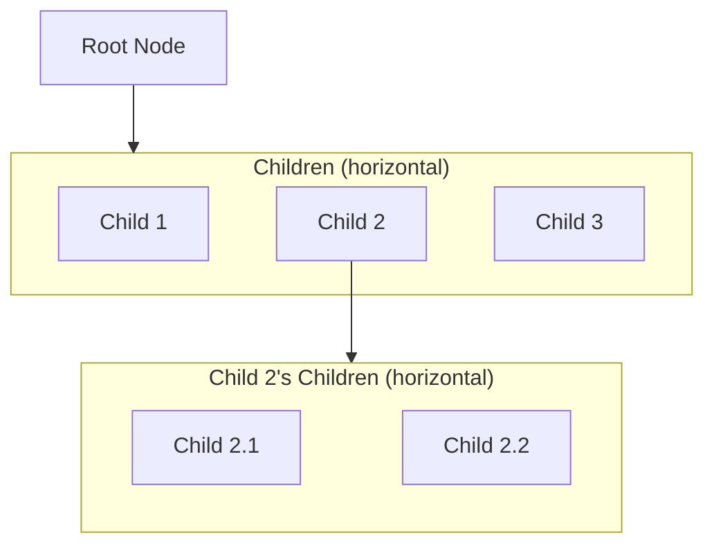
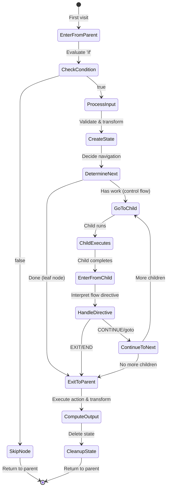
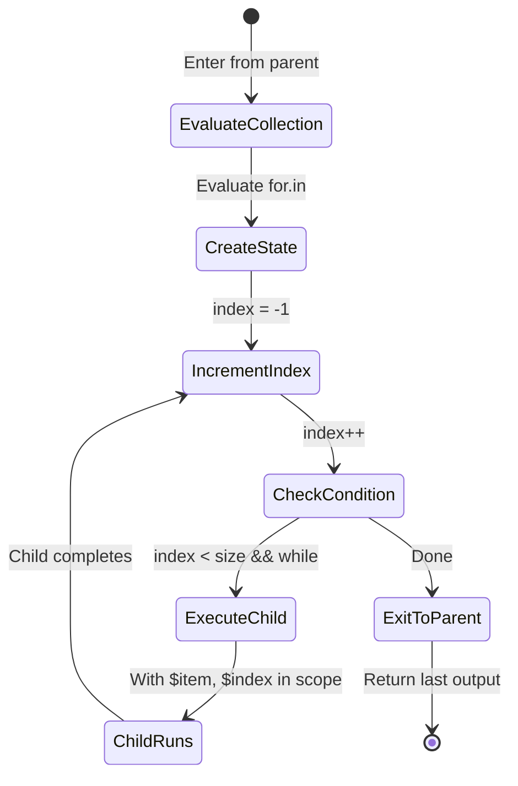
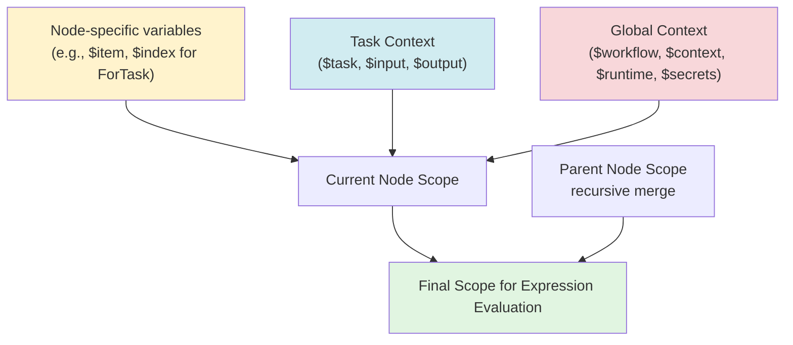

# Workflow Execution: Formal Model

This document provides a formal, functional description of how Lemline executes workflows as tree traversal with dataset
transformation.

## Table of Contents

1. [Core Concepts](#core-concepts)
    - Workflow Structure
    - Instance State
    - Dataset
    - FlowDirective
2. [Traveling through the Tree](#traveling-through-the-tree)
    - Main Execution Loop
    - The Run Function
3. [Node Entry and Exit](#node-entry-and-exit)
    - Enter from Up
    - Enter from Down
    - Continue Function
    - Exit to Up Function
4. [Node Type Implementations](#node-type-implementations)
    - DoTask, ForTask, SwitchTask, TryTask, ActivityTask
5. [Dataset Transformation Pipeline](#dataset-transformation-pipeline)
6. [Expression Evaluation Scope](#expression-evaluation-scope)
    - Scope vs Dataset
    - Scope Structure
    - Task Descriptor
    - Hierarchical Scope Building
    - Where Scope is Used
    - ForTask Scope Examples
    - Scope and Dataset Interaction
7. [Complete Example](#complete-example)
8. [Summary](#summary)

---

## Core Concepts

### Workflow Structure

A workflow is represented as a **tree of Nodes**:



**Properties**:

- Each node has a **unique position** in the tree
- Each node has **internal state** (structure depends on node type)
- Nodes may have **0 or more children** (horizontally aligned below parent)
- Execution starts at the **root node**

### Instance State

The complete execution state is represented as:

- `currentNode`: Node<*> - Node to be executed (immutable topology)
- `dataset`: JsonElement - the data to be processed by this node (must contain valid state for `currentNode` and all its
  ancestors.)
- `Map<Node<*>, NodeState>` - Runtime state for each active node (keyed by node)
- `flowDirective`: FlowDirective? - Optional navigation instruction from child to parent

A **FlowDirective** is a navigation instruction that guides parent execution flow after a leaf task completes. It is
defined in the
task's `.then` field:

- `null` or `CONTINUE`: Continue to next sibling in parent's child list
- `EXIT`: Return to parent immediately
- `END`: Return to root (complete workflow)
- `"taskName"`: Jump to specific sibling task by name

The dataset flows:

- **Down**: From parent to child
- **Up**: From child to parent

## Traveling through the Tree

Workflow execution is a step-by-step loop that navigates through the node tree. Each iteration:

1. **Executes one step** by calling the current node's processor
2. **Updates state atomically** based on what the processor returns
3. **Moves to the next node** (child, parent, or sibling)
4. **Terminates** when the current node becomes null (workflow complete)



### Core Concepts

**Pure Functional Design**: Each step is a pure function that takes immutable state and returns new values. This means:
- State never mutates in place
- Failed operations leave state unchanged (no rollback needed)
- Each step is a consistent checkpoint for persistence

**Two Entry Paths**: A node can be entered in two ways:
- **From Parent** (`enterFromParent`): First time visiting - no state exists yet
- **From Child** (`enterFromChild`): Returning after a child completes - state already exists

**State Flow**: The processor returns a `StepResult` containing:
- `next`: The next node to execute (null = workflow complete)
- `dataset`: Transformed data to pass to the next node
- `stateUpdates`: Changes to persist (null value = delete that node's state)
- `flowDirective`: Optional navigation instruction (CONTINUE, EXIT, END, or task name for goto)

### Scope Building

Scope provides the context for expression evaluation (JQ expressions in `input.from`, `output.as`, conditions). It's built hierarchically:

1. **Node-specific variables**: From `NodeState.scope` (e.g., `$item` and `$index` for ForTask iterations)
2. **Task context**: From temporary `TaskContext` (provides `$task`, `$input`, `$output` during execution)
3. **Parent scope**: Recursively merged from parent nodes up the tree

This creates a scope chain where inner tasks can access outer task variables, workflow metadata, and runtime context.

### Node Execution Flow

When **entering from parent** (first visit):
1. Check `if` condition → skip to parent if false (no state created)
2. Validate and transform input using parent scope
3. Create minimal initial state (startedAt + node-specific fields)
4. Determine next node (child to execute, or parent if done)

When **entering from child** (returning):
1. Interpret flow directive (END, EXIT, CONTINUE, or goto task name)
2. Navigate accordingly (continue to next child, exit to parent, or unwind to root)

When **exiting to parent** (work complete):
1. Execute node's action (HTTP call, data transformation, etc.)
2. Transform and validate output using current scope
3. Delete this node's state (cleanup)
4. Return transformed output to parent with flow directive

### Navigation Rules

**Control Flow Nodes** (do, for, try):
- Create state on first entry
- Navigate to first child
- On return from child, update state and decide: next child or exit to parent

**Leaf Nodes** (set, call, switch):
- Create state, execute action immediately
- Exit to parent with transformed output

**Flow Directives** (from `.then` field):
- `null`/`CONTINUE`: Continue to next sibling
- `EXIT`: Return to parent immediately
- `END`: Unwind to root (complete workflow)
- `"taskName"`: Jump to named sibling task

---

## Error Handling

**Note**: Error handling with Try/Catch is not yet fully implemented in the current execution model. The sections below
describe the planned design for when it is implemented.

### Exception Flow

When an exception occurs during workflow execution, the error handling mechanism determines how to proceed:

```
handleException(current, dataset, exception):
    // Find the nearest TryTask that can handle this error (retry or catch)
    val tryTask = findHandlingTry(current, exception)

    if tryTask is not null:
        // Check if should retry before catching
        if tryTask.state.shouldRetry():
            // Reset state and retry the try block
            return retryTryBlock(tryTask, current)
        else:
            // Retries exhausted or not configured - transition to catch block
            return enterCatch(tryTask, current, exception)
    else:
        // No try/catch block found - workflow fails
        throw WorkflowFailedException(exception)
```

### Finding a Handling Try Block

Walk up the parent chain to find a TryTask that can either retry or catch the error:

```
findHandlingTry(node, exception):
    if node is null:
        return null  // No try block found

    if node is TryTask:
        // Check if this TryTask can handle the error (retry or catch)
        if node.state.shouldRetry() or node.canCatch(exception):
            return node
        // Otherwise, continue searching up the chain

    return findHandlingTry(node.parent, exception)
```

### Retrying Try Block

When a TryTask should retry, reset state and return to the try body with the original input:

```
retryTryBlock(tryTask, failingNode):
    // Reset state from failing node up to try body (exclusive)
    resetStateUpTo(failingNode, tryTask.doBody)

    // Increment attempt counter
    tryTask.state.attemptIndex++

    // Get the try body to execute again
    val tryBody = tryTask.state.nextChild()  // Returns doBody when not in catch mode

    // Return tuple to re-execute try block with ORIGINAL input (not current dataset)
    return (tryBody, tryTask.state.transformedInput, FlowDirective.Continue)
```

**Note**: `resetStateUpTo()` clears the state of all nodes from `failingNode` up to (but not including)
`tryTask.doBody`, ensuring a clean retry.

### Entering Catch Block

When retries are exhausted and a catch block exists, transition to the appropriate catch block:

```
enterCatch(tryTask, failingNode, exception):
    // Reset state from failing node up to try body (exclusive)
    resetStateUpTo(failingNode, tryTask.doBody)

    // Prepare dataset with error information merged into ORIGINAL input
    val datasetWithError = tryTask.state.transformedInput.merge({
        error: {
            type: exception.type,
            status: exception.status,
            title: exception.title,
            details: exception.details
        }
    })

    // Update TryTask state to enter catch mode (also clears transformedInput)
    tryTask.state.enterCatch(exception)

    // Get the matching catch block child
    val catchBlock = tryTask.state.nextChild()

    // Return tuple to continue execution in catch block
    return (catchBlock, datasetWithError, FlowDirective.Continue)
```

**Note**: The catch block receives the TryTask's original `transformedInput` plus error information, not the dataset
from wherever the exception occurred.

**Key Points**:

- **State Rollback**: Before `handleException()` is called, the failing node's state has been restored by the main loop
- **State Reset for Retry/Catch**: Both `retryTryBlock()` and `enterCatch()` reset state from the failing node up to the
  try body, ensuring clean re-execution
- **Original Input**: TryTask stores `transformedInput` to provide the same starting dataset for all retries and the
  catch block
- **Retry First**: TryTask attempts retries before entering catch blocks
- **Attempt Counting**: Each retry increments `attemptIndex` (done in `retryTryBlock()`)
- **Error Context**: The catch block receives the TryTask's original `transformedInput` plus error information, not the
  dataset from where the exception occurred
- **Memory Optimization**: `transformedInput` is cleared when entering catch mode (no longer needed)
- **Parent Chain**: TryTask doesn't need to be the immediate parent - can be any ancestor
- **Type Matching**: Each catch block specifies which error types it handles (e.g., validation errors, runtime errors)

---

## Node Type Implementations

Each node type implements the execution interface with type-specific behavior. The node's `.state` structure and the
implementation of key methods vary by type.

### State Architecture

Node state is represented as simple data classes, one per node type. State is **external to nodes** - stored in a
`Map<NodePosition, NodeState>` that is passed to pure functions.

**Key Design Principles**:

- **External State**: State is NOT embedded in `Node<*>` objects. Nodes are immutable topology.
- **Simple Data Classes**: Each node type defines its own state data class (e.g., `DoState`, `ForState`)
- **Pure Operations**: All state operations are pure functions that create new state objects
- **Explicit Changes**: Functions return `deltaStates` to show exactly what changed

**Common State Fields**:

All node states contain only:

```kotlin
@Serializable
sealed class NodeState {
    abstract val startedAt: Instant  // When node started

    @Transient
    open val scope: Scope = JsonObject(mapOf())  // Node-specific scope variables
}
```

**Node-Specific State Classes**:

- `DoState`: `index: Int` - Current child index (-1 before first child)
- `ForState`: `collection: List<JsonElement>?, index: Int` - Iteration state with computed scope property
- `SwitchState`: To be implemented
- `TryState`: To be implemented
- `NoState` (for leaf nodes like SetTask): No additional fields beyond `startedAt`

**Key Difference from Document**:

- **No `rawInput` or `transformedInput`** stored in state
- These are managed via temporary `TaskContext` during execution
- This minimizes state size for serialization/persistence

**Serialization Considerations**:

When persisting workflow state for resumption (e.g., to database or message broker), the entire states map is
serialized. The current implementation uses a **minimal state** approach:

**What is serialized**:

- `startedAt: Instant` - Timestamp when node started
- Node-specific runtime state (e.g., `index` for DoTask, `collection` + `index` for ForTask)

**What is NOT serialized**:

- `rawInput` / `transformedInput` - Not stored in state (managed via TaskContext during execution)
- `scope` - Computed on-demand from state + parent chain (marked `@Transient`)
- Node variable names (`forEach`, `forAt` in ForState) - Marked `@Transient`, recomputed from definition

**Trade-offs**:

1. **Smaller serialized state** - Less data to persist, faster serialization
2. **Re-computation on resume** - Must re-evaluate `for.in` expression and rebuild scope from definition
3. **Requires deterministic expressions** - Expressions must produce same results when re-evaluated

The pure functional model makes this optimization decision independent of the core execution logic.

### Pure State Operations

Each node type (via its `NodeProcessor`) implements pure functions for state management:

```kotlin
abstract class NodeProcessor<T : TaskBase, S : NodeState>(val node: Node<T>) {
    // Create initial state when entering node
    abstract fun createState(
        transformedInput: JsonElement,
        scope: Scope
    ): S

    // Execute node action (for activity tasks)
    open suspend fun execute(
        transformedInput: JsonElement,
        scope: Scope
    ): JsonElement = transformedInput

    // Determine next step (returns updated state, next node, flow directive)
    open fun getNextStepInfo(
        state: S,
        dataset: JsonElement,
        nodeName: String? = null,
        scope: Scope
    ): Triple<NodeState?, Node<*>?, FlowDirective?> =
        Triple(null, node.parent, getFlowDirective())  // Default: leaf node behavior
}
```

**Key Benefits**:

- **Pure Functions**: No side effects, easy to test
- **Minimal State**: Only execution-critical data is stored
- **Type Safety**: Each processor has type-safe state parameter `S`
- **Separation of Concerns**: Topology (Node) vs Runtime (State) vs Execution Context (TaskContext) clearly separated

### DoTask (Sequential Execution)

Executes children sequentially in order.

**State Type**:

```kotlin
// Node state - serialized for resumption
@Serializable
data class DoState(
    override val startedAt: Instant,  // When task started
    val index: Int                     // Current child index (-1 before first child)
) : NodeState()
```

**Node-Type-Specific Operations**:

```kotlin
class DoProcessor(node: Node<DoTask>) : NodeProcessor<DoTask, DoState>(node) {

    // Create initial state
    override fun createState(transformedInput: JsonElement, scope: Scope): DoState =
        DoState(
            startedAt = Clock.System.now(),
            index = -1  // Will be incremented to 0 on first continueTo()
        )

    // Determine next step - called by continueTo()
    override fun getNextStepInfo(
        state: DoState,
        dataset: JsonElement,
        nodeName: String?,
        scope: Scope,
    ): Triple<NodeState?, Node<*>?, FlowDirective?> {
        val nextIndex = getNextIndex(state, nodeName)
        val updatedState = state.copy(index = nextIndex)

        return when (nextIndex >= (node.children?.size ?: 0)) {
            true -> Triple(null, node.parent, getFlowDirective())  // Done
            false -> Triple(updatedState, node.children?.get(nextIndex), null)  // Go to child
        }
    }

    private fun getNextIndex(state: DoState, name: String?): Int = when (name) {
        null -> state.index + 1  // CONTINUE: next sibling
        else -> node.children?.indexOfFirst { it.name == name }
            ?: throw NoSuchElementException()  // GOTO: named sibling
    }
}
```

**Key Points**:

- State only contains `startedAt` and `index` (minimal state)
- No `rawInput` or `transformedInput` stored in state (managed via TaskContext during execution)
- Index starts at -1, incremented to 0 on first `continueTo()`
- `getNextStepInfo()` returns Triple of (updatedState?, nextNode?, flowDirective?)

### ForTask (Iteration)

Executes child repeatedly for each item in a collection.



**State Type**:

```kotlin
// Node state - serialized for resumption
@Serializable
data class ForState(
    override val startedAt: Instant,       // When task started
    val collection: List<JsonElement>?,    // Computed from for.in expression
    val index: Int                         // Current iteration index (-1 before first)
) : NodeState() {

    @Transient
    lateinit var forEach: String  // Variable name from for.each (default: "item")

    @Transient
    lateinit var forAt: String    // Variable name from for.at (default: "index")

    // Computed scope property - provides iteration variables
    override val scope: Scope
        get() = buildJsonObject {
            if (index >= 0 && index < (collection?.size ?: 0)) {
                put(forEach, collection!![index])    // $item (or custom name)
                put(forAt, JsonPrimitive(index))     // $index (or custom name)
            }
        }

    fun from(node: Node<ForTask>): ForState {
        forEach = node.task.`for`.each ?: "item"
        forAt = node.task.`for`.at ?: "index"
        return this
    }
}
```

**Node-Type-Specific Operations**:

```kotlin
class ForProcessor(node: Node<ForTask>) : NodeProcessor<ForTask, ForState>(node) {

    // Create initial state
    override fun createState(transformedInput: JsonElement, scope: Scope): ForState {
        return ForState(
            startedAt = Clock.System.now(),
            collection = evalForIn(transformedInput, scope),  // Evaluate collection
            index = -1  // Will be incremented to 0 on first continueTo()
        ).from(node)
    }

    // Determine next step - called by continueTo()
    override fun getNextStepInfo(
        state: ForState,
        dataset: JsonElement,
        nodeName: String?,
        scope: Scope,
    ): Triple<NodeState?, Node<*>?, FlowDirective?> {
        val updatedState = state.copy(index = state.index + 1)

        // Check if we should continue looping
        val shouldContinue = updatedState.index < (updatedState.collection?.size ?: 0) &&
            evalWhile(dataset, scope)

        return when (shouldContinue) {
            false -> Triple(null, node.parent, getFlowDirective())  // Done
            true -> Triple(updatedState, node.children?.firstOrNull(), null)  // Next iteration
        }
    }

    private fun evalWhile(dataset: JsonElement, scope: Scope): Boolean {
        val whileCondition = node.task.`while` ?: return true
        return evalBoolean(dataset, whileCondition, "while", scope)
    }

    private fun evalForIn(dataset: JsonElement, scope: Scope): List<JsonElement> {
        return evalList(dataset, node.task.`for`.`in`, "for.in", scope)
    }
}
```

**Important Notes**:

- **Iteration Variables**: `for.each` (default: `item`) and `for.at` (default: `index`) are **scope variables**, not
  dataset fields. Children access them via expressions (e.g., `.item.id`), but they are not merged into the dataset.
- **Dataset Flow Across Iterations**: Each iteration receives the previous iteration's output as input. The first
  iteration receives the ForTask's `transformedInput`.
- **Dataset Flow Within Iteration**: Like any DoTask, the first child receives the iteration's input, subsequent
  children receive the previous child's output.
- **Output Semantics**: ForTask returns the **last child's output from the last iteration**. This is standard flow task
  behavior.

**Scope Management**:

ForTask adds iteration variables to the scope at the start of each iteration:

```
// Computed when entering child (at start of iteration)
scope[$item] = collection[forIndex]    // Default name: "item" (or custom from for.each)
scope[$index] = forIndex               // Default name: "index" (or custom from for.at)
```

Children can then access these via expressions:

- `.item.id` - Access current item's id field
- `.index` - Access current iteration index (0-based)
- `$task.input` - Access task's raw input (via scope, not dataset)

The scope is hierarchical, so children also have access to:

- Parent ForTask's iteration variables (if nested)
- All ancestor task descriptors (`$task.*`)
- Workflow context (`$context`, `$workflow.*`)

### SwitchTask (Conditional Branching)

Evaluates cases and executes one branch.

**State Type**:

```kotlin
// Node state - serialized for resumption
data class SwitchState(
    val startedAt: Instant,           // When task started
    val rawInput: JsonElement,        // Original input
    val transformedInput: JsonElement, // After input.from transformation
    val selectedCase: Int,            // Which case was selected
    val hasExecuted: Boolean          // Whether the case has been executed
)
```

**Pure State Operations**:

```kotlin
// Create initial state (called by enter())
fun SwitchNode.createInitialState(
    startedAt: Instant,
    rawInput: JsonElement,
    transformedInput: JsonElement
): SwitchState {
    // Evaluate cases to find first match
    val scope = buildScope(this, emptyMap())
    val selectedCase = selectCase(transformedInput, scope)

    return SwitchState(
        startedAt = startedAt,
        rawInput = rawInput,
        transformedInput = transformedInput,
        selectedCase = selectedCase,
        hasExecuted = false
    )
}

// Helper to select matching case
fun SwitchNode.selectCase(
    dataset: JsonElement,
    scope: Scope
): Int {
    for ((index, case) in definition.switch.withIndex()) {
        if (case.`when` == null || evaluateExpression(case.`when`, dataset, scope)) {
            return index
        }
    }
    throw Error("No switch case matched")
}

// Update state after child completes (called by reEnter())
fun SwitchNode.updateStateAfterChild(
    currentState: SwitchState,
    datasetFromChild: JsonElement
): SwitchState = currentState.copy(hasExecuted = true)

// Advance state for navigation (called by continue())
fun SwitchNode.advanceState(
    currentState: SwitchState,
    flowDirective: FlowDirective
): SwitchState = currentState  // No advancement - switches execute once

// Check if done
fun SwitchNode.shouldExit(state: SwitchState): Boolean = state.hasExecuted
```

**Note**: Uses the selected case's `.then` flowDirective to navigate after execution.

### TryTask (Error Handling)

Attempts execution with catch blocks for errors.

**State Type**:

```kotlin
// Node state - serialized for resumption
data class TryState(
    val startedAt: Instant,           // When task started
    val rawInput: JsonElement,        // Original input
    val transformedInput: JsonElement, // After input.from transformation (for retries)
    val maxAttempts: Int,             // Retry limit from definition
    val attemptIndex: Int,            // Current retry attempt (0-based)
    val inCatch: Boolean,             // Whether in catch block
    val catchIndex: Int,              // Which catch block is active (-1 if not in catch)
    val lastError: WorkflowError?     // Last caught error (for context)
)
```

**Pure State Operations**:

```kotlin
// Create initial state (called by enter())
fun TryNode.createInitialState(
    startedAt: Instant,
    rawInput: JsonElement,
    transformedInput: JsonElement
): TryState {
    val maxAttempts = definition.retry?.limit ?: 1

    return TryState(
        startedAt = startedAt,
        rawInput = rawInput,
        transformedInput = transformedInput,  // Store for retries
        maxAttempts = maxAttempts,
        attemptIndex = 0,
        inCatch = false,
        catchIndex = -1,
        lastError = null
    )
}

// Update state after child completes (called by reEnter())
fun TryNode.updateStateAfterChild(
    currentState: TryState,
    datasetFromChild: JsonElement
): TryState {
    if (currentState.inCatch) {
        // Catch block completed - no state change
        return currentState
    } else {
        // Try block completed successfully - skip retries
        return currentState.copy(attemptIndex = currentState.maxAttempts)
    }
}

// Advance state for navigation (called by continue())
fun TryNode.advanceState(
    currentState: TryState,
    flowDirective: FlowDirective
): TryState = currentState  // No advancement needed

// Check if done
fun TryNode.shouldExit(state: TryState): Boolean {
    if (state.inCatch) return true  // Catch block completed
    if (state.attemptIndex >= state.maxAttempts) return true  // Try succeeded or retries exhausted
    return false
}

// Check if should retry (called by handleException)
fun TryNode.shouldRetry(state: TryState): Boolean =
    state.attemptIndex < state.maxAttempts

// Create state for retry (called by retryTryBlock)
fun TryNode.incrementAttempt(state: TryState): TryState =
    state.copy(attemptIndex = state.attemptIndex + 1)

// Create state for catch (called by enterCatch)
fun TryNode.enterCatch(
    state: TryState,
    exception: WorkflowError
): TryState {
    val catchIndex = findMatchingCatch(exception)

    return state.copy(
        inCatch = true,
        catchIndex = catchIndex,
        lastError = exception
    )
}

// Helper to find matching catch block
fun TryNode.findMatchingCatch(exception: WorkflowError): Int {
    for ((index, catchDef) in definition.catch.withIndex()) {
        if (catchDef.errors == null || catchDef.errors.contains(exception.type)) {
            return index
        }
    }
    throw Error("No matching catch block")
}
```

**TryTask Methods**:

```kotlin
// Check if this TryTask can catch the given exception
canCatch(exception):
// If no catch blocks defined, cannot catch
if node.definition.catch is null or node.definition.catch.isEmpty():
return false

// Check if any catch block matches this error type
for catchDef in node.definition.catch:
// Catch block with no error filter catches all errors
if catchDef.errors is null:
return true
// Check if error type matches
if catchDef.errors.contains(exception.type):
return true

return false  // No matching catch block
```

**Important Notes**:

- **Stored Input**: TryTask stores `transformedInput` to provide consistent input for retries and catch blocks. This is
  the only flow task that stores input.
- **Retry First**: When the try body throws an exception, `handleException()` checks `shouldRetry()` before entering
  catch. If retries remain, `retryTryBlock()` resets state, increments `attemptIndex`, and re-executes the try body with
  the stored `transformedInput`.
- **State Reset**: Both retry and catch operations reset the state of all nodes from the failing node up to (but not
  including) the try body, ensuring clean re-execution.
- **Catch After Retries**: Only when `attemptIndex >= maxAttempts` (retries exhausted) does `handleException()` call
  `enterCatch()` to transition to the catch block.
- **Error Type Matching**: Each catch block can specify which error types it handles (validation, runtime, etc.) or
  catch all errors.
- **Dataset Flow**:
    - Retries receive the stored `transformedInput` (no error info)
    - Catch blocks receive the stored `transformedInput` plus error information merged in
    - After entering catch, `transformedInput` is cleared to save memory

### ActivityTask (Leaf Nodes)

Tasks with actions but no children (Set, CallHTTP, Emit, etc.).

**State Type**:

```kotlin
// Node state - serialized for resumption
data class ActivityState(
    val startedAt: Instant,           // When task started
    val rawInput: JsonElement,        // Original input
    val transformedInput: JsonElement // After input.from transformation
)
```

**Pure State Operations**:

```kotlin
// Create initial state (called by enter())
fun ActivityNode.createInitialState(
    startedAt: Instant,
    rawInput: JsonElement,
    transformedInput: JsonElement
): ActivityState = ActivityState(
    startedAt = startedAt,
    rawInput = rawInput,
    transformedInput = transformedInput
)

// Update state after child completes (called by reEnter())
// Not applicable - activity tasks have no children

// Advance state for navigation (called by continue())
fun ActivityNode.advanceState(
    currentState: ActivityState,
    flowDirective: FlowDirective
): ActivityState = currentState  // No advancement

// Check if done - always exit immediately
fun ActivityNode.shouldExit(state: ActivityState): Boolean = true
```

**Note**: Activity tasks execute their action (Set, CallHTTP, etc.) in `exitToUp()` and immediately return to parent.
Since `shouldExit()` returns true, `continue()` always calls `exitToUp()`.

---

## Dataset Transformation Pipeline

The dataset flows functionally through the execution - transformed but never stored. Only execution progress (`.state`)
is persisted.

### Data Flow: Enter from Up


**Key Points**:

- `datasetFromParent` is a parameter (not stored)
- `transformedInput` is a local variable (not stored)
- Only `.startedAt` and `.state` are persisted

### Data Flow: Re-enter from Child


**Key Points**:

- `datasetFromChild` is a parameter
- `state.continue()` may store child result in state (node-type-specific)
- Dataset flows through to `continue()`

### Data Flow: Exit to Up


**Key Points**:

- `rawOutput` and `transformedOutput` are local variables (not stored)
- `flowDirective` extracted from task definition
- State is cleared before returning

---

## Expression Evaluation Scope

Throughout workflow execution, expressions need access to contextual data beyond just the dataset that flows through the
tree. This contextual data is provided through a **scope** - a hierarchical structure that contains task metadata,
workflow state, and node-specific variables.

### Scope vs Dataset

**Dataset** and **Scope** serve different purposes:

| Aspect       | Dataset                                  | Scope                                     |
|--------------|------------------------------------------|-------------------------------------------|
| **Purpose**  | Data being transformed by workflow       | Context for expression evaluation         |
| **Flow**     | Flows through tree as function parameter | Computed per node from hierarchical chain |
| **Storage**  | Not stored (functional parameter)        | Not stored (computed from state)          |
| **Access**   | Via `.fieldName` expressions             | Via `$variable` expressions               |
| **Mutation** | Transformed by tasks                     | Read-only during expression evaluation    |

**Example**:

```yaml
do:
    -   processItem:
            set:
                # Dataset access: .order.id
                # Reads from the dataset flowing into this task
                orderId: .order.id

                # Scope access: $task.name
                # Reads from the task descriptor in the scope
                taskName: $task.name

                # Mixed: evaluates against dataset, but scope provides $context
                total: .price + $context.taxRate
```

### Scope Structure

The scope contains the following top-level variables:

```
Scope = {
  $context: JsonObject           // Workflow-level exported values (from export.as)
  $input: JsonElement            // Current task's raw input
  $output: JsonElement?          // Current task's raw output (nullable, only available after execution)
  $secrets: Map<String, *>       // Secret values (e.g., API keys)
  $task: TaskDescriptor          // Current task metadata
  $workflow: WorkflowDescriptor  // Workflow metadata and state
  $runtime: RuntimeDescriptor    // Runtime information (timestamps, etc.)
  $authorization: AuthorizationDescriptor  // Authentication/authorization context

  // Plus node-specific variables:
  $item: JsonElement?            // Current item in ForTask iteration
  $index: Int?                   // Current index in ForTask iteration
  // ... other node-specific variables
}
```

### Task Descriptor ($task.*)

The task descriptor provides metadata about the currently executing task:

```
TaskDescriptor = {
  name: String              // Task name (e.g., "validateOrder")
  reference: String         // Unique task reference ID
  definition: JsonObject    // Full task definition from workflow DSL
  input: JsonElement?       // Task's raw input (before input.from transformation)
  output: JsonElement?      // Task's raw output (before output.as transformation, nullable)
  startedAt: JsonObject?    // Timestamp when task started (ISO-8601 format)
}
```

**Usage Examples**:

- `$task.name` - Get current task name
- `$task.input.orderId` - Access raw input before transformation
- `$task.startedAt` - Get task start timestamp
- `$task.definition.then` - Access task's flow directive

### Hierarchical Scope Building

The scope is built hierarchically, merging node-specific variables with task context and parent scopes:



**Scope Composition** (from highest to lowest precedence):
1. **Node-specific variables**: `$item`, `$index` (ForTask), etc.
2. **Task context**: `$task`, `$input`, `$output` for current node
3. **Global context**: `$workflow`, `$context`, `$runtime`, `$secrets`, `$authorization`
4. **Parent scope**: Recursively merged from parent nodes up the tree

**Merge Semantics**: When merging scopes, child values take precedence over parent values. This means:

- Inner tasks can override outer task variables (if they define the same variable name)
- Each task's `$task.*` refers to its own metadata, not its parent's
- Node-specific variables (like `$item`) are scoped to their defining node and descendants

### Where Scope is Used

Scope is used throughout expression evaluation:

1. **Conditional Check** (`if` expression):
   ```yaml
   validateOrder:
     if: .order.total > 100 and $context.validateLargeOrders == true
   ```

2. **Input Transformation** (`input.from` expression):
   ```yaml
   processOrder:
     input:
       from:
         orderId: .id
         taskName: $task.name
         processedAt: $runtime.now
   ```

3. **Output Transformation** (`output.as` expression):
   ```yaml
   callAPI:
     output:
       as:
         result: .response.data
         apiCallDuration: $task.startedAt | elapsed
   ```

4. **Export to Context** (`export.as` expression):
   ```yaml
   calculateTax:
     export:
       as:
         taxRate: .computed.rate
         calculatedBy: $task.name
   ```

5. **Action Execution** (e.g., HTTP call with expressions in headers):
   ```yaml
   callService:
     call: http
     with:
       headers:
         X-Task-Name: $task.name
         X-Correlation-Id: $workflow.id
   ```

6. **ForTask Collection** (`for.in` expression):
   ```yaml
   processItems:
     for:
       each: item
       in: .order.items  # Evaluated with scope
   ```

7. **SwitchTask Conditions** (`switch.when` expressions):
   ```yaml
   routeOrder:
     switch:
       - urgent:
           when: .priority == "urgent" and $context.urgentProcessingEnabled
       - normal:
           when: true
   ```

### ForTask Scope Example

ForTask adds iteration-specific variables to the scope:

```yaml
do:
    -   processOrders:
            for:
                each: order      # Variable name (default: "item")
                at: orderIndex   # Variable name (default: "index")
                in: .orders      # Evaluated once with parent scope
            do:
                -   processOrder:
                        set:
                            # Access iteration variables from scope
                            id: $order.id
                            position: $orderIndex

                            # Access parent task metadata
                            parentTask: $task.name  # Will be "processOrder" (current task)

                            # Access dataset
                            customerId: .customerId  # From dataset flowing into processOrder
```

**Scope during iteration 0**:

```
{
  $order: {id: 123, ...},        // From for.each
  $orderIndex: 0,                 // From for.at
  $task: {name: "processOrder", ...},  // Current task
  $input: {...},                  // processOrder's input
  $context: {...},                // Workflow context
  // ... parent scope variables
}
```

### Nested ForTask Scope

When ForTasks are nested, the scope chain contains all ancestor iteration variables:

```yaml
do:
    -   processOrders:
            for:
                each: order
                in: .orders
            do:
                -   processItems:
                        for:
                            each: item
                            in: $order.items  # Access outer loop variable
                        do:
                            -   processItem:
                                    set:
                                        # Access both loop variables
                                        orderId: $order.id
                                        itemId: $item.id

                                        # Access current task metadata
                                        taskName: $task.name  # "processItem"
```

**Scope for inner task**:

```
{
  $item: {id: 456, ...},           // Inner loop variable
  $order: {id: 123, ...},          // Outer loop variable (from parent scope)
  $task: {name: "processItem", ...},
  $input: {...},
  $context: {...},
  // ... more parent scope variables
}
```

### Scope and Dataset Interaction

Expressions can reference both dataset and scope:

```yaml
calculateTotal:
    input:
        from:
            # Dataset access
            basePrice: .price
            quantity: .quantity

            # Scope access
            taxRate: $context.taxRate

            # Mixed - expression evaluated against dataset, but with scope available
            total: (.price * .quantity) * (1 + $context.taxRate)

            # Task metadata
            calculatedBy: $task.name
            calculatedAt: $task.startedAt
```

**Dataset flowing in**:

```json
{
    "price": 100,
    "quantity": 2
}
```

**Scope during evaluation**:

```json
{
    "$context": {
        "taxRate": 0.1
    },
    "$task": {
        "name": "calculateTotal",
        "startedAt": "2024-01-15T10:30:00Z"
    },
    "$input": {
        "price": 100,
        "quantity": 2
    },
    ...
}
```

**Transformed input (result)**:

```json
{
    "basePrice": 100,
    "quantity": 2,
    "taxRate": 0.1,
    "total": 220,
    "calculatedBy": "calculateTotal",
    "calculatedAt": "2024-01-15T10:30:00Z"
}
```

### Key Differences: Dataset vs Scope

1. **Dataset** is what flows through the tree:
    - Enter from parent: receives parent's output
    - Exit to parent: returns transformed output
    - Modified by `input.from`, `output.as` transformations
    - Represents the "data being processed"

2. **Scope** is contextual information for expressions:
    - Built hierarchically from node state + parent scopes
    - Provides task metadata, iteration variables, workflow state
    - Read-only during expression evaluation
    - Represents "where and how we're executing"

**Analogy**: Think of the dataset as the "arguments" to a function, and scope as the "closure variables" and "metadata"
available during execution.

---

## Summary

### Core Principles

1. **Pure Functional Execution Loop**
   ```kotlin
   while (current != null) {
       try {
           // Pure function - no side effects, no mutations
           val stepResult = runStep(current, input, states.toMap(), flowDirective)

           current = stepResult.next
           input = stepResult.dataset
           flowDirective = stepResult.flowDirective

           // Apply state changes atomically
           states.updateWith(stepResult.stateUpdates)

           // Checkpoint - state is consistent for persistence

       } catch (e: Exception) {
           // States unchanged since runStep() is pure - no rollback needed
           throw e  // Currently re-throws; will add try/catch handling later
       }
   }
   ```
   Each iteration is a pure function call that returns explicit state changes. No cloning needed.

2. **Tree Structure with External State**
    - Workflow is a tree of immutable `Node<*>` objects (topology only)
    - Runtime state is external: `Map<Node<*>, NodeState>` (keyed by node reference)
    - Navigation is functional: each function returns `StepResult(next, dataset, stateUpdates, flowDirective)`
    - State changes are explicit: `stateUpdates` shows exactly what mutated

3. **Pure State Operations**
    - All state operations are pure functions that create new state objects
    - `createState()` - Creates new state when entering a node (minimal state)
    - `getNextStepInfo()` - Returns (updatedState?, nextNode?, flowDirective?)
    - No mutations - all operations return new state via `stateUpdates`

4. **Node State Structure**
    - Each node type defines a simple data class (e.g., `DoState`, `ForState`)
    - All states contain:
        - `startedAt: Instant` - When node started
        - Node-specific fields (e.g., `index` for DoState, `collection` and `index` for ForState)
    - **No rawInput/transformedInput stored** - managed via temporary TaskContext during execution
    - States may have computed `scope` property for node-specific variables (e.g., `$item`, `$index`)

5. **TaskContext for Temporary Execution Context**
    - `TaskContext` provides temporary execution data (not stored in state)
    - Contains: `startedAt`, `rawInput`, `transformedInput`, `rawOutput`, `transformedOutput`
    - Used for building scope during execution: `$task.*`, `$input`, `$output`
    - Evolved through execution (created → updated with input → updated with output)

6. **Delta States for Explicit Mutations**
    - Functions return `stateUpdates: Map<Node<*>, NodeState?>`
    - Null value means deletion (cleanup when node exits)
    - Non-null value means insert or update
    - Orchestrator applies deltas via `states.updateWith()`
    - Makes all state changes visible and trackable

7. **FlowDirective Navigation**
    - `CONTINUE` or `null`: Proceed to next sibling
    - `EXIT`: Return to parent immediately
    - `END`: Recursive unwinding to root
    - `String (goto)`: Jump to specific sibling by name

8. **Transformation Pipeline** (functional, not stored)
    - **Input**: `rawInput` → `validateInput()` → `transformInput()` → `transformedInput`
    - **Output**: `dataset` → `execute()` → `rawOutput` → `transformOutput()` → `transformedOutput` → `validateOutput()`
    - All transformation operations use scope for expression evaluation

9. **Expression Evaluation Scope** (computed on-demand)
    - Hierarchical context for expression evaluation
    - Built on-demand: `getScope(node, states)` recursively merges parent scope
    - Three sources:
        1. Node-specific scope (from `NodeState.scope` property, e.g., `$item`, `$index`)
        2. TaskContext scope (from `TaskContext.toScope()`, provides `$task.*`, `$input`, `$output`)
        3. Parent scope (recursive merge up the tree)
    - Used by: `if` conditions, `input.from`, `output.as`, action parameters

10. **Conditional Navigation**
    - `if`: Skip node if condition false (no state created)
    - `switch`: Select branch based on data
    - `for`: Iterate over collection

11. **Exception Handling**
    - **No Rollback Needed**: Pure functions don't mutate state, so exceptions leave `states` unchanged
    - **Try/Catch**: Not yet implemented (placeholder for future error handling)
    - Current behavior: Exceptions are re-thrown to caller

### Benefits

This pure functional model provides:

- ✅ **Pure Functions** - All operations are side-effect free, taking inputs and returning new values
- ✅ **Explicit State Changes** - `deltaStates` makes all mutations visible
- ✅ **No Cloning Needed** - Pure functions eliminate the need for state cloning/rollback
- ✅ **Minimal State** - Only execution progress stored in external map
- ✅ **State Atomicity** - `applyDelta()` either applies all changes or none (on exception)
- ✅ **Safe Resumption** - Checkpoint after each successful step ensures consistent state for persistence
- ✅ **Clear Semantics** - Pure function composition with explicit state deltas
- ✅ **Easy Testing** - Functions are testable in isolation without mocking
- ✅ **Serializability** - State is minimal and explicit (just the states map)
- ✅ **Horizontal Scaling** - Any worker can resume from checkpointed state
- ✅ **Deterministic Replay** - Same `(node, dataset, states, flowDirective)` → same result
- ✅ **Error Recovery** - Try/catch blocks handle exceptions without state rollback complexity
- ✅ **Separation of Concerns** - Topology (Node) vs Runtime (State) clearly separated
