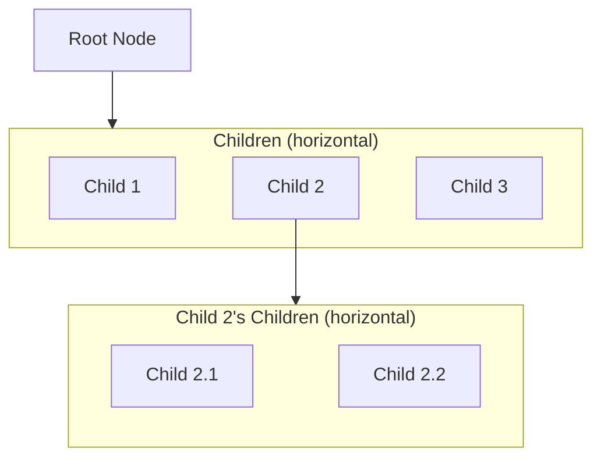
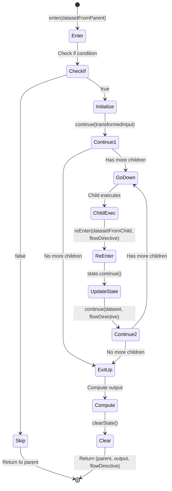

# Workflow Execution: Formal Model

This document provides a formal, functional description of how Lemline executes workflows as tree traversal with dataset
transformation.

## Table of Contents

1. [Core Concepts](#core-concepts)
    - Workflow Structure
    - Instance State
    - Dataset
    - FlowDirective
2. [Traveling through the Tree](#traveling-through-the-tree)
    - Main Execution Loop
    - The Run Function
3. [Node Entry and Exit](#node-entry-and-exit)
    - Enter from Up
    - Enter from Down
    - Continue Function
    - Exit to Up Function
4. [Node Type Implementations](#node-type-implementations)
    - DoTask, ForTask, SwitchTask, TryTask, ActivityTask
5. [Dataset Transformation Pipeline](#dataset-transformation-pipeline)
6. [Expression Evaluation Scope](#expression-evaluation-scope)
    - Scope vs Dataset
    - Scope Structure
    - Task Descriptor
    - Hierarchical Scope Building
    - Where Scope is Used
    - ForTask Scope Examples
    - Scope and Dataset Interaction
7. [Complete Example](#complete-example)
8. [Summary](#summary)

---

## Core Concepts

### Workflow Structure

A workflow is represented as a **tree of Nodes**:



**Properties**:

- Each node has a **unique position** in the tree
- Each node has **internal state** (structure depends on node type)
- Nodes may have **0 or more children** (horizontally aligned below parent)
- Execution starts at the **root node**

### Instance State

The complete execution state is represented as:

```
InstanceState = (currentNode, currentStates)
```

Where:

- `currentNode`: Node - Currently executing node
- `currentStates`: Map<NodePosition, MutableState> - **Mutable state only** for each node

**State Optimization**: Node state separates immutable fields (computed once, never saved) from mutable fields (
serialized for resumption). Only the minimal mutable state is stored in `currentStates`, reducing serialization
overhead.

**Invariant**: The instance state must always be **consistent** - the `currentStates` map must contain valid state for
`currentNode` and all its ancestors.

### Dataset

A **dataset** (JSON value) is transported and transformed as execution moves through the tree:

```
Dataset = JsonElement
```

The dataset flows:

- **Down**: From parent to child
- **Up**: From child to parent

### FlowDirective

A **FlowDirective** is a navigation instruction that guides execution flow after a task completes. It is defined in the
task's `.then` field.

**Possible Values**:

- `null` or `CONTINUE`: Continue to next sibling in parent's child list
- `EXIT`: Return to parent immediately
- `END`: Return to root (complete workflow)
- `"taskName"`: Jump to specific sibling task by name

**Example**:

```yaml
do:
    -   processOrder:
            set: { status: "processed" }
            then: notifyCustomer  # FlowDirective: jump to sibling "notifyCustomer"

    -   validateOrder:
            if: .needsValidation
            call: http
            then: exit  # FlowDirective: return to parent immediately
```

---

## Traveling through the Tree

### Main Execution Loop

The workflow execution is a loop that repeatedly calls the `run` function until completion, with exception handling for
error recovery:

```
execute(workflow, input):
    current = workflow.rootNode
    dataset = input
    flowDirective = null

    while current is not null:
        // Save current state for rollback in case of exception
        currentState = current.state.clone()

        try:
            // Attempt to execute current node
            (next, dataset, flowDirective) = run(current, dataset, flowDirective)

            // ← Checkpoint here for workflow persistence (state is consistent)

            // Move to next node
            current = next

        catch exception:
            // Rollback to saved state
            current.state = currentState

            // Handle exception (see Error Handling section)
            (current, dataset, flowDirective) = handleException(current, dataset, exception)

    return dataset  // Final workflow output
```

**Key Points**:

- Each iteration processes one execution step
- **State Safety**: Node state is cloned before execution and restored on exception
- **Atomicity**: State is either fully updated (success) or fully rolled back (exception)
- **Checkpointing**: After successful `run()`, before updating `current`, state is consistent for persistence
- Loop terminates when `current` becomes `null` (workflow complete)
- Dataset flows as function parameters (functional, no storage)

### The Run Function

The `run` function determines whether to enter a node for the first time or re-enter after a child:

```
run(current, dataset, flowDirective):
    if current.startedAt is null:
        return enter(current, dataset)
    else:
        return reEnter(current, dataset, flowDirective)
```

**Returns**: `(next, nextDataset, nextFlowDirective)` - the complete next state

---

## Node Entry and Exit

### Instance Methods vs Free Functions

The execution model uses a hybrid approach:

**Free Functions** (Orchestration):

- `enter(node, dataset)` - Entry from parent
- `reEnter(node, dataset, flowDirective)` - Re-entry from child
- `continue(node, dataset, flowDirective)` - Navigation decision
- `exitToUp(node, transformedInput)` - Exit to parent
- `run(current, dataset, flowDirective)` - Main dispatcher

These orchestrate the execution flow in a functional style: `(next, dataset, flowDirective) = function(node, ...)`.

**Instance Methods** (Scope-Dependent Operations):

- `node.checkIf(dataset)` - Evaluate `if` condition (needs scope)
- `node.validateInput(dataset)` - Validate input schema (needs scope for context)
- `node.evaluateInput(dataset)` - Transform input with `input.from` (needs scope)
- `node.validateOutput(output)` - Validate output schema (needs scope for context)
- `node.evaluateOutput(output)` - Transform output with `output.as` (needs scope)
- `node.execute(input)` - Execute action (might need scope for context)

**Why this separation?**

Scope-dependent operations need access to a hierarchical **scope** that contains:

- Task context (`$task.*`: name, reference, definition, startedAt, input, output)
- Parent scopes (recursively merged up the tree)
- Node-specific variables (e.g., `$item`, `$index` from ForTask)
- Workflow context (`$context`, `$workflow.*`, `$runtime.*`)

The scope is built hierarchically by:

1. Starting with node-specific variables (e.g., `$item`, `$index` from ForTask)
2. Merging current task descriptor (`$task.*`, `$input`, `$output`)
3. Recursively merging with parent scope

This creates a scope chain where inner tasks can access outer task variables and metadata. This scope is internal to the
node instance and shouldn't be passed around as a parameter. Making these operations instance methods encapsulates this
complexity.

### Entry Points

A node can be entered from two directions:

#### Enter from Up (from parent)

Called when entering a node for the first time from its parent.

```
enter(node, datasetFromParent):
    // ===========================================
    // PHASE 1: Conditional Check
    // ===========================================

    // Check if condition - skip if false
    // (instance method - needs scope: $task.*, $input, parent scopes, node variables)
    if not node.checkIf(datasetFromParent):
        // Skip this node entirely (no state initialization)
        // Return to parent - parent.continue() will advance to next sibling
        return (node.parent, datasetFromParent, FlowDirective.Continue)

    // ===========================================
    // PHASE 2: Initialize Node State
    // ===========================================

    // Mark as started
    node.startedAt = now()

    // Validate input against schema (throws ValidationError)
    // (instance method - needs scope for error context and expression evaluation)
    node.validateInput(datasetFromParent)

    // Apply input transformation (throws ExpressionError)
    // (instance method - evaluates expressions with scope: $input, $task.*, $context, etc.)
    val transformedInput = node.evaluateInput(datasetFromParent)

    // Initialize type-specific state (implementation-dependent)
    node.state.init(transformedInput)

    // ===========================================
    // PHASE 3: Determine Next Step
    // ===========================================

    // Delegate to continue() to decide where to go
    return continue(node, transformedInput, FlowDirective.Continue)
```

**Parameters**:

- `datasetFromParent`: Parent's output (becomes this node's input)

**Returns**: `(next, dataset, flowDirective)` tuple

**Phases**:

1. **Conditional Check**: Evaluate `if` condition, skip if false
2. **Initialize**: Set `.startedAt`, validate, transform input, init state
3. **Navigate**: Call `continue()` to decide next node

#### Enter from Down (from child)

Called when returning to a node after a child completes.

```
reEnter(node, datasetFromChild, flowDirective):
    // ===========================================
    // Update Node State
    // ===========================================

    // Update internal state based on child's result
    // (node-type-specific: may store result, update indices, etc.)
    node.state.continue(datasetFromChild)

    // ===========================================
    // Determine Next Step
    // ===========================================

    // Delegate to continue() to decide where to go
    return continue(node, datasetFromChild, flowDirective)
```

**Parameters**:

- `datasetFromChild`: Child's output result
- `flowDirective`: Navigation instruction from child's `.then` field

**Returns**: `(next, dataset, flowDirective)` tuple

**Purpose**:

- Update node's internal state (implementation-dependent)
- Delegate navigation decision to `continue()`

### Continue Function

Determines the next step based on FlowDirective and node state.

```
continue(node, datasetForNavigation, flowDirective):
    when(flowDirective):
      : End ->
          // Workflow complete - recursive unwinding
          return (node.parent, datasetForNavigation, End)

      : Exit ->
          // Exit to parent immediately
          return exitToUp(node, datasetForNavigation, FlowDirective.Continue)

      : $name, Continue ->
          // Update state: advance indices, or jump to named sibling
          node.state.continue(datasetForNavigation, flowDirective)

          // Check if node has more work to do
          if (node.state.shouldExit()):
              return exitToUp(node, datasetForNavigation)
          else:
              return (node.state.nextChild(), datasetForNavigation, FlowDirective.Continue)
```

**Parameters**:

- `datasetForNavigation`: The `transformedInput` (for going down) or child result (when re-entering)
- `flowDirective`: Navigation instruction

**Logic**:

1. **End**: Recursive unwinding to root (parent's parent will eventually be null)
2. **Exit**: Exit immediately to parent
3. **$name / Continue**: Update state, check if done, go to next child or exit

### Exit to Up Function

Computes output and returns to parent.

```
exitToUp(node, datasetForExit):
    // ===========================================
    // Compute Output
    // ===========================================

    // Execute action (eg. HTTP call, throws ActionError)
    // (instance method - might need scope for error context and expression evaluation)
    val rawOutput = node.execute(datasetForExit)

    // Apply output transformation (throws ExpressionError)
    // (instance method - evaluates expressions with scope: $output, $task.*, $context, etc.)
    val transformedOutput = node.evaluateOutput(rawOutput)

    // Validate output schema (throws ValidationError)
    // (instance method - needs scope for error context and expression evaluation)
    node.validateOutput(transformedOutput)

    // ===========================================
    // Prepare Return
    // ===========================================

    // Clear this node's state
    clearState(node)

    // Return to parent
    return (node.parent, transformedOutput, node.definition.then)
```

**Parameters**:

- `datasetForExit`: The dataset to use for computing output (child's result for flow tasks, transformedInput for
  activity tasks)

**Returns**: `(parent, transformedOutput, flowDirective)` tuple

**Flow**: `datasetForExit` → action → `rawOutput` → transform → `transformedOutput` → validate

### Execution State Machine



**Legend**:

- **Enter**: First visit from parent
- **ReEnter**: Returning from child
- **Continue**: Determine next step based on state and flowDirective
- **ExitUp**: Compute output and return to parent

---

## Error Handling

### Exception Flow

When an exception occurs during workflow execution, the error handling mechanism determines how to proceed:

```
handleException(current, dataset, exception):
    // Find the nearest TryTask that can handle this error (retry or catch)
    val tryTask = findHandlingTry(current, exception)

    if tryTask is not null:
        // Check if should retry before catching
        if tryTask.state.shouldRetry():
            // Reset state and retry the try block
            return retryTryBlock(tryTask, current)
        else:
            // Retries exhausted or not configured - transition to catch block
            return enterCatch(tryTask, current, exception)
    else:
        // No try/catch block found - workflow fails
        throw WorkflowFailedException(exception)
```

### Finding a Handling Try Block

Walk up the parent chain to find a TryTask that can either retry or catch the error:

```
findHandlingTry(node, exception):
    if node is null:
        return null  // No try block found

    if node is TryTask:
        // Check if this TryTask can handle the error (retry or catch)
        if node.state.shouldRetry() or node.canCatch(exception):
            return node
        // Otherwise, continue searching up the chain

    return findHandlingTry(node.parent, exception)
```

### Retrying Try Block

When a TryTask should retry, reset state and return to the try body with the original input:

```
retryTryBlock(tryTask, failingNode):
    // Reset state from failing node up to try body (exclusive)
    resetStateUpTo(failingNode, tryTask.doBody)

    // Increment attempt counter
    tryTask.state.attemptIndex++

    // Get the try body to execute again
    val tryBody = tryTask.state.nextChild()  // Returns doBody when not in catch mode

    // Return tuple to re-execute try block with ORIGINAL input (not current dataset)
    return (tryBody, tryTask.state.transformedInput, FlowDirective.Continue)
```

**Note**: `resetStateUpTo()` clears the state of all nodes from `failingNode` up to (but not including)
`tryTask.doBody`, ensuring a clean retry.

### Entering Catch Block

When retries are exhausted and a catch block exists, transition to the appropriate catch block:

```
enterCatch(tryTask, failingNode, exception):
    // Reset state from failing node up to try body (exclusive)
    resetStateUpTo(failingNode, tryTask.doBody)

    // Prepare dataset with error information merged into ORIGINAL input
    val datasetWithError = tryTask.state.transformedInput.merge({
        error: {
            type: exception.type,
            status: exception.status,
            title: exception.title,
            details: exception.details
        }
    })

    // Update TryTask state to enter catch mode (also clears transformedInput)
    tryTask.state.enterCatch(exception)

    // Get the matching catch block child
    val catchBlock = tryTask.state.nextChild()

    // Return tuple to continue execution in catch block
    return (catchBlock, datasetWithError, FlowDirective.Continue)
```

**Note**: The catch block receives the TryTask's original `transformedInput` plus error information, not the dataset
from wherever the exception occurred.

**Key Points**:

- **State Rollback**: Before `handleException()` is called, the failing node's state has been restored by the main loop
- **State Reset for Retry/Catch**: Both `retryTryBlock()` and `enterCatch()` reset state from the failing node up to the
  try body, ensuring clean re-execution
- **Original Input**: TryTask stores `transformedInput` to provide the same starting dataset for all retries and the
  catch block
- **Retry First**: TryTask attempts retries before entering catch blocks
- **Attempt Counting**: Each retry increments `attemptIndex` (done in `retryTryBlock()`)
- **Error Context**: The catch block receives the TryTask's original `transformedInput` plus error information, not the
  dataset from where the exception occurred
- **Memory Optimization**: `transformedInput` is cleared when entering catch mode (no longer needed)
- **Parent Chain**: TryTask doesn't need to be the immediate parent - can be any ancestor
- **Type Matching**: Each catch block specifies which error types it handles (e.g., validation errors, runtime errors)

---

## Node Type Implementations

Each node type implements the execution interface with type-specific behavior. The node's `.state` structure and the
implementation of key methods vary by type.

### State Architecture

To optimize serialization and avoid copying data unnecessarily, node state separates **immutable** fields (computed
once, never saved) from **mutable** fields (must be serialized for resumption):

```kotlin
abstract class NodeState<M>(
    open val startedAt: Instant,    // Immutable - never needs saving
    open var mutable: M              // Mutable state - needs serialization
) {
    abstract fun shouldExit(): Boolean
    abstract fun nextChildIndex(): Int
    abstract fun continue()
}
```

**Key Benefits**:

- **Immutable fields** (e.g., `startedAt`, `collection`, `doSize`) are computed once and never saved
- **Mutable fields** (e.g., current index, attempt count) are isolated in a data class for efficient serialization
- Only the minimal state needed for resumption is persisted

### Interface Methods

All node state types must implement:

```kotlin
.startedAt: Instant              // When node started (immutable)
.mutable: M                      // Type-specific mutable state

shouldExit(): Boolean            // Check if node has completed its work
nextChildIndex(): Int            // Get index of next child to process
continue()                       // Update mutable state (advance indices, etc.)
```

### DoTask (Sequential Execution)

Executes children sequentially in order.

**State Types**:

```kotlin
// Mutable state - serialized for resumption
data class DoMutableState(
    val childIndex: Int  // Current child position
)

// Complete state - combines immutable and mutable
class DoTaskState(
    val doSize: Int,                                    // Immutable - number of children
    override val startedAt: Instant,                    // Immutable - when task started
    override var mutable: DoMutableState = DoMutableState(-1)  // Mutable - what gets saved
) : NodeState<DoMutableState>(startedAt, mutable) {

    // Check if all children have been processed
    override fun shouldExit(): Boolean = mutable.childIndex >= doSize

    // Get index of next child to process
    override fun nextChildIndex(): Int = mutable.childIndex

    // Update state - advance or jump to named child
    override fun continue() {
        // Implementation handles flowDirective to either increment or jump
        mutable = mutable.copy(childIndex = mutable.childIndex + 1)
    }

    // Jump to named child
    fun gotoChild(name: String) {
        val targetIndex = findChildIndexByName(name)
        mutable = mutable.copy(childIndex = targetIndex)
    }
}
```

### ForTask (Iteration)

Executes child repeatedly for each item in a collection.

**State Types**:

```kotlin
// Mutable state - serialized for resumption
data class ForMutableState(
    val forIndex: Int  // Current iteration index
)

// Complete state - combines immutable and mutable
class ForTaskState(
    val collection: List<JsonElement>,                  // Immutable - computed once, never saved
    override val startedAt: Instant,                    // Immutable - when task started
    override var mutable: ForMutableState = ForMutableState(-1)  // Mutable - what gets saved
) : NodeState<ForMutableState>(startedAt, mutable) {

    // Check if iteration is complete
    override fun shouldExit(): Boolean {
        if (mutable.forIndex >= collection.size) return true
        // Check while condition if present
        if (whileCondition != null) {
            return !evaluateWhile()  // Stop if condition becomes false
        }
        return false
    }

    // Get index of next child (always 0 - same child, different iteration)
    override fun nextChildIndex(): Int = 0  // Always the doBody child

    // Update state - advance to next iteration
    override fun continue() {
        mutable = mutable.copy(forIndex = mutable.forIndex + 1)
    }

    // Get current iteration variables for scope
    fun getCurrentItem(): JsonElement = collection[mutable.forIndex]
    fun getCurrentIndex(): Int = mutable.forIndex
}
```

**Important Notes**:

- **Iteration Variables**: `for.each` (default: `item`) and `for.at` (default: `index`) are **scope variables**, not
  dataset fields. Children access them via expressions (e.g., `.item.id`), but they are not merged into the dataset.
- **Dataset Flow Across Iterations**: Each iteration receives the previous iteration's output as input. The first
  iteration receives the ForTask's `transformedInput`.
- **Dataset Flow Within Iteration**: Like any DoTask, the first child receives the iteration's input, subsequent
  children receive the previous child's output.
- **Output Semantics**: ForTask returns the **last child's output from the last iteration**. This is standard flow task
  behavior.

**Scope Management**:

ForTask adds iteration variables to the scope at the start of each iteration:

```
// Computed when entering child (at start of iteration)
scope[$item] = collection[forIndex]    // Default name: "item" (or custom from for.each)
scope[$index] = forIndex               // Default name: "index" (or custom from for.at)
```

Children can then access these via expressions:

- `.item.id` - Access current item's id field
- `.index` - Access current iteration index (0-based)
- `$task.input` - Access task's raw input (via scope, not dataset)

The scope is hierarchical, so children also have access to:

- Parent ForTask's iteration variables (if nested)
- All ancestor task descriptors (`$task.*`)
- Workflow context (`$context`, `$workflow.*`)

### SwitchTask (Conditional Branching)

Evaluates cases and executes one branch.

**State Types**:

```kotlin
// Mutable state - serialized for resumption
data class SwitchMutableState(
    val selectedCase: Int,      // Which case was selected
    val hasExecuted: Boolean    // Whether the case has been executed
)

// Complete state - combines immutable and mutable
class SwitchTaskState(
    override val startedAt: Instant,                    // Immutable - when task started
    override var mutable: SwitchMutableState            // Mutable - what gets saved
) : NodeState<SwitchMutableState>(startedAt, mutable) {

    // Initialize - evaluate cases to find match (called once at enter)
    companion object {
        fun selectCase(transformedInput: JsonElement, cases: List<Case>): Int {
            for ((index, case) in cases.withIndex()) {
                if (case.`when` == null || evaluate(transformedInput, case.`when`)) {
                    return index
                }
            }
            throw Error("No switch case matched")
        }
    }

    // Check if done - true after executing the selected case
    override fun shouldExit(): Boolean = mutable.hasExecuted

    // Get index of next child - returns the selected case index
    override fun nextChildIndex(): Int = mutable.selectedCase

    // Update state - mark as executed after case completes
    override fun continue() {
        mutable = mutable.copy(hasExecuted = true)
    }
}
```

**Note**: Uses `case.then` flowDirective to navigate to target sibling after the case completes.

### TryTask (Error Handling)

Attempts execution with catch blocks for errors.

**State Types**:

```kotlin
// Mutable state - serialized for resumption
data class TryMutableState(
    val attemptIndex: Int,      // Current retry attempt (0-based)
    val inCatch: Boolean,       // Whether in catch block
    val catchIndex: Int,        // Which catch block is active (-1 if not in catch)
    val lastError: WorkflowError?  // Last caught error (for context)
)

// Complete state - combines immutable and mutable
class TryTaskState(
    val maxAttempts: Int,                               // Immutable - retry limit from definition
    val transformedInput: JsonElement?,                 // Immutable - cached for retries (not serialized)
    override val startedAt: Instant,                    // Immutable - when task started
    override var mutable: TryMutableState = TryMutableState(
        attemptIndex = 0,
        inCatch = false,
        catchIndex = -1,
        lastError = null
    )
) : NodeState<TryMutableState>(startedAt, mutable) {

    // Check if done
    override fun shouldExit(): Boolean {
        if (mutable.inCatch) return true  // Catch block completed
        if (mutable.attemptIndex >= maxAttempts) return true  // Try succeeded or retries exhausted
        return false
    }

    // Get index of next child based on state
    override fun nextChildIndex(): Int {
        return if (mutable.inCatch) mutable.catchIndex else 0  // 0 = doBody
    }

    // Update state after child completion
    override fun continue() {
        if (mutable.inCatch) {
            // Catch block completed - mark as done (no state change needed)
        } else {
            // Try block completed successfully - skip retries
            mutable = mutable.copy(attemptIndex = maxAttempts)
        }
    }

    // Check if should retry (called by handleException before entering catch)
    fun shouldRetry(): Boolean = mutable.attemptIndex < maxAttempts

    // Increment retry attempt (called by retryTryBlock)
    fun incrementAttempt() {
        mutable = mutable.copy(attemptIndex = mutable.attemptIndex + 1)
    }

    // Transition to catch block (called by enterCatch)
    fun enterCatch(exception: WorkflowError, catchIndex: Int) {
        mutable = TryMutableState(
            attemptIndex = mutable.attemptIndex,
            inCatch = true,
            catchIndex = catchIndex,
            lastError = exception
        )
    }

    // Find which catch block matches this exception
    fun findMatchingCatch(exception: WorkflowError, catchBlocks: List<CatchDef>): Int {
        for ((index, catchDef) in catchBlocks.withIndex()) {
            if (catchDef.errors == null || catchDef.errors.contains(exception.type)) {
                return index
            }
        }
        throw Error("No matching catch block")  // Should never happen - canCatch() ensures match
    }
}
```

**Serialized State**: Only `TryMutableState(attemptIndex = 2, inCatch = false, catchIndex = -1, lastError = null)` is
saved.

**Important Notes**:

- `maxAttempts` is computed once from definition and never saved
- `transformedInput` is cached in-memory for retries but NOT serialized (recomputed on resume)
- Only the minimal retry state is persisted

**TryTask Methods**:

```kotlin
// Check if this TryTask can catch the given exception
canCatch(exception):
// If no catch blocks defined, cannot catch
if node.definition.catch is null or node.definition.catch.isEmpty():
return false

// Check if any catch block matches this error type
for catchDef in node.definition.catch:
// Catch block with no error filter catches all errors
if catchDef.errors is null:
return true
// Check if error type matches
if catchDef.errors.contains(exception.type):
return true

return false  // No matching catch block
```

**Important Notes**:

- **Stored Input**: TryTask stores `transformedInput` to provide consistent input for retries and catch blocks. This is
  the only flow task that stores input.
- **Retry First**: When the try body throws an exception, `handleException()` checks `shouldRetry()` before entering
  catch. If retries remain, `retryTryBlock()` resets state, increments `attemptIndex`, and re-executes the try body with
  the stored `transformedInput`.
- **State Reset**: Both retry and catch operations reset the state of all nodes from the failing node up to (but not
  including) the try body, ensuring clean re-execution.
- **Catch After Retries**: Only when `attemptIndex >= maxAttempts` (retries exhausted) does `handleException()` call
  `enterCatch()` to transition to the catch block.
- **Error Type Matching**: Each catch block can specify which error types it handles (validation, runtime, etc.) or
  catch all errors.
- **Dataset Flow**:
    - Retries receive the stored `transformedInput` (no error info)
    - Catch blocks receive the stored `transformedInput` plus error information merged in
    - After entering catch, `transformedInput` is cleared to save memory

### ActivityTask (Leaf Nodes)

Tasks with actions but no children (Set, CallHTTP, Emit, etc.).

**State Types**:

```kotlin
// Mutable state - serialized for resumption
data class ActivityMutableState(
    val hasExecuted: Boolean = false  // Whether action has been executed
)

// Complete state - combines immutable and mutable
class ActivityTaskState(
    override val startedAt: Instant,                    // Immutable - when task started
    override var mutable: ActivityMutableState = ActivityMutableState()  // Mutable - what gets saved
) : NodeState<ActivityMutableState>(startedAt, mutable) {

    // Check if done - true after execution
    override fun shouldExit(): Boolean = mutable.hasExecuted

    // Get index of next child - no children
    override fun nextChildIndex(): Int = -1  // Indicates no children

    // Update state - mark as executed
    override fun continue() {
        mutable = mutable.copy(hasExecuted = true)
    }
}
```

**Note**: Activity tasks execute their action (Set, CallHTTP, etc.) once and immediately exit to parent.

---

## Dataset Transformation Pipeline

The dataset flows functionally through the execution - transformed but never stored. Only execution progress (`.state`)
is persisted.

### Data Flow: Enter from Up


**Key Points**:

- `datasetFromParent` is a parameter (not stored)
- `transformedInput` is a local variable (not stored)
- Only `.startedAt` and `.state` are persisted

### Data Flow: Re-enter from Child


**Key Points**:

- `datasetFromChild` is a parameter
- `state.continue()` may store child result in state (node-type-specific)
- Dataset flows through to `continue()`

### Data Flow: Exit to Up


**Key Points**:

- `rawOutput` and `transformedOutput` are local variables (not stored)
- `flowDirective` extracted from task definition
- State is cleared before returning

---

## Expression Evaluation Scope

Throughout workflow execution, expressions need access to contextual data beyond just the dataset that flows through the
tree. This contextual data is provided through a **scope** - a hierarchical structure that contains task metadata,
workflow state, and node-specific variables.

### Scope vs Dataset

**Dataset** and **Scope** serve different purposes:

| Aspect       | Dataset                                  | Scope                                     |
|--------------|------------------------------------------|-------------------------------------------|
| **Purpose**  | Data being transformed by workflow       | Context for expression evaluation         |
| **Flow**     | Flows through tree as function parameter | Computed per node from hierarchical chain |
| **Storage**  | Not stored (functional parameter)        | Not stored (computed from state)          |
| **Access**   | Via `.fieldName` expressions             | Via `$variable` expressions               |
| **Mutation** | Transformed by tasks                     | Read-only during expression evaluation    |

**Example**:

```yaml
do:
    -   processItem:
            set:
                # Dataset access: .order.id
                # Reads from the dataset flowing into this task
                orderId: .order.id

                # Scope access: $task.name
                # Reads from the task descriptor in the scope
                taskName: $task.name

                # Mixed: evaluates against dataset, but scope provides $context
                total: .price + $context.taxRate
```

### Scope Structure

The scope contains the following top-level variables:

```
Scope = {
  $context: JsonObject           // Workflow-level exported values (from export.as)
  $input: JsonElement            // Current task's raw input
  $output: JsonElement?          // Current task's raw output (nullable, only available after execution)
  $secrets: Map<String, *>       // Secret values (e.g., API keys)
  $task: TaskDescriptor          // Current task metadata
  $workflow: WorkflowDescriptor  // Workflow metadata and state
  $runtime: RuntimeDescriptor    // Runtime information (timestamps, etc.)
  $authorization: AuthorizationDescriptor  // Authentication/authorization context

  // Plus node-specific variables:
  $item: JsonElement?            // Current item in ForTask iteration
  $index: Int?                   // Current index in ForTask iteration
  // ... other node-specific variables
}
```

### Task Descriptor ($task.*)

The task descriptor provides metadata about the currently executing task:

```
TaskDescriptor = {
  name: String              // Task name (e.g., "validateOrder")
  reference: String         // Unique task reference ID
  definition: JsonObject    // Full task definition from workflow DSL
  input: JsonElement?       // Task's raw input (before input.from transformation)
  output: JsonElement?      // Task's raw output (before output.as transformation, nullable)
  startedAt: JsonObject?    // Timestamp when task started (ISO-8601 format)
}
```

**Usage Examples**:

- `$task.name` - Get current task name
- `$task.input.orderId` - Access raw input before transformation
- `$task.startedAt` - Get task start timestamp
- `$task.definition.then` - Access task's flow directive

### Hierarchical Scope Building

The scope is built hierarchically, merging node-specific variables with task context and parent scopes:

```
buildScope(node):
  // Start with node-specific variables
  scope = node.variables  // e.g., {$item: ..., $index: ...} for ForTask

  // Merge current task context
  scope = scope.merge({
    $context: workflow.context,
    $input: node.rawInput,
    $output: node.rawOutput,
    $task: {
      name: node.name,
      reference: node.reference,
      definition: node.definition,
      input: node.rawInput,
      output: node.rawOutput,
      startedAt: node.startedAt
    },
    $workflow: ...,
    $runtime: ...,
    $secrets: ...,
    $authorization: ...
  })

  // Recursively merge with parent scope
  if node.parent is not null:
    scope = scope.merge(node.parent.scope)

  return scope
```

**Merge Semantics**: When merging scopes, child values take precedence over parent values. This means:

- Inner tasks can override outer task variables (if they define the same variable name)
- Each task's `$task.*` refers to its own metadata, not its parent's
- Node-specific variables (like `$item`) are scoped to their defining node and descendants

### Where Scope is Used

Scope is used throughout expression evaluation:

1. **Conditional Check** (`if` expression):
   ```yaml
   validateOrder:
     if: .order.total > 100 and $context.validateLargeOrders == true
   ```

2. **Input Transformation** (`input.from` expression):
   ```yaml
   processOrder:
     input:
       from:
         orderId: .id
         taskName: $task.name
         processedAt: $runtime.now
   ```

3. **Output Transformation** (`output.as` expression):
   ```yaml
   callAPI:
     output:
       as:
         result: .response.data
         apiCallDuration: $task.startedAt | elapsed
   ```

4. **Export to Context** (`export.as` expression):
   ```yaml
   calculateTax:
     export:
       as:
         taxRate: .computed.rate
         calculatedBy: $task.name
   ```

5. **Action Execution** (e.g., HTTP call with expressions in headers):
   ```yaml
   callService:
     call: http
     with:
       headers:
         X-Task-Name: $task.name
         X-Correlation-Id: $workflow.id
   ```

6. **ForTask Collection** (`for.in` expression):
   ```yaml
   processItems:
     for:
       each: item
       in: .order.items  # Evaluated with scope
   ```

7. **SwitchTask Conditions** (`switch.when` expressions):
   ```yaml
   routeOrder:
     switch:
       - urgent:
           when: .priority == "urgent" and $context.urgentProcessingEnabled
       - normal:
           when: true
   ```

### ForTask Scope Example

ForTask adds iteration-specific variables to the scope:

```yaml
do:
    -   processOrders:
            for:
                each: order      # Variable name (default: "item")
                at: orderIndex   # Variable name (default: "index")
                in: .orders      # Evaluated once with parent scope
            do:
                -   processOrder:
                        set:
                            # Access iteration variables from scope
                            id: $order.id
                            position: $orderIndex

                            # Access parent task metadata
                            parentTask: $task.name  # Will be "processOrder" (current task)

                            # Access dataset
                            customerId: .customerId  # From dataset flowing into processOrder
```

**Scope during iteration 0**:

```
{
  $order: {id: 123, ...},        // From for.each
  $orderIndex: 0,                 // From for.at
  $task: {name: "processOrder", ...},  // Current task
  $input: {...},                  // processOrder's input
  $context: {...},                // Workflow context
  // ... parent scope variables
}
```

### Nested ForTask Scope

When ForTasks are nested, the scope chain contains all ancestor iteration variables:

```yaml
do:
    -   processOrders:
            for:
                each: order
                in: .orders
            do:
                -   processItems:
                        for:
                            each: item
                            in: $order.items  # Access outer loop variable
                        do:
                            -   processItem:
                                    set:
                                        # Access both loop variables
                                        orderId: $order.id
                                        itemId: $item.id

                                        # Access current task metadata
                                        taskName: $task.name  # "processItem"
```

**Scope for inner task**:

```
{
  $item: {id: 456, ...},           // Inner loop variable
  $order: {id: 123, ...},          // Outer loop variable (from parent scope)
  $task: {name: "processItem", ...},
  $input: {...},
  $context: {...},
  // ... more parent scope variables
}
```

### Scope and Dataset Interaction

Expressions can reference both dataset and scope:

```yaml
calculateTotal:
    input:
        from:
            # Dataset access
            basePrice: .price
            quantity: .quantity

            # Scope access
            taxRate: $context.taxRate

            # Mixed - expression evaluated against dataset, but with scope available
            total: (.price * .quantity) * (1 + $context.taxRate)

            # Task metadata
            calculatedBy: $task.name
            calculatedAt: $task.startedAt
```

**Dataset flowing in**:

```json
{
    "price": 100,
    "quantity": 2
}
```

**Scope during evaluation**:

```json
{
    "$context": {
        "taxRate": 0.1
    },
    "$task": {
        "name": "calculateTotal",
        "startedAt": "2024-01-15T10:30:00Z"
    },
    "$input": {
        "price": 100,
        "quantity": 2
    },
    ...
}
```

**Transformed input (result)**:

```json
{
    "basePrice": 100,
    "quantity": 2,
    "taxRate": 0.1,
    "total": 220,
    "calculatedBy": "calculateTotal",
    "calculatedAt": "2024-01-15T10:30:00Z"
}
```

### Key Differences: Dataset vs Scope

1. **Dataset** is what flows through the tree:
    - Enter from parent: receives parent's output
    - Exit to parent: returns transformed output
    - Modified by `input.from`, `output.as` transformations
    - Represents the "data being processed"

2. **Scope** is contextual information for expressions:
    - Built hierarchically from node state + parent scopes
    - Provides task metadata, iteration variables, workflow state
    - Read-only during expression evaluation
    - Represents "where and how we're executing"

**Analogy**: Think of the dataset as the "arguments" to a function, and scope as the "closure variables" and "metadata"
available during execution.

---

## Summary

### Core Principles

1. **Functional Execution Loop with State Safety**
   ```
   while current is not null:
       currentState = current.state.clone()  // Snapshot for rollback
       try:
           (next, dataset, flowDirective) = run(current, dataset, flowDirective)
           current = next
       catch exception:
           current.state = currentState  // Restore on failure
           (current, dataset, flowDirective) = handleException(current, dataset, exception)
   ```
   Each iteration is a pure function call with state atomicity guaranteed.

2. **Tree Structure**
    - Workflow is a tree with horizontal siblings and vertical parent-child relationships
    - Navigation is functional: each function returns `(next, dataset, flowDirective)`

3. **Minimal State with Immutable/Mutable Separation**
    - State separates **immutable** fields (never saved) from **mutable** fields (serialized)
    - Immutable: `startedAt`, `collection`, `doSize`, `maxAttempts` (computed once, cached in-memory)
    - Mutable: `childIndex`, `forIndex`, `attemptIndex`, `inCatch`, etc. (minimal state for resumption)
    - Dataset flows as parameters (not stored)
    - Intermediate values are local variables (`val transformedInput`, `val rawOutput`)

4. **Node Type State Classes**
    - Base class: `NodeState<M>(startedAt: Instant, mutable: M)`
    - Each node type defines:
        - A mutable data class (e.g., `DoMutableState(childIndex: Int)`)
        - A complete state class extending `NodeState<M>`
    - All state classes implement:
        - `shouldExit(): Boolean` - Check if node has completed
        - `nextChildIndex(): Int` - Get index of next child to process
        - `continue()` - Update mutable state (creates new copy)

5. **FlowDirective Navigation**
    - `continue`: Proceed to next sibling
    - `exit`: Return to parent immediately
    - `end`: Recursive unwinding to root
    - `"taskName"`: Jump to specific sibling

6. **Transformation Pipeline** (functional, not stored)
    - **Input**: `dataset` → `node.validateInput()` → `node.evaluateInput()` → `val transformedInput`
    - **Output**: `transformedInput` → `node.execute()` → `val rawOutput` → `node.evaluateOutput()` →
      `node.validateOutput()` → `val transformedOutput`
    - All transformation operations are instance methods (need scope)

7. **Expression Evaluation Scope** (computed, not stored)
    - Hierarchical context for expression evaluation
    - Contains: `$task.*`, `$input`, `$output`, `$context`, `$workflow.*`, `$runtime.*`, node variables (`$item`,
      `$index`)
    - Built by merging: node variables → task descriptor → parent scope (recursively)
    - Separate from dataset: dataset flows through tree, scope provides contextual metadata
    - Used by: `if` conditions, `input.from`, `output.as`, `export.as`, action parameters

8. **Conditional Navigation**
    - `if`: Skip node if condition false
    - `switch`: Select branch based on data
    - `for`: Iterate over collection

9. **Exception Handling**
    - **State Rollback**: Node state cloned before execution and restored on exception
    - **Try/Catch**: TryTask walks up parent chain to find matching catch block
    - **Error Context**: Catch blocks receive original dataset merged with error information
    - **Type Matching**: Catch blocks can filter by error type (validation, runtime, etc.)

### Benefits

This functional model provides:

- ✅ **Minimal state** - Only execution progress stored
- ✅ **Optimized serialization** - Immutable/mutable separation avoids copying unchanging data (startedAt, collection,
  doSize)
- ✅ **State atomicity** - State is either fully updated or fully rolled back on exception
- ✅ **Safe resumption** - Checkpoint after each successful step ensures consistent state for persistence
- ✅ **Clear semantics** - Pure function composition with explicit state mutations
- ✅ **Easy testing** - Functions are testable in isolation
- ✅ **Serializability** - State is minimal and explicit (only mutable fields serialized)
- ✅ **Horizontal scaling** - Any worker can resume from checkpointed state
- ✅ **Deterministic replay** - Same state + dataset → same result
- ✅ **Error recovery** - Try/catch blocks handle exceptions with type matching and state rollback
