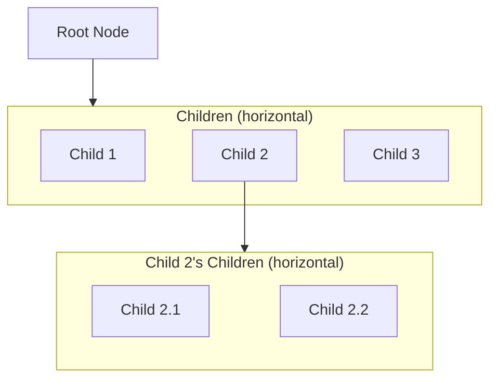
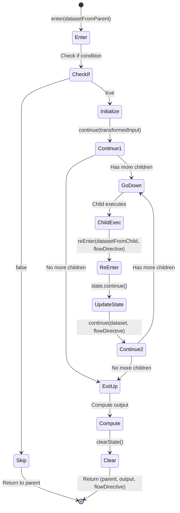
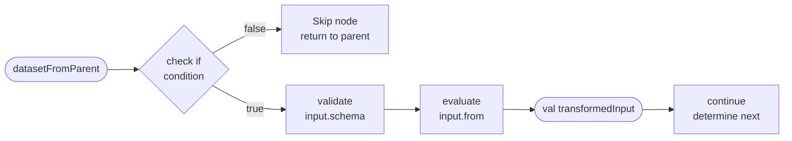

# Workflow Execution: Formal Model

This document provides a formal, functional description of how Lemline executes workflows as tree traversal with dataset
transformation.

## Table of Contents

1. [Core Concepts](#core-concepts)
    - Workflow Structure
    - Instance State
    - Dataset
    - FlowDirective
2. [Traveling through the Tree](#traveling-through-the-tree)
    - Main Execution Loop
    - The Run Function
3. [Node Entry and Exit](#node-entry-and-exit)
    - Enter from Up
    - Enter from Down
    - Continue Function
    - Exit to Up Function
4. [Node Type Implementations](#node-type-implementations)
    - DoTask, ForTask, SwitchTask, TryTask, ActivityTask
5. [Dataset Transformation Pipeline](#dataset-transformation-pipeline)
6. [Expression Evaluation Scope](#expression-evaluation-scope)
    - Scope vs Dataset
    - Scope Structure
    - Task Descriptor
    - Hierarchical Scope Building
    - Where Scope is Used
    - ForTask Scope Examples
    - Scope and Dataset Interaction
7. [Complete Example](#complete-example)
8. [Summary](#summary)

---

## Core Concepts

### Workflow Structure

A workflow is represented as a **tree of Nodes**:



**Properties**:

- Each node has a **unique position** in the tree
- Each node has **internal state** (structure depends on node type)
- Nodes may have **0 or more children** (horizontally aligned below parent)
- Execution starts at the **root node**

### Instance State

The complete execution state is represented as:

```
InstanceState = (currentNode, states)
```

Where:

- `currentNode`: Node<*> - Currently executing node (immutable topology)
- `states`: Map<NodePosition, NodeState> - Runtime state for each active node

**Key Separation**:

- `Node<*>` represents the **immutable workflow topology** (what tasks exist, their structure)
- `Map<NodePosition, NodeState>` represents the **mutable runtime state** (where we are in execution)

**Invariant**: The instance state must always be **consistent** - the `states` map must contain valid state for
`currentNode` and all its ancestors.

### Dataset

A **dataset** (JSON value) is transported and transformed as execution moves through the tree:

```
Dataset = JsonElement
```

The dataset flows:

- **Down**: From parent to child
- **Up**: From child to parent

### FlowDirective

A **FlowDirective** is a navigation instruction that guides execution flow after a task completes. It is defined in the
task's `.then` field.

**Possible Values**:

- `null` or `CONTINUE`: Continue to next sibling in parent's child list
- `EXIT`: Return to parent immediately
- `END`: Return to root (complete workflow)
- `"taskName"`: Jump to specific sibling task by name

**Example**:

```yaml
do:
    -   processOrder:
            set: { status: "processed" }
            then: notifyCustomer  # FlowDirective: jump to sibling "notifyCustomer"

    -   validateOrder:
            if: .needsValidation
            call: http
            then: exit  # FlowDirective: return to parent immediately
```

---

## Traveling through the Tree

### Main Execution Loop

The workflow execution is a loop that repeatedly calls the `run` function until completion, with exception handling for
error recovery:

```
execute(workflow, input):
    current = workflow.rootNode
    currentPosition = [0]  // Root position
    states = emptyMap()
    dataset = input
    flowDirective = null

    while current is not null:
        try:
            // Execute current node - pure function returns delta
            (current, dataset, deltaStates, flowDirective) =
                run(current, dataset, states, flowDirective)

            // Apply state changes atomically (creates new map)
            states = applyDelta(states, deltaStates)

            // ← Checkpoint here for workflow persistence (state is consistent)

        catch exception:
            // Handle exception - states is unchanged since run() is pure
            (current, dataset, states, flowDirective) =
                handleException(current, states, exception)

    return dataset  // Final workflow output

applyDelta(states, deltaStates):
    result = states.toMutableMap()
    for (position, state) in deltaStates:
        if state is null:
            result.remove(position)  // Delete state
        else:
            result[position] = state  // Update or insert state
    return result
```

**Key Points**:

- Each iteration processes one execution step
- **Pure Function**: `run()` takes immutable inputs and returns new values (no side effects)
- **Delta States**: Only changed states are returned, making mutations explicit
- **No Clone Needed**: Since `run()` is pure, `states` remains unchanged on exception - no need to clone
- **Atomic Updates**: `applyDelta()` creates a new states map - either apply all changes or none
- **Checkpointing**: After applying delta, state is consistent for persistence
- Loop terminates when `current` becomes `null` (workflow complete)
- Dataset flows as function parameters (functional, no storage)

### The Run Function

The `run` function determines whether to enter a node for the first time or re-enter after a child. It is a **pure
function** - takes immutable inputs and returns new values without side effects:

```
run(currentNode, dataset, states, flowDirective):
    val scope = getScope(currentNode, states)
    
    if currentState is null:
        // First time entering this node - doesn't need states
        return enter(currentNode, dataset, scope)
    else:
        val currentState = states[currentNode.position]
        // Re-entering after a child - needs states for scope
        return reEnter(currentNode, dataset, currentState, scope, flowDirective)
```

**Parameters**:

- `currentNode`: Node<*> - The current node (immutable topology)
- `dataset`: JsonElement - Data flowing into this node
- `states`: Map<NodePosition, NodeState> - All active node states
- `flowDirective`: FlowDirective - Navigation instruction

**Returns**: `RunResult(nextNode, dataset, deltaStates, flowDirective)` where:

- `nextNode`: Node<*>? - Next node to execute (null if workflow complete)
- `dataset`: JsonElement - Transformed dataset
- `deltaStates`: Map<NodePosition, NodeState?> - State changes (null value = deletion)
- `flowDirective`: FlowDirective - Next navigation instruction

---

## Node Entry and Exit

### Pure Functions with Scope Building

The execution model uses **pure functions** that take states as input and return delta states as output:

**Pure Orchestration Functions**:

- `enter(node, dataset, scope)` - Entry from parent (no states needed - node has no state yet)
- `reEnter(node, dataset, currentState, scope, flowDirective)` - Re-entry from child (needs states for scope)
- `continue(node, dataset, currentState, flowDirective)` - Navigation decision
- `exitToUp(node, dataset, currentState)` - Exit to parent
- `run(node, dataset, states, flowDirective)` - Main dispatcher

All return: `(nextNode, dataset, deltaStates, flowDirective)`

**Helper Functions** (Scope-Dependent Operations):

- `checkIf(node, dataset, scope)` - Evaluate `if` condition (needs scope)
- `validateInput(node, dataset, scope)` - Validate input schema (needs scope for context)
- `evaluateInput(node, dataset, scope)` - Transform input with `input.from` (needs scope)
- `validateOutput(node, output, scope)` - Validate output schema (needs scope for context)
- `evaluateOutput(node, output, scope)` - Transform output with `output.as` (needs scope)
- `execute(node, input, scope)` - Execute action (might need scope for context)

**Building Scope**:

Scope is computed differently depending on whether the node has state yet:

```
// For enter() - node has no state yet, build from parent chain only
buildScopeForEnter(node):
    // Start with empty scope for this node (no state yet)
    val scope = {
        $context: workflow.context,
        $input: null,  // Will be set after input transformation
        $output: null,
        $task: {
            name: node.name,
            reference: node.reference,
            definition: node.definition,
            input: null,
            output: null,
            startedAt: null
        },
        $workflow: ...,
        $runtime: ...,
        $secrets: ...,
        $authorization: ...
    }

    // Recursively merge with parent scope (if parent exists and has state)
    if node.parent is not null:
        scope.merge(buildScope(node.parent, getStatesFromContext()))

    return scope

// For reEnter() - node has state, build from states map
buildScope(node, states):
    // Get current node's state
    val currentState = states[node.position]

    return buildScopeFromState(node, currentState, states)

// For exitToUp() and continue() - node has state, build from single state
buildScopeFromState(node, currentState):
    // Start with node-specific variables
    val scope = node.buildNodeVariables(currentState)  // e.g., $item, $index

    // Merge current task descriptor
    scope.merge({
        $task: buildTaskDescriptor(node, currentState),
        $input: currentState.rawInput,
        $output: currentState.rawOutput,
        $context: workflow.context,
        $workflow: ...,
        $runtime: ...,
        $secrets: ...,
        $authorization: ...
    })

    // Recursively merge with parent scope (if parent exists and has state)
    if node.parent is not null:
        scope.merge(buildScopeForParent(node.parent))

    return scope
```

This creates a scope chain where inner tasks can access outer task variables and metadata. Three variants:

- `buildScopeForEnter(node)` - For first entry, node has no state yet
- `buildScopeFromState(node, currentState)` - For operations with current state available
- `buildScope(node, states)` - For operations with full states map (convenience wrapper)

### Entry Points

A node can be entered from two directions:

#### Enter from Up (from parent)

Called when entering a node for the first time from its parent. This is a **pure function** - it computes new state
without mutating the input.

```
enter(node, datasetFromParent, flowDirective):
    // ===========================================
    // PHASE 1: Conditional Check
    // ===========================================

    // Build scope from parent chain (node has no state yet)
    val scope = buildScopeForEnter(node)

    // Check if condition - skip if false
    if not checkIf(node, datasetFromParent, scope):
        // Skip this node entirely (no state initialization, no delta)
        // Return to parent - parent.continue() will advance to next sibling
        return (node.parent, datasetFromParent, emptyMap(), FlowDirective.Continue)

    // ===========================================
    // PHASE 2: Initialize Node State
    // ===========================================

    // Validate input against schema (throws ValidationError)
    validateInput(node, datasetFromParent, scope)

    // Apply input transformation (throws ExpressionError)
    val transformedInput = evaluateInput(node, datasetFromParent, scope)

    // Create initial node state
    val newState = node.createInitialState(
        startedAt = now(),
        rawInput = datasetFromParent,
        transformedInput = transformedInput
    )

    // Delta: add new state for this node
    val deltaStates = mapOf(node.position -> newState)

    // ===========================================
    // PHASE 3: Determine Next Step
    // ===========================================

    // Delegate to continue() to decide where to go
    val (nextNode, nextDataset, continueDeltas, nextFlowDirective) =
        continue(node, transformedInput, newState, FlowDirective.Continue)

    // Merge deltas
    val mergedDeltas = deltaStates + continueDeltas

    return (nextNode, nextDataset, mergedDeltas, nextFlowDirective)
```

**Parameters**:

- `node`: Node<*> - The node being entered
- `datasetFromParent`: JsonElement - Parent's output (becomes this node's input)
- `flowDirective`: FlowDirective - Navigation instruction (usually Continue)

**Returns**: `(nextNode, dataset, deltaStates, flowDirective)` tuple

**Phases**:

1. **Conditional Check**: Evaluate `if` condition using parent scope, skip if false (no state changes)
2. **Initialize**: Create initial state with startedAt, rawInput, transformedInput
3. **Navigate**: Call `continue()` with new state to decide next node, merge deltas

#### Enter from Down (from child)

Called when returning to a node after a child completes. This is a **pure function** - it computes updated state without
mutating the input.

```
reEnter(node, datasetFromChild, states, currentState, flowDirective):
    // ===========================================
    // Update Node State
    // ===========================================

    // Update state based on child's result
    // (node-type-specific: may store result, update indices, etc.)
    val updatedState = node.updateStateAfterChild(currentState, datasetFromChild)

    // Delta: update this node's state
    val deltaStates = mapOf(node.position -> updatedState)

    // ===========================================
    // Determine Next Step
    // ===========================================

    // Update states with new state for continue() call
    val updatedStates = states + deltaStates

    // Delegate to continue() to decide where to go
    val (nextNode, nextDataset, continueDeltas, nextFlowDirective) =
        continue(node, datasetFromChild, updatedStates, updatedState, flowDirective)

    // Merge deltas
    val mergedDeltas = deltaStates + continueDeltas

    return (nextNode, nextDataset, mergedDeltas, nextFlowDirective)
```

**Parameters**:

- `node`: Node<*> - The node being re-entered
- `datasetFromChild`: JsonElement - Child's output result
- `states`: Map<NodePosition, NodeState> - Current states map
- `currentState`: NodeState - This node's current state
- `flowDirective`: FlowDirective - Navigation instruction from child's `.then` field

**Returns**: `(nextNode, dataset, deltaStates, flowDirective)` tuple

**Purpose**:

- Update node's state based on child result (pure - creates new state)
- Delegate navigation decision to `continue()`, merge deltas

### Continue Function

Determines the next step based on FlowDirective and node state. This is a **pure function** - computes navigation
without mutating state.

```
continue(node, datasetForNavigation, currentState, flowDirective):
    when(flowDirective):
      : End ->
          // Workflow complete - recursive unwinding
          return (node.parent, datasetForNavigation, emptyMap(), End)

      : Exit ->
          // Exit to parent immediately
          return exitToUp(node, datasetForNavigation, currentState)

      : $name, Continue ->
          // Compute next state based on flowDirective
          val updatedState = node.advanceState(currentState, flowDirective)

          // Check if node has more work to do
          if node.shouldExit(updatedState):
              // Done - exit to parent
              val (nextNode, dataset, exitDeltas, nextFlow) =
                  exitToUp(node, datasetForNavigation, updatedState)

              // Merge state update with exit deltas
              val deltaStates = mapOf(node.position -> updatedState) + exitDeltas
              return (nextNode, dataset, deltaStates, nextFlow)
          else:
              // More work - go to next child
              val nextChild = node.getChild(updatedState.nextChildIndex())

              // Delta: update this node's state
              val deltaStates = mapOf(node.position -> updatedState)

              return (nextChild, datasetForNavigation, deltaStates, FlowDirective.Continue)
```

**Parameters**:

- `node`: Node<*> - The current node
- `datasetForNavigation`: JsonElement - Dataset to use for navigation
- `currentState`: NodeState - This node's current state
- `flowDirective`: FlowDirective - Navigation instruction

**Returns**: `(nextNode, dataset, deltaStates, flowDirective)` tuple

**Logic**:

1. **End**: Recursive unwinding to root (parent's parent will eventually be null)
2. **Exit**: Exit immediately to parent via `exitToUp()`
3. **$name / Continue**: Compute next state, check if done, go to next child or exit

### Exit to Up Function

Computes output and returns to parent. This is a **pure function** - computes output and returns delta indicating state
deletion.

```
exitToUp(node, datasetForExit, currentState):
    // ===========================================
    // Compute Output
    // ===========================================

    // Build scope from current state (node is exiting, has state)
    val scope = buildScopeFromState(node, currentState)

    // Execute action (eg. HTTP call, Set, throws ActionError)
    val rawOutput = execute(node, datasetForExit, scope)

    // Apply output transformation (throws ExpressionError)
    val transformedOutput = evaluateOutput(node, rawOutput, scope)

    // Validate output schema (throws ValidationError)
    validateOutput(node, transformedOutput, scope)

    // ===========================================
    // Prepare Return
    // ===========================================

    // Delta: remove this node's state (cleanup)
    val deltaStates = mapOf(node.position -> null)

    // Return to parent with flowDirective from node definition
    return (node.parent, transformedOutput, deltaStates, node.definition.then)
```

**Parameters**:

- `node`: Node<*> - The node that is exiting
- `datasetForExit`: JsonElement - Dataset to use for computing output
- `currentState`: NodeState - This node's current state

**Returns**: `(parent, transformedOutput, deltaStates, flowDirective)` tuple

**Flow**: `datasetForExit` → action → `rawOutput` → transform → `transformedOutput` → validate

**State Cleanup**: Returns `deltaStates` with `null` value to remove this node's state from the map

### Execution State Machine



**Legend**:

- **Enter**: First visit from parent
- **ReEnter**: Returning from child
- **Continue**: Determine next step based on state and flowDirective
- **ExitUp**: Compute output and return to parent

---

## Error Handling

### Exception Flow

When an exception occurs during workflow execution, the error handling mechanism determines how to proceed:

```
handleException(current, dataset, exception):
    // Find the nearest TryTask that can handle this error (retry or catch)
    val tryTask = findHandlingTry(current, exception)

    if tryTask is not null:
        // Check if should retry before catching
        if tryTask.state.shouldRetry():
            // Reset state and retry the try block
            return retryTryBlock(tryTask, current)
        else:
            // Retries exhausted or not configured - transition to catch block
            return enterCatch(tryTask, current, exception)
    else:
        // No try/catch block found - workflow fails
        throw WorkflowFailedException(exception)
```

### Finding a Handling Try Block

Walk up the parent chain to find a TryTask that can either retry or catch the error:

```
findHandlingTry(node, exception):
    if node is null:
        return null  // No try block found

    if node is TryTask:
        // Check if this TryTask can handle the error (retry or catch)
        if node.state.shouldRetry() or node.canCatch(exception):
            return node
        // Otherwise, continue searching up the chain

    return findHandlingTry(node.parent, exception)
```

### Retrying Try Block

When a TryTask should retry, reset state and return to the try body with the original input:

```
retryTryBlock(tryTask, failingNode):
    // Reset state from failing node up to try body (exclusive)
    resetStateUpTo(failingNode, tryTask.doBody)

    // Increment attempt counter
    tryTask.state.attemptIndex++

    // Get the try body to execute again
    val tryBody = tryTask.state.nextChild()  // Returns doBody when not in catch mode

    // Return tuple to re-execute try block with ORIGINAL input (not current dataset)
    return (tryBody, tryTask.state.transformedInput, FlowDirective.Continue)
```

**Note**: `resetStateUpTo()` clears the state of all nodes from `failingNode` up to (but not including)
`tryTask.doBody`, ensuring a clean retry.

### Entering Catch Block

When retries are exhausted and a catch block exists, transition to the appropriate catch block:

```
enterCatch(tryTask, failingNode, exception):
    // Reset state from failing node up to try body (exclusive)
    resetStateUpTo(failingNode, tryTask.doBody)

    // Prepare dataset with error information merged into ORIGINAL input
    val datasetWithError = tryTask.state.transformedInput.merge({
        error: {
            type: exception.type,
            status: exception.status,
            title: exception.title,
            details: exception.details
        }
    })

    // Update TryTask state to enter catch mode (also clears transformedInput)
    tryTask.state.enterCatch(exception)

    // Get the matching catch block child
    val catchBlock = tryTask.state.nextChild()

    // Return tuple to continue execution in catch block
    return (catchBlock, datasetWithError, FlowDirective.Continue)
```

**Note**: The catch block receives the TryTask's original `transformedInput` plus error information, not the dataset
from wherever the exception occurred.

**Key Points**:

- **State Rollback**: Before `handleException()` is called, the failing node's state has been restored by the main loop
- **State Reset for Retry/Catch**: Both `retryTryBlock()` and `enterCatch()` reset state from the failing node up to the
  try body, ensuring clean re-execution
- **Original Input**: TryTask stores `transformedInput` to provide the same starting dataset for all retries and the
  catch block
- **Retry First**: TryTask attempts retries before entering catch blocks
- **Attempt Counting**: Each retry increments `attemptIndex` (done in `retryTryBlock()`)
- **Error Context**: The catch block receives the TryTask's original `transformedInput` plus error information, not the
  dataset from where the exception occurred
- **Memory Optimization**: `transformedInput` is cleared when entering catch mode (no longer needed)
- **Parent Chain**: TryTask doesn't need to be the immediate parent - can be any ancestor
- **Type Matching**: Each catch block specifies which error types it handles (e.g., validation errors, runtime errors)

---

## Node Type Implementations

Each node type implements the execution interface with type-specific behavior. The node's `.state` structure and the
implementation of key methods vary by type.

### State Architecture

Node state is represented as simple data classes, one per node type. State is **external to nodes** - stored in a
`Map<NodePosition, NodeState>` that is passed to pure functions.

**Key Design Principles**:

- **External State**: State is NOT embedded in `Node<*>` objects. Nodes are immutable topology.
- **Simple Data Classes**: Each node type defines its own state data class (e.g., `DoState`, `ForState`)
- **Pure Operations**: All state operations are pure functions that create new state objects
- **Explicit Changes**: Functions return `deltaStates` to show exactly what changed

**Common State Fields**:

All node states typically contain:

```kotlin
data class XxxState(
    val startedAt: Instant,           // When node started
    val rawInput: JsonElement,        // Original input (for $input scope variable)
    val transformedInput: JsonElement, // After input.from transformation
    // ... node-specific fields ...
)
```

**Node-Specific Fields**:

- `DoState`: `childIndex: Int` - Current child position
- `ForState`: `collection: List<JsonElement>, forIndex: Int` - Iteration state
- `SwitchState`: `selectedCase: Int, hasExecuted: Boolean` - Case selection state
- `TryState`: `maxAttempts: Int, attemptIndex: Int, inCatch: Boolean, catchIndex: Int, lastError: WorkflowError?` -
  Retry/catch state
- `ActivityState`: No additional fields (executes once)

**Serialization Considerations**:

When persisting workflow state for resumption (e.g., to database or message broker), the entire states map is
serialized. Some fields like `collection`, `transformedInput`, and `maxAttempts` are computed once and don't change
during execution. These could potentially be recomputed on resume rather than serialized, but this requires:

- Re-evaluating expressions (which must be deterministic)
- Re-loading workflow definition
- Additional complexity in the resume logic

The pure functional model makes this optimization decision independent of the core execution logic. You can choose to:

1. **Serialize everything** - Simpler, self-contained state
2. **Serialize minimal state** - Recompute derived fields on resume (smaller messages/storage)
3. **Use compression** - Serialize everything but compress (balanced approach)

### Pure State Operations

Each node type implements pure functions for state management:

```kotlin
// Create initial state when entering node
fun Node.createInitialState(
    startedAt: Instant,
    rawInput: JsonElement,
    transformedInput: JsonElement
): NodeState

// Update state after child completes
fun Node.updateStateAfterChild(
    currentState: NodeState,
    datasetFromChild: JsonElement
): NodeState

// Advance state for navigation
fun Node.advanceState(
    currentState: NodeState,
    flowDirective: FlowDirective
): NodeState

// Check if node is done
fun Node.shouldExit(state: NodeState): Boolean

// Build node-specific scope variables
fun Node.buildNodeVariables(state: NodeState): Map<String, JsonElement>
```

**Key Benefits**:

- **Pure Functions**: No side effects, easy to test
- **Explicit State**: All state is visible in the states map
- **Flexible Serialization**: Serialize the entire states map or individual states
- **Separation of Concerns**: Topology (Node) vs Runtime (State) clearly separated

### DoTask (Sequential Execution)

Executes children sequentially in order.

**State Type**:

```kotlin
// Node state - serialized for resumption
data class DoState(
    val startedAt: Instant,           // When task started
    val rawInput: JsonElement,        // Original input
    val transformedInput: JsonElement, // After input.from transformation
    val childIndex: Int               // Current child position
)
```

**Pure State Operations**:

```kotlin
// Create initial state (called by enter())
fun DoNode.createInitialState(
    startedAt: Instant,
    rawInput: JsonElement,
    transformedInput: JsonElement
): DoState = DoState(
    startedAt = startedAt,
    rawInput = rawInput,
    transformedInput = transformedInput,
    childIndex = 0  // Start with first child
)

// Update state after child completes (called by reEnter())
fun DoNode.updateStateAfterChild(
    currentState: DoState,
    datasetFromChild: JsonElement
): DoState = currentState  // No change - DoTask doesn't store child results

// Advance state for navigation (called by continue())
fun DoNode.advanceState(
    currentState: DoState,
    flowDirective: FlowDirective
): DoState = when (flowDirective) {
    is Continue -> currentState.copy(childIndex = currentState.childIndex + 1)
    is Goto -> currentState.copy(childIndex = findChildIndex(flowDirective.taskName))
    else -> currentState
}

// Check if done
fun DoNode.shouldExit(state: DoState): Boolean =
    state.childIndex >= children.size
```

### ForTask (Iteration)

Executes child repeatedly for each item in a collection.

**State Type**:

```kotlin
// Node state - serialized for resumption
data class ForState(
    val startedAt: Instant,           // When task started
    val rawInput: JsonElement,        // Original input
    val transformedInput: JsonElement, // After input.from transformation
    val collection: List<JsonElement>, // Computed from for.in expression
    val forIndex: Int                 // Current iteration index
)
```

**Pure State Operations**:

```kotlin
// Create initial state (called by enter())
fun ForNode.createInitialState(
    startedAt: Instant,
    rawInput: JsonElement,
    transformedInput: JsonElement
): ForState {
    // Evaluate collection expression once at initialization
    val scope = buildScope(this, emptyMap())  // No parent state yet
    val collection = evaluateExpression(definition.for. in, transformedInput, scope)

    return ForState(
        startedAt = startedAt,
        rawInput = rawInput,
        transformedInput = transformedInput,
        collection = collection.asJsonArray().toList(),
        forIndex = 0  // Start with first item
    )
}

// Update state after child completes (called by reEnter())
fun ForNode.updateStateAfterChild(
    currentState: ForState,
    datasetFromChild: JsonElement
): ForState = currentState  // No change - advance happens in advanceState()

// Advance state for navigation (called by continue())
fun ForNode.advanceState(
    currentState: ForState,
    flowDirective: FlowDirective
): ForState = currentState.copy(forIndex = currentState.forIndex + 1)

// Check if done
fun ForNode.shouldExit(state: ForState): Boolean {
    if (state.forIndex >= state.collection.size) return true

    // Check while condition if present
    if (definition.for. while != null) {
        val scope = buildScopeWithIteration(state)
        return !evaluateExpression(definition.for. while, state.transformedInput, scope)
    }

    return false
}

// Build node-specific scope variables (for buildScope())
fun ForNode.buildNodeVariables(state: ForState): Map<String, JsonElement> {
    if (state.forIndex >= state.collection.size) return emptyMap()

    val itemName = definition.for. each ?: "item"
    val indexName = definition.for. at ?: "index"

    return mapOf(
        itemName to state.collection[state.forIndex],
        indexName to JsonPrimitive(state.forIndex)
    )
}
```

**Important Notes**:

- **Iteration Variables**: `for.each` (default: `item`) and `for.at` (default: `index`) are **scope variables**, not
  dataset fields. Children access them via expressions (e.g., `.item.id`), but they are not merged into the dataset.
- **Dataset Flow Across Iterations**: Each iteration receives the previous iteration's output as input. The first
  iteration receives the ForTask's `transformedInput`.
- **Dataset Flow Within Iteration**: Like any DoTask, the first child receives the iteration's input, subsequent
  children receive the previous child's output.
- **Output Semantics**: ForTask returns the **last child's output from the last iteration**. This is standard flow task
  behavior.

**Scope Management**:

ForTask adds iteration variables to the scope at the start of each iteration:

```
// Computed when entering child (at start of iteration)
scope[$item] = collection[forIndex]    // Default name: "item" (or custom from for.each)
scope[$index] = forIndex               // Default name: "index" (or custom from for.at)
```

Children can then access these via expressions:

- `.item.id` - Access current item's id field
- `.index` - Access current iteration index (0-based)
- `$task.input` - Access task's raw input (via scope, not dataset)

The scope is hierarchical, so children also have access to:

- Parent ForTask's iteration variables (if nested)
- All ancestor task descriptors (`$task.*`)
- Workflow context (`$context`, `$workflow.*`)

### SwitchTask (Conditional Branching)

Evaluates cases and executes one branch.

**State Type**:

```kotlin
// Node state - serialized for resumption
data class SwitchState(
    val startedAt: Instant,           // When task started
    val rawInput: JsonElement,        // Original input
    val transformedInput: JsonElement, // After input.from transformation
    val selectedCase: Int,            // Which case was selected
    val hasExecuted: Boolean          // Whether the case has been executed
)
```

**Pure State Operations**:

```kotlin
// Create initial state (called by enter())
fun SwitchNode.createInitialState(
    startedAt: Instant,
    rawInput: JsonElement,
    transformedInput: JsonElement
): SwitchState {
    // Evaluate cases to find first match
    val scope = buildScope(this, emptyMap())
    val selectedCase = selectCase(transformedInput, scope)

    return SwitchState(
        startedAt = startedAt,
        rawInput = rawInput,
        transformedInput = transformedInput,
        selectedCase = selectedCase,
        hasExecuted = false
    )
}

// Helper to select matching case
fun SwitchNode.selectCase(
    dataset: JsonElement,
    scope: Scope
): Int {
    for ((index, case) in definition.switch.withIndex()) {
        if (case.`when` == null || evaluateExpression(case.`when`, dataset, scope)) {
            return index
        }
    }
    throw Error("No switch case matched")
}

// Update state after child completes (called by reEnter())
fun SwitchNode.updateStateAfterChild(
    currentState: SwitchState,
    datasetFromChild: JsonElement
): SwitchState = currentState.copy(hasExecuted = true)

// Advance state for navigation (called by continue())
fun SwitchNode.advanceState(
    currentState: SwitchState,
    flowDirective: FlowDirective
): SwitchState = currentState  // No advancement - switches execute once

// Check if done
fun SwitchNode.shouldExit(state: SwitchState): Boolean = state.hasExecuted
```

**Note**: Uses the selected case's `.then` flowDirective to navigate after execution.

### TryTask (Error Handling)

Attempts execution with catch blocks for errors.

**State Type**:

```kotlin
// Node state - serialized for resumption
data class TryState(
    val startedAt: Instant,           // When task started
    val rawInput: JsonElement,        // Original input
    val transformedInput: JsonElement, // After input.from transformation (for retries)
    val maxAttempts: Int,             // Retry limit from definition
    val attemptIndex: Int,            // Current retry attempt (0-based)
    val inCatch: Boolean,             // Whether in catch block
    val catchIndex: Int,              // Which catch block is active (-1 if not in catch)
    val lastError: WorkflowError?     // Last caught error (for context)
)
```

**Pure State Operations**:

```kotlin
// Create initial state (called by enter())
fun TryNode.createInitialState(
    startedAt: Instant,
    rawInput: JsonElement,
    transformedInput: JsonElement
): TryState {
    val maxAttempts = definition.retry?.limit ?: 1

    return TryState(
        startedAt = startedAt,
        rawInput = rawInput,
        transformedInput = transformedInput,  // Store for retries
        maxAttempts = maxAttempts,
        attemptIndex = 0,
        inCatch = false,
        catchIndex = -1,
        lastError = null
    )
}

// Update state after child completes (called by reEnter())
fun TryNode.updateStateAfterChild(
    currentState: TryState,
    datasetFromChild: JsonElement
): TryState {
    if (currentState.inCatch) {
        // Catch block completed - no state change
        return currentState
    } else {
        // Try block completed successfully - skip retries
        return currentState.copy(attemptIndex = currentState.maxAttempts)
    }
}

// Advance state for navigation (called by continue())
fun TryNode.advanceState(
    currentState: TryState,
    flowDirective: FlowDirective
): TryState = currentState  // No advancement needed

// Check if done
fun TryNode.shouldExit(state: TryState): Boolean {
    if (state.inCatch) return true  // Catch block completed
    if (state.attemptIndex >= state.maxAttempts) return true  // Try succeeded or retries exhausted
    return false
}

// Check if should retry (called by handleException)
fun TryNode.shouldRetry(state: TryState): Boolean =
    state.attemptIndex < state.maxAttempts

// Create state for retry (called by retryTryBlock)
fun TryNode.incrementAttempt(state: TryState): TryState =
    state.copy(attemptIndex = state.attemptIndex + 1)

// Create state for catch (called by enterCatch)
fun TryNode.enterCatch(
    state: TryState,
    exception: WorkflowError
): TryState {
    val catchIndex = findMatchingCatch(exception)

    return state.copy(
        inCatch = true,
        catchIndex = catchIndex,
        lastError = exception
    )
}

// Helper to find matching catch block
fun TryNode.findMatchingCatch(exception: WorkflowError): Int {
    for ((index, catchDef) in definition.catch.withIndex()) {
        if (catchDef.errors == null || catchDef.errors.contains(exception.type)) {
            return index
        }
    }
    throw Error("No matching catch block")
}
```

**TryTask Methods**:

```kotlin
// Check if this TryTask can catch the given exception
canCatch(exception):
// If no catch blocks defined, cannot catch
if node.definition.catch is null or node.definition.catch.isEmpty():
return false

// Check if any catch block matches this error type
for catchDef in node.definition.catch:
// Catch block with no error filter catches all errors
if catchDef.errors is null:
return true
// Check if error type matches
if catchDef.errors.contains(exception.type):
return true

return false  // No matching catch block
```

**Important Notes**:

- **Stored Input**: TryTask stores `transformedInput` to provide consistent input for retries and catch blocks. This is
  the only flow task that stores input.
- **Retry First**: When the try body throws an exception, `handleException()` checks `shouldRetry()` before entering
  catch. If retries remain, `retryTryBlock()` resets state, increments `attemptIndex`, and re-executes the try body with
  the stored `transformedInput`.
- **State Reset**: Both retry and catch operations reset the state of all nodes from the failing node up to (but not
  including) the try body, ensuring clean re-execution.
- **Catch After Retries**: Only when `attemptIndex >= maxAttempts` (retries exhausted) does `handleException()` call
  `enterCatch()` to transition to the catch block.
- **Error Type Matching**: Each catch block can specify which error types it handles (validation, runtime, etc.) or
  catch all errors.
- **Dataset Flow**:
    - Retries receive the stored `transformedInput` (no error info)
    - Catch blocks receive the stored `transformedInput` plus error information merged in
    - After entering catch, `transformedInput` is cleared to save memory

### ActivityTask (Leaf Nodes)

Tasks with actions but no children (Set, CallHTTP, Emit, etc.).

**State Type**:

```kotlin
// Node state - serialized for resumption
data class ActivityState(
    val startedAt: Instant,           // When task started
    val rawInput: JsonElement,        // Original input
    val transformedInput: JsonElement // After input.from transformation
)
```

**Pure State Operations**:

```kotlin
// Create initial state (called by enter())
fun ActivityNode.createInitialState(
    startedAt: Instant,
    rawInput: JsonElement,
    transformedInput: JsonElement
): ActivityState = ActivityState(
    startedAt = startedAt,
    rawInput = rawInput,
    transformedInput = transformedInput
)

// Update state after child completes (called by reEnter())
// Not applicable - activity tasks have no children

// Advance state for navigation (called by continue())
fun ActivityNode.advanceState(
    currentState: ActivityState,
    flowDirective: FlowDirective
): ActivityState = currentState  // No advancement

// Check if done - always exit immediately
fun ActivityNode.shouldExit(state: ActivityState): Boolean = true
```

**Note**: Activity tasks execute their action (Set, CallHTTP, etc.) in `exitToUp()` and immediately return to parent.
Since `shouldExit()` returns true, `continue()` always calls `exitToUp()`.

---

## Dataset Transformation Pipeline

The dataset flows functionally through the execution - transformed but never stored. Only execution progress (`.state`)
is persisted.

### Data Flow: Enter from Up



**Key Points**:

- `datasetFromParent` is a parameter (not stored)
- `transformedInput` is a local variable (not stored)
- Only `.startedAt` and `.state` are persisted

### Data Flow: Re-enter from Child


**Key Points**:

- `datasetFromChild` is a parameter
- `state.continue()` may store child result in state (node-type-specific)
- Dataset flows through to `continue()`

### Data Flow: Exit to Up


**Key Points**:

- `rawOutput` and `transformedOutput` are local variables (not stored)
- `flowDirective` extracted from task definition
- State is cleared before returning

---

## Expression Evaluation Scope

Throughout workflow execution, expressions need access to contextual data beyond just the dataset that flows through the
tree. This contextual data is provided through a **scope** - a hierarchical structure that contains task metadata,
workflow state, and node-specific variables.

### Scope vs Dataset

**Dataset** and **Scope** serve different purposes:

| Aspect       | Dataset                                  | Scope                                     |
|--------------|------------------------------------------|-------------------------------------------|
| **Purpose**  | Data being transformed by workflow       | Context for expression evaluation         |
| **Flow**     | Flows through tree as function parameter | Computed per node from hierarchical chain |
| **Storage**  | Not stored (functional parameter)        | Not stored (computed from state)          |
| **Access**   | Via `.fieldName` expressions             | Via `$variable` expressions               |
| **Mutation** | Transformed by tasks                     | Read-only during expression evaluation    |

**Example**:

```yaml
do:
    -   processItem:
            set:
                # Dataset access: .order.id
                # Reads from the dataset flowing into this task
                orderId: .order.id

                # Scope access: $task.name
                # Reads from the task descriptor in the scope
                taskName: $task.name

                # Mixed: evaluates against dataset, but scope provides $context
                total: .price + $context.taxRate
```

### Scope Structure

The scope contains the following top-level variables:

```
Scope = {
  $context: JsonObject           // Workflow-level exported values (from export.as)
  $input: JsonElement            // Current task's raw input
  $output: JsonElement?          // Current task's raw output (nullable, only available after execution)
  $secrets: Map<String, *>       // Secret values (e.g., API keys)
  $task: TaskDescriptor          // Current task metadata
  $workflow: WorkflowDescriptor  // Workflow metadata and state
  $runtime: RuntimeDescriptor    // Runtime information (timestamps, etc.)
  $authorization: AuthorizationDescriptor  // Authentication/authorization context

  // Plus node-specific variables:
  $item: JsonElement?            // Current item in ForTask iteration
  $index: Int?                   // Current index in ForTask iteration
  // ... other node-specific variables
}
```

### Task Descriptor ($task.*)

The task descriptor provides metadata about the currently executing task:

```
TaskDescriptor = {
  name: String              // Task name (e.g., "validateOrder")
  reference: String         // Unique task reference ID
  definition: JsonObject    // Full task definition from workflow DSL
  input: JsonElement?       // Task's raw input (before input.from transformation)
  output: JsonElement?      // Task's raw output (before output.as transformation, nullable)
  startedAt: JsonObject?    // Timestamp when task started (ISO-8601 format)
}
```

**Usage Examples**:

- `$task.name` - Get current task name
- `$task.input.orderId` - Access raw input before transformation
- `$task.startedAt` - Get task start timestamp
- `$task.definition.then` - Access task's flow directive

### Hierarchical Scope Building

The scope is built hierarchically, merging node-specific variables with task context and parent scopes:

```
buildScope(node):
  // Start with node-specific variables
  scope = node.variables  // e.g., {$item: ..., $index: ...} for ForTask

  // Merge current task context
  scope = scope.merge({
    $context: workflow.context,
    $input: node.rawInput,
    $output: node.rawOutput,
    $task: {
      name: node.name,
      reference: node.reference,
      definition: node.definition,
      input: node.rawInput,
      output: node.rawOutput,
      startedAt: node.startedAt
    },
    $workflow: ...,
    $runtime: ...,
    $secrets: ...,
    $authorization: ...
  })

  // Recursively merge with parent scope
  if node.parent is not null:
    scope = scope.merge(node.parent.scope)

  return scope
```

**Merge Semantics**: When merging scopes, child values take precedence over parent values. This means:

- Inner tasks can override outer task variables (if they define the same variable name)
- Each task's `$task.*` refers to its own metadata, not its parent's
- Node-specific variables (like `$item`) are scoped to their defining node and descendants

### Where Scope is Used

Scope is used throughout expression evaluation:

1. **Conditional Check** (`if` expression):
   ```yaml
   validateOrder:
     if: .order.total > 100 and $context.validateLargeOrders == true
   ```

2. **Input Transformation** (`input.from` expression):
   ```yaml
   processOrder:
     input:
       from:
         orderId: .id
         taskName: $task.name
         processedAt: $runtime.now
   ```

3. **Output Transformation** (`output.as` expression):
   ```yaml
   callAPI:
     output:
       as:
         result: .response.data
         apiCallDuration: $task.startedAt | elapsed
   ```

4. **Export to Context** (`export.as` expression):
   ```yaml
   calculateTax:
     export:
       as:
         taxRate: .computed.rate
         calculatedBy: $task.name
   ```

5. **Action Execution** (e.g., HTTP call with expressions in headers):
   ```yaml
   callService:
     call: http
     with:
       headers:
         X-Task-Name: $task.name
         X-Correlation-Id: $workflow.id
   ```

6. **ForTask Collection** (`for.in` expression):
   ```yaml
   processItems:
     for:
       each: item
       in: .order.items  # Evaluated with scope
   ```

7. **SwitchTask Conditions** (`switch.when` expressions):
   ```yaml
   routeOrder:
     switch:
       - urgent:
           when: .priority == "urgent" and $context.urgentProcessingEnabled
       - normal:
           when: true
   ```

### ForTask Scope Example

ForTask adds iteration-specific variables to the scope:

```yaml
do:
    -   processOrders:
            for:
                each: order      # Variable name (default: "item")
                at: orderIndex   # Variable name (default: "index")
                in: .orders      # Evaluated once with parent scope
            do:
                -   processOrder:
                        set:
                            # Access iteration variables from scope
                            id: $order.id
                            position: $orderIndex

                            # Access parent task metadata
                            parentTask: $task.name  # Will be "processOrder" (current task)

                            # Access dataset
                            customerId: .customerId  # From dataset flowing into processOrder
```

**Scope during iteration 0**:

```
{
  $order: {id: 123, ...},        // From for.each
  $orderIndex: 0,                 // From for.at
  $task: {name: "processOrder", ...},  // Current task
  $input: {...},                  // processOrder's input
  $context: {...},                // Workflow context
  // ... parent scope variables
}
```

### Nested ForTask Scope

When ForTasks are nested, the scope chain contains all ancestor iteration variables:

```yaml
do:
    -   processOrders:
            for:
                each: order
                in: .orders
            do:
                -   processItems:
                        for:
                            each: item
                            in: $order.items  # Access outer loop variable
                        do:
                            -   processItem:
                                    set:
                                        # Access both loop variables
                                        orderId: $order.id
                                        itemId: $item.id

                                        # Access current task metadata
                                        taskName: $task.name  # "processItem"
```

**Scope for inner task**:

```
{
  $item: {id: 456, ...},           // Inner loop variable
  $order: {id: 123, ...},          // Outer loop variable (from parent scope)
  $task: {name: "processItem", ...},
  $input: {...},
  $context: {...},
  // ... more parent scope variables
}
```

### Scope and Dataset Interaction

Expressions can reference both dataset and scope:

```yaml
calculateTotal:
    input:
        from:
            # Dataset access
            basePrice: .price
            quantity: .quantity

            # Scope access
            taxRate: $context.taxRate

            # Mixed - expression evaluated against dataset, but with scope available
            total: (.price * .quantity) * (1 + $context.taxRate)

            # Task metadata
            calculatedBy: $task.name
            calculatedAt: $task.startedAt
```

**Dataset flowing in**:

```json
{
    "price": 100,
    "quantity": 2
}
```

**Scope during evaluation**:

```json
{
    "$context": {
        "taxRate": 0.1
    },
    "$task": {
        "name": "calculateTotal",
        "startedAt": "2024-01-15T10:30:00Z"
    },
    "$input": {
        "price": 100,
        "quantity": 2
    },
    ...
}
```

**Transformed input (result)**:

```json
{
    "basePrice": 100,
    "quantity": 2,
    "taxRate": 0.1,
    "total": 220,
    "calculatedBy": "calculateTotal",
    "calculatedAt": "2024-01-15T10:30:00Z"
}
```

### Key Differences: Dataset vs Scope

1. **Dataset** is what flows through the tree:
    - Enter from parent: receives parent's output
    - Exit to parent: returns transformed output
    - Modified by `input.from`, `output.as` transformations
    - Represents the "data being processed"

2. **Scope** is contextual information for expressions:
    - Built hierarchically from node state + parent scopes
    - Provides task metadata, iteration variables, workflow state
    - Read-only during expression evaluation
    - Represents "where and how we're executing"

**Analogy**: Think of the dataset as the "arguments" to a function, and scope as the "closure variables" and "metadata"
available during execution.

---

## Summary

### Core Principles

1. **Pure Functional Execution Loop**
   ```
   while current is not null:
       try:
           // Pure function - no side effects, no mutations
           (nextNode, dataset, deltaStates, flowDirective) =
               run(current, dataset, states, flowDirective)

           // Apply state changes atomically (creates new map)
           states = applyDelta(states, deltaStates)

           // Checkpoint - state is consistent for persistence
           current = nextNode

       catch exception:
           // States unchanged since run() is pure - no rollback needed
           (current, _, dataset, flowDirective) =
               handleException(current, _, states, dataset, exception)
   ```
   Each iteration is a pure function call that returns explicit state changes. No cloning needed.

2. **Tree Structure with External State**
    - Workflow is a tree of immutable `Node<*>` objects (topology only)
    - Runtime state is external: `Map<NodePosition, NodeState>`
    - Navigation is functional: each function returns `(nextNode, dataset, deltaStates, flowDirective)`
    - State changes are explicit: `deltaStates` shows exactly what mutated

3. **Pure State Operations**
    - All state operations are pure functions that create new state objects
    - `createInitialState()` - Creates new state when entering a node
    - `updateStateAfterChild()` - Creates updated state after child completes
    - `advanceState()` - Creates advanced state for navigation
    - `shouldExit()` - Checks if node is done (pure predicate)
    - No mutations - all operations return new state via `deltaStates`

4. **Node State Structure**
    - Each node type defines a simple data class (e.g., `DoState`, `ForState`, `TryState`)
    - All states contain:
        - `startedAt: Instant` - When node started
        - `rawInput: JsonElement` - Original input
        - `transformedInput: JsonElement` - After input.from
        - Node-specific fields (e.g., `childIndex`, `forIndex`, `attemptIndex`)
    - No inheritance required - each node type uses its own state class

5. **Delta States for Explicit Mutations**
    - Functions return `deltaStates: Map<NodePosition, NodeState?>`
    - Null value means deletion (cleanup when node exits)
    - Non-null value means insert or update
    - Orchestrator applies deltas atomically via `applyDelta()`
    - Makes all state changes visible and trackable

6. **FlowDirective Navigation**
    - `continue`: Proceed to next sibling
    - `exit`: Return to parent immediately
    - `end`: Recursive unwinding to root
    - `"taskName"`: Jump to specific sibling

7. **Transformation Pipeline** (functional, not stored)
    - **Input**: `dataset` → `validateInput()` → `evaluateInput()` → `val transformedInput`
    - **Output**: `transformedInput` → `execute()` → `val rawOutput` → `evaluateOutput()` → `validateOutput()` →
      `val transformedOutput`
    - All transformation operations are helper functions that take `(node, data, scope)`

8. **Expression Evaluation Scope** (computed from states)
    - Hierarchical context for expression evaluation
    - Built on-demand: `buildScope(node, states)` walks parent chain
    - Contains: `$task.*`, `$input`, `$output`, `$context`, `$workflow.*`, `$runtime.*`, node variables (`$item`,
      `$index`)
    - Separate from dataset: dataset flows through tree, scope provides contextual metadata
    - Used by: `if` conditions, `input.from`, `output.as`, `export.as`, action parameters

9. **Conditional Navigation**
    - `if`: Skip node if condition false (no state created)
    - `switch`: Select branch based on data
    - `for`: Iterate over collection

10. **Exception Handling**
    - **No Rollback Needed**: Pure functions don't mutate state, so exceptions leave `states` unchanged
    - **Try/Catch**: TryNode walks up parent chain to find matching catch block
    - **Error Context**: Catch blocks receive original dataset merged with error information
    - **Type Matching**: Catch blocks can filter by error type (validation, runtime, etc.)

### Benefits

This pure functional model provides:

- ✅ **Pure Functions** - All operations are side-effect free, taking inputs and returning new values
- ✅ **Explicit State Changes** - `deltaStates` makes all mutations visible
- ✅ **No Cloning Needed** - Pure functions eliminate the need for state cloning/rollback
- ✅ **Minimal State** - Only execution progress stored in external map
- ✅ **State Atomicity** - `applyDelta()` either applies all changes or none (on exception)
- ✅ **Safe Resumption** - Checkpoint after each successful step ensures consistent state for persistence
- ✅ **Clear Semantics** - Pure function composition with explicit state deltas
- ✅ **Easy Testing** - Functions are testable in isolation without mocking
- ✅ **Serializability** - State is minimal and explicit (just the states map)
- ✅ **Horizontal Scaling** - Any worker can resume from checkpointed state
- ✅ **Deterministic Replay** - Same `(node, dataset, states, flowDirective)` → same result
- ✅ **Error Recovery** - Try/catch blocks handle exceptions without state rollback complexity
- ✅ **Separation of Concerns** - Topology (Node) vs Runtime (State) clearly separated
