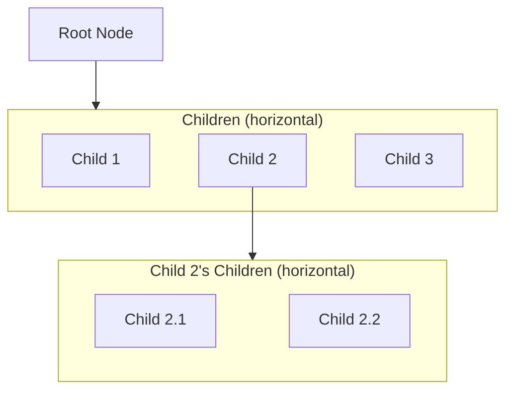
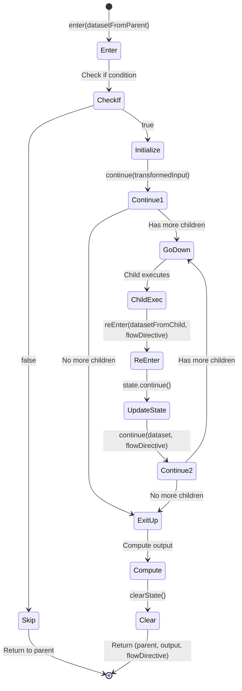
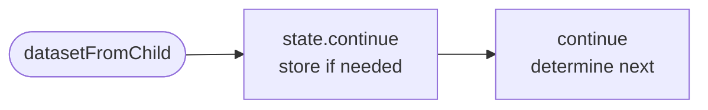

# Workflow Execution: Formal Model

This document provides a formal, functional description of how Lemline executes workflows as tree traversal with dataset
transformation.

## Table of Contents

1. [Core Concepts](#core-concepts)
    - Workflow Structure
    - Instance State
    - Dataset
    - FlowDirective
2. [Traveling through the Tree](#traveling-through-the-tree)
    - Main Execution Loop
    - The Run Function
3. [Node Entry and Exit](#node-entry-and-exit)
    - Enter from Up
    - Enter from Down
    - Continue Function
    - Exit to Up Function
4. [Node Type Implementations](#node-type-implementations)
    - DoTask, ForTask, SwitchTask, TryTask, ActivityTask
5. [Dataset Transformation Pipeline](#dataset-transformation-pipeline)
6. [Complete Example](#complete-example)
7. [Summary](#summary)

---

## Core Concepts

### Workflow Structure

A workflow is represented as a **tree of Nodes**:



**Properties**:

- Each node has a **unique position** in the tree
- Each node has **internal state** (structure depends on node type)
- Nodes may have **0 or more children** (horizontally aligned below parent)
- Execution starts at the **root node**

### Instance State

The complete execution state is represented as:

```
InstanceState = (currentNode, currentStates)
```

Where:

- `currentNode`: Node - Currently executing node
- `currentStates`: Map<NodePosition, NodeState> - State for each node

**Invariant**: The instance state must always be **consistent** - the `currentStates` map must contain valid state for
`currentNode` and all its ancestors.

### Dataset

A **dataset** (JSON value) is transported and transformed as execution moves through the tree:

```
Dataset = JsonElement
```

The dataset flows:

- **Down**: From parent to child
- **Up**: From child to parent

### FlowDirective

A **FlowDirective** is a navigation instruction that guides execution flow after a task completes. It is defined in the
task's `.then` field.

**Possible Values**:

- `null` or `CONTINUE`: Continue to next sibling in parent's child list
- `EXIT`: Return to parent immediately
- `END`: Return to root (complete workflow)
- `"taskName"`: Jump to specific sibling task by name

**Example**:

```yaml
do:
    -   processOrder:
            set: { status: "processed" }
            then: notifyCustomer  # FlowDirective: jump to sibling "notifyCustomer"

    -   validateOrder:
            if: .needsValidation
            call: http
            then: exit  # FlowDirective: return to parent immediately
```

---

## Traveling through the Tree

### Main Execution Loop

The workflow execution is a loop that repeatedly calls the `run` function until completion, with exception handling for
error recovery:

```
execute(workflow, input):
    current = workflow.rootNode
    dataset = input
    flowDirective = null

    while current is not null:
        // Save current state for rollback in case of exception
        currentState = current.state.clone()

        try:
            // Attempt to execute current node
            (next, dataset, flowDirective) = run(current, dataset, flowDirective)

            // ← Checkpoint here for workflow persistence (state is consistent)

            // Move to next node
            current = next

        catch exception:
            // Rollback to saved state
            current.state = currentState

            // Handle exception (see Error Handling section)
            (current, dataset, flowDirective) = handleException(current, dataset, exception)

    return dataset  // Final workflow output
```

**Key Points**:

- Each iteration processes one execution step
- **State Safety**: Node state is cloned before execution and restored on exception
- **Atomicity**: State is either fully updated (success) or fully rolled back (exception)
- **Checkpointing**: After successful `run()`, before updating `current`, state is consistent for persistence
- Loop terminates when `current` becomes `null` (workflow complete)
- Dataset flows as function parameters (functional, no storage)

### The Run Function

The `run` function determines whether to enter a node for the first time or re-enter after a child:

```
run(current, dataset, flowDirective):
    if current.startedAt is null:
        return enter(current, dataset)
    else:
        return reEnter(current, dataset, flowDirective)
```

**Returns**: `(next, nextDataset, nextFlowDirective)` - the complete next state

---

## Node Entry and Exit

### Instance Methods vs Free Functions

The execution model uses a hybrid approach:

**Free Functions** (Orchestration):

- `enter(node, dataset)` - Entry from parent
- `reEnter(node, dataset, flowDirective)` - Re-entry from child
- `continue(node, dataset, flowDirective)` - Navigation decision
- `exitToUp(node, transformedInput)` - Exit to parent
- `run(current, dataset, flowDirective)` - Main dispatcher

These orchestrate the execution flow in a functional style: `(next, dataset, flowDirective) = function(node, ...)`.

**Instance Methods** (Scope-Dependent Operations):

- `node.checkIf(dataset)` - Evaluate `if` condition (needs scope)
- `node.validateInput(dataset)` - Validate input schema (needs scope for context)
- `node.evaluateInput(dataset)` - Transform input with `input.from` (needs scope)
- `node.validateOutput(output)` - Validate output schema (needs scope for context)
- `node.evaluateOutput(output)` - Transform output with `output.as` (needs scope)
- `node.execute(input)` - Execute action (might need scope for context)

**Why this separation?**

Scope-dependent operations need access to:

- Task context (name, reference, definition, startedAt, input, output)
- Parent scopes (recursively merged)
- Variables from For loops, etc.

This scope is internal to the node instance and shouldn't be passed around as a parameter. Making these operations
instance methods encapsulates this complexity.

### Entry Points

A node can be entered from two directions:

#### Enter from Up (from parent)

Called when entering a node for the first time from its parent.

```
enter(node, datasetFromParent):
    // ===========================================
    // PHASE 1: Conditional Check
    // ===========================================

    // Check if condition - skip if false
    // (instance method - needs scope from task + parents)
    if not node.checkIf(datasetFromParent):
        // Skip this node entirely (no state initialization)
        // Return to parent - parent.continue() will advance to next sibling
        return (node.parent, datasetFromParent, FlowDirective.Continue)

    // ===========================================
    // PHASE 2: Initialize Node State
    // ===========================================

    // Mark as started
    node.startedAt = now()

    // Validate input against schema (throws ValidationError)
    // (instance method - needs scope for error context)
    node.validateInput(datasetFromParent)

    // Apply input transformation (throws ExpressionError)
    // (instance method - needs scope from task + parents)
    val transformedInput = node.evaluateInput(datasetFromParent)

    // Initialize type-specific state (implementation-dependent)
    node.state.init(transformedInput)

    // ===========================================
    // PHASE 3: Determine Next Step
    // ===========================================

    // Delegate to continue() to decide where to go
    return continue(node, transformedInput, FlowDirective.Continue)
```

**Parameters**:

- `datasetFromParent`: Parent's output (becomes this node's input)

**Returns**: `(next, dataset, flowDirective)` tuple

**Phases**:

1. **Conditional Check**: Evaluate `if` condition, skip if false
2. **Initialize**: Set `.startedAt`, validate, transform input, init state
3. **Navigate**: Call `continue()` to decide next node

#### Enter from Down (from child)

Called when returning to a node after a child completes.

```
reEnter(node, datasetFromChild, flowDirective):
    // ===========================================
    // Update Node State
    // ===========================================

    // Update internal state based on child's result
    // (node-type-specific: may store result, update indices, etc.)
    node.state.continue(datasetFromChild)

    // ===========================================
    // Determine Next Step
    // ===========================================

    // Delegate to continue() to decide where to go
    return continue(node, datasetFromChild, flowDirective)
```

**Parameters**:

- `datasetFromChild`: Child's output result
- `flowDirective`: Navigation instruction from child's `.then` field

**Returns**: `(next, dataset, flowDirective)` tuple

**Purpose**:

- Update node's internal state (implementation-dependent)
- Delegate navigation decision to `continue()`

### Continue Function

Determines the next step based on FlowDirective and node state.

```
continue(node, datasetForNavigation, flowDirective):
    when(flowDirective):
      : End ->
          // Workflow complete - recursive unwinding
          return (node.parent, datasetForNavigation, End)

      : Exit ->
          // Exit to parent immediately
          return exitToUp(node, datasetForNavigation, FlowDirective.Continue)

      : $name, Continue ->
          // Update state: advance indices, or jump to named sibling
          node.state.continue(datasetForNavigation, flowDirective)

          // Check if node has more work to do
          if (node.state.shouldExit()):
              return exitToUp(node, datasetForNavigation)
          else:
              return (node.state.nextChild(), datasetForNavigation, FlowDirective.Continue)
```

**Parameters**:

- `datasetForNavigation`: The `transformedInput` (for going down) or child result (when re-entering)
- `flowDirective`: Navigation instruction

**Logic**:

1. **End**: Recursive unwinding to root (parent's parent will eventually be null)
2. **Exit**: Exit immediately to parent
3. **$name / Continue**: Update state, check if done, go to next child or exit

### Exit to Up Function

Computes output and returns to parent.

```
exitToUp(node, datasetForExit):
    // ===========================================
    // Compute Output
    // ===========================================

    // Execute action (eg. HTTP call, throws ActionError)
    // (instance method - might need scope for error context)
    val rawOutput = node.execute(datasetForExit)

    // Apply output transformation (throws ExpressionError)
    // (instance method - needs scope from task + parents)
    val transformedOutput = node.evaluateOutput(rawOutput)

    // Validate output schema (throws ValidationError)
    // (instance method - needs scope for error context)
    node.validateOutput(transformedOutput)

    // ===========================================
    // Prepare Return
    // ===========================================

    // Clear this node's state
    clearState(node)

    // Return to parent
    return (node.parent, transformedOutput, node.definition.then)
```

**Parameters**:

- `datasetForExit`: The dataset to use for computing output (child's result for flow tasks, transformedInput for
  activity tasks)

**Returns**: `(parent, transformedOutput, flowDirective)` tuple

**Flow**: `datasetForExit` → action → `rawOutput` → transform → `transformedOutput` → validate

### Execution State Machine



**Legend**:

- **Enter**: First visit from parent
- **ReEnter**: Returning from child
- **Continue**: Determine next step based on state and flowDirective
- **ExitUp**: Compute output and return to parent

---

## Error Handling

### Exception Flow

When an exception occurs during workflow execution, the error handling mechanism determines how to proceed:

```
handleException(current, dataset, exception):
    // Find the nearest TryTask that can handle this error (retry or catch)
    val tryTask = findHandlingTry(current, exception)

    if tryTask is not null:
        // Check if should retry before catching
        if tryTask.state.shouldRetry():
            // Reset state and retry the try block
            return retryTryBlock(tryTask, current)
        else:
            // Retries exhausted or not configured - transition to catch block
            return enterCatch(tryTask, current, exception)
    else:
        // No try/catch block found - workflow fails
        throw WorkflowFailedException(exception)
```

### Finding a Handling Try Block

Walk up the parent chain to find a TryTask that can either retry or catch the error:

```
findHandlingTry(node, exception):
    if node is null:
        return null  // No try block found

    if node is TryTask:
        // Check if this TryTask can handle the error (retry or catch)
        if node.state.shouldRetry() or node.canCatch(exception):
            return node
        // Otherwise, continue searching up the chain

    return findHandlingTry(node.parent, exception)
```

### Retrying Try Block

When a TryTask should retry, reset state and return to the try body with the original input:

```
retryTryBlock(tryTask, failingNode):
    // Reset state from failing node up to try body (exclusive)
    resetStateUpTo(failingNode, tryTask.doBody)

    // Increment attempt counter
    tryTask.state.attemptIndex++

    // Get the try body to execute again
    val tryBody = tryTask.state.nextChild()  // Returns doBody when not in catch mode

    // Return tuple to re-execute try block with ORIGINAL input (not current dataset)
    return (tryBody, tryTask.state.transformedInput, FlowDirective.Continue)
```

**Note**: `resetStateUpTo()` clears the state of all nodes from `failingNode` up to (but not including)
`tryTask.doBody`, ensuring a clean retry.

### Entering Catch Block

When retries are exhausted and a catch block exists, transition to the appropriate catch block:

```
enterCatch(tryTask, failingNode, exception):
    // Reset state from failing node up to try body (exclusive)
    resetStateUpTo(failingNode, tryTask.doBody)

    // Prepare dataset with error information merged into ORIGINAL input
    val datasetWithError = tryTask.state.transformedInput.merge({
        error: {
            type: exception.type,
            status: exception.status,
            title: exception.title,
            details: exception.details
        }
    })

    // Update TryTask state to enter catch mode (also clears transformedInput)
    tryTask.state.enterCatch(exception)

    // Get the matching catch block child
    val catchBlock = tryTask.state.nextChild()

    // Return tuple to continue execution in catch block
    return (catchBlock, datasetWithError, FlowDirective.Continue)
```

**Note**: The catch block receives the TryTask's original `transformedInput` plus error information, not the dataset
from wherever the exception occurred.

**Key Points**:

- **State Rollback**: Before `handleException()` is called, the failing node's state has been restored by the main loop
- **State Reset for Retry/Catch**: Both `retryTryBlock()` and `enterCatch()` reset state from the failing node up to the
  try body, ensuring clean re-execution
- **Original Input**: TryTask stores `transformedInput` to provide the same starting dataset for all retries and the
  catch block
- **Retry First**: TryTask attempts retries before entering catch blocks
- **Attempt Counting**: Each retry increments `attemptIndex` (done in `retryTryBlock()`)
- **Error Context**: The catch block receives the TryTask's original `transformedInput` plus error information, not the
  dataset from where the exception occurred
- **Memory Optimization**: `transformedInput` is cleared when entering catch mode (no longer needed)
- **Parent Chain**: TryTask doesn't need to be the immediate parent - can be any ancestor
- **Type Matching**: Each catch block specifies which error types it handles (e.g., validation errors, runtime errors)

---

## Node Type Implementations

Each node type implements the execution interface with type-specific behavior. The node's `.state` structure and the
implementation of key methods vary by type.

### Interface Methods

All node types have their own state type, that must implement:

```
.startedAt: Instant?

// Update internal state based on child result and flow directive
continue(datasetFromChild, flowDirective)

// Check if node has completed its work
shouldExit() : Boolean

// Get the next child to process
nextChild() : Node

// Initialize type-specific state
init(transformedInput)
```

### DoTask (Sequential Execution)

Executes children sequentially in order.

**State Type**:

```kotlin
class DoTaskState {
    .startedAt: Instant
    .childIndex: Int  // Current child position

    // Initialize state
    init(transformedInput):
    childIndex = -1

    // Update state based on child result and flow directive
    continue(dataset, flowDirective):
    if flowDirective is $name:
    childIndex = indexOfChild($name)  // Jump to named child
    else:
    childIndex++  // Next child

    // Check if all children have been processed
    shouldExit():
    return childIndex >= children.length

    // Get next child to process
    nextChild():
    return children[childIndex]
}
```

### ForTask (Iteration)

Executes child repeatedly for each item in a collection.

**State Type**:

```kotlin
class ForTaskState {
    .startedAt: Instant
    .forIndex: Int        // Current iteration index
    .collection: List     // Items to iterate (computed once)

    // Initialize state - evaluate collection once
    init(transformedInput):
    collection = node.evaluate(transformedInput, node.definition.for.in )
    forIndex = -1

    // Update state - advance to next iteration
    continue(dataset, flowDirective):
    forIndex++

    // Check if iteration is complete
    shouldExit():
    if forIndex >= collection.length:
    return true
    if node.definition.while is not null:
    return not node.evaluate(node.definition.while, currentContext)
    return false

    // Get next child - same child, different iteration
    nextChild():
    return node.doBody
}
```

**Important Notes**:

- **Iteration Variables**: `for.each` (default: `item`) and `for.at` (default: `index`) are **scope variables**, not
  dataset fields. Children access them via expressions (e.g., `.item.id`), but they are not merged into the dataset.
- **Dataset Flow Across Iterations**: Each iteration receives the previous iteration's output as input. The first
  iteration receives the ForTask's `transformedInput`.
- **Dataset Flow Within Iteration**: Like any DoTask, the first child receives the iteration's input, subsequent
  children receive the previous child's output.
- **Output Semantics**: ForTask returns the **last child's output from the last iteration**. This is standard flow task
  behavior.

### SwitchTask (Conditional Branching)

Evaluates cases and executes one branch.

**State Type**:

```kotlin
class SwitchTaskState {
    .startedAt: Instant
    .selectedCase: Int  // Which case was selected

    // Initialize state - evaluate cases to find match
    init(transformedInput):
    for (index, case) in node.definition.switch:
    if case.when is null or node.evaluate(transformedInput, case.when):
    selectedCase = index
    return
    throw Error("No switch case matched")

    // Update state - switch executes only once
    continue(dataset, flowDirective):
    // No update needed

    // Check if done - always true (executes once)
    shouldExit():
    return true

    // Get next child - should not be called
    nextChild():
    throw Error("Switch task should exit after case selection")
}
```

**Note**: Uses `case.then` flowDirective to navigate to target sibling.

### TryTask (Error Handling)

Attempts execution with catch blocks for errors.

**State Type**:

```kotlin
class TryTaskState {
    .startedAt: Instant
    .attemptIndex: Int            // Current retry attempt
    .inCatch: Boolean             // Whether in catch block
    .catchIndex: Int              // Which catch block is active
    .lastError: Error?            // Last caught error
    .maxAttempts: Int             // Retry limit
    .transformedInput: JsonElement?  // Original input for retries/catch (cleared after entering catch)

    // Initialize state - prepare for try block execution
    init(transformedInput):
    this.transformedInput = transformedInput  // Store for retries and catch
    maxAttempts = node.definition.retry?.limit ?? 1
    attemptIndex = 0
    inCatch = false
    catchIndex = -1

    // Update state after child completion
    continue(dataset, flowDirective):
    if inCatch:
    // Catch block completed successfully - mark as done
    // No further update needed
    else:
    // Try block completed successfully - mark as done
    attemptIndex = maxAttempts  // Skip retries

    // Check if done
    shouldExit():
    if inCatch:
    return true  // Catch block completed
    if attemptIndex >= maxAttempts:
    return true  // Try succeeded or all retries exhausted
    return false

    // Get next child based on state
    nextChild():
    if inCatch:
    return node.catchBlocks[catchIndex]
    else:
    return node.doBody

    // Check if should retry (called by handleException before entering catch)
    shouldRetry():
    return attemptIndex < maxAttempts

    // Transition to catch block (called by enterCatch)
    enterCatch(exception):
    inCatch = true
    lastError = exception
    catchIndex = findMatchingCatch(exception)
    transformedInput = null  // Clear after transitioning (no longer needed)

    // Find which catch block matches this exception
    findMatchingCatch(exception):
    for (index, catchDef) in node.definition.catch:
    if catchDef.errors is null or catchDef.errors.contains(exception.type):
    return index
    // Should never happen - canCatch() ensures a match exists
    throw Error("No matching catch block")
}
```

**TryTask Methods**:

```kotlin
// Check if this TryTask can catch the given exception
canCatch(exception):
// If no catch blocks defined, cannot catch
if node.definition.catch is null or node.definition.catch.isEmpty():
return false

// Check if any catch block matches this error type
for catchDef in node.definition.catch:
// Catch block with no error filter catches all errors
if catchDef.errors is null:
return true
// Check if error type matches
if catchDef.errors.contains(exception.type):
return true

return false  // No matching catch block
```

**Important Notes**:

- **Stored Input**: TryTask stores `transformedInput` to provide consistent input for retries and catch blocks. This is
  the only flow task that stores input.
- **Retry First**: When the try body throws an exception, `handleException()` checks `shouldRetry()` before entering
  catch. If retries remain, `retryTryBlock()` resets state, increments `attemptIndex`, and re-executes the try body with
  the stored `transformedInput`.
- **State Reset**: Both retry and catch operations reset the state of all nodes from the failing node up to (but not
  including) the try body, ensuring clean re-execution.
- **Catch After Retries**: Only when `attemptIndex >= maxAttempts` (retries exhausted) does `handleException()` call
  `enterCatch()` to transition to the catch block.
- **Error Type Matching**: Each catch block can specify which error types it handles (validation, runtime, etc.) or
  catch all errors.
- **Dataset Flow**:
    - Retries receive the stored `transformedInput` (no error info)
    - Catch blocks receive the stored `transformedInput` plus error information merged in
    - After entering catch, `transformedInput` is cleared to save memory

### ActivityTask (Leaf Nodes)

Tasks with actions but no children (Set, CallHTTP, Emit, etc.).

**State Type**:

```kotlin
class ActivityTaskState {
    .startedAt: Instant

    // Initialize state - no additional setup needed
    init(transformedInput):
    // No additional state needed

    // Update state - no children to process
    continue(dataset, flowDirective):
    // No update needed

    // Check if done - always true
    shouldExit():
    return true

    // Get next child - no children
    nextChild():
    return null
}
```

---

## Dataset Transformation Pipeline

The dataset flows functionally through the execution - transformed but never stored. Only execution progress (`.state`)
is persisted.

### Data Flow: Enter from Up


**Key Points**:

- `datasetFromParent` is a parameter (not stored)
- `transformedInput` is a local variable (not stored)
- Only `.startedAt` and `.state` are persisted

### Data Flow: Re-enter from Child



**Key Points**:

- `datasetFromChild` is a parameter
- `state.continue()` may store child result in state (node-type-specific)
- Dataset flows through to `continue()`

### Data Flow: Exit to Up

```mermaid
flowchart LR
    Start([transformedInput])
    Action[executeAction]
    RawOut([val rawOutput])
    Transform[evaluate<br/>output.as]
    TransOut([val transformedOutput])
    Validate[validate<br/>output.schema]
    GetFlow[get .then<br/>directive]
    Flow([val flowDirective])
    Clear[clearState]
    Return([return to parent])
    Start --> Action
    Action --> RawOut
    RawOut --> Transform
    Transform --> TransOut
    TransOut --> Validate
    Validate --> GetFlow
    GetFlow --> Flow
    Flow --> Clear
    Clear --> Return
```



**Key Points**:

- `rawOutput` and `transformedOutput` are local variables (not stored)
- `flowDirective` extracted from task definition
- State is cleared before returning

---

## Complete Example

### Workflow Definition

```yaml
document:
    dsl: '1.0.0'
    namespace: example
    name: order-processing
    version: 1.0.0
do:
    -   validateOrder:
            if: .order.requiresValidation == true
            set:
                validated: true

    -   processItems:
            for:
                each: item
                at: index
                in: .order.items
            do:
                -   processItem:
                        set:
                            itemId: .item.id
                            price: .item.price

    -   routeOrder:
            switch:
                -   urgent:
                        when: .order.priority == "urgent"
                        then: processUrgent
                -   normal:
                        then: processNormal

    -   processUrgent:
            set:
                status: "urgent_processed"

    -   processNormal:
            set:
                status: "normal_processed"
```

### Execution Trace

**Input**:

```json
{
    "order": {
        "requiresValidation": false,
        "priority": "urgent",
        "items": [
            {
                "id": 1,
                "price": 10
            },
            {
                "id": 2,
                "price": 20
            }
        ]
    }
}
```

**Trace**: WARNING - THIS IS WRING AND WILL BE UPDATED LATER

| Step | Current Node   | Direction | Dataset             | FlowDirective   | State Change               | Reason                                        |
|------|----------------|-----------|---------------------|-----------------|----------------------------|-----------------------------------------------|
| 1    | Root           | DOWN      | {order:{...}}       | -               | Init Root state            | Start                                         |
| 2    | DoTask         | DOWN      | {order:{...}}       | -               | Init DoTask, childIndex=-1 | Enter DoTask                                  |
| 3    | validateOrder  | SKIP      | {order:{...}}       | -               | DoTask.childIndex=1        | if: .requiresValidation == false              |
| 4    | processItems   | DOWN      | {order:{...}}       | -               | Init ForTask, forIndex=-1  | Enter ForTask                                 |
| 5    | processItems   | ITERATE   | {order:{...}}       | -               | forIndex=0                 | First iteration, scope: item={id:1,price:10}  |
| 6    | ForBody DoTask | DOWN      | {order:{...}}       | -               | Init ForBody DoTask        | Enter loop body                               |
| 7    | processItem    | UP        | {itemId:1,price:10} | null (continue) | Execute set, clear state   | Eval .item.id/.item.price from scope          |
| 8    | ForBody DoTask | UP        | {itemId:1,price:10} | null (continue) | Clear ForBody state        | FlowDirective: continue                       |
| 9    | processItems   | ITERATE   | {itemId:1,price:10} | -               | forIndex=1                 | Second iteration, scope: item={id:2,price:20} |
| 10   | ForBody DoTask | DOWN      | {itemId:1,price:10} | -               | Init ForBody DoTask        | Enter loop body                               |
| 11   | processItem    | UP        | {itemId:2,price:20} | null (continue) | Execute set, clear state   | Eval .item.id/.item.price from scope          |
| 12   | ForBody DoTask | UP        | {itemId:2,price:20} | null (continue) | Clear ForBody state        | FlowDirective: continue                       |
| 13   | processItems   | UP        | {itemId:2,price:20} | null (continue) | Clear ForTask state        | forIndex=2 >= items.length                    |
| 14   | DoTask         | UP        | {itemId:2,price:20} | null (continue) | Clear DoTask state         | FlowDirective: continue (no more children)    |
| 15   | Root           | UP        | {itemId:2,price:20} | null (continue) | Clear Root state           | Workflow COMPLETED                            |

**Final Output**: `{itemId:2, price:20}`

**Note**: This example workflow is simplified to demonstrate ForTask mechanics. In practice, the `routeOrder` and
`processUrgent` tasks would fail because the dataset `{itemId:2,price:20}` doesn't contain `.order.priority`. A real
workflow would need to preserve the order data through the loop.

**Key Observations**:

1. **ForTask Output Semantics (Step 13)**:
    - `processItems` ForTask returns `{itemId:2,price:20}` (the last iteration's output)
    - This is standard flow task behavior - ForTask doesn't preserve the original input
    - Each iteration receives the previous iteration's output as input

2. **ForTask Iteration Variables (Steps 5, 9)**:
    - `item` and `index` are **scope variables**, not dataset fields
    - Step 5: Dataset is `{order:{...}}`, scope includes `item={id:1,price:10}` and `index=0`
    - Step 9: Dataset is `{itemId:1,price:10}`, scope includes `item={id:2,price:20}` and `index=1`
    - Children access these via expressions (e.g., `.item.id` evaluates to `1` then `2`)

3. **Dataset Flow Across Iterations**:
    - Iteration 1: Receives `{order:{...}}` (ForTask's input) → outputs `{itemId:1,price:10}`
    - Iteration 2: Receives `{itemId:1,price:10}` (previous output) → outputs `{itemId:2,price:20}`
    - This allows iterations to accumulate state or transform data progressively

4. **Direction Semantics**:
    - **DOWN**: Entering a child or sibling (current → child/sibling)
    - **UP**: Returning to parent (current → parent)
    - **SKIP**: Conditional skip, jumping to next sibling
    - **ITERATE**: ForTask advancing to next iteration

---

## Try/Catch Example

### Workflow Definition with Error Handling

```yaml
document:
    dsl: '1.0.0'
    namespace: example
    name: payment-processing
    version: 1.0.0
do:
    -   processPayment:
            try:
                do:
                    -   validateCard:
                            call: http
                            with:
                                method: post
                                uri: https://api.payment.com/validate
                    -   chargeCard:
                            call: http
                            with:
                                method: post
                                uri: https://api.payment.com/charge
            catch:
                errors:
                    - validation
                as:
                    validationError:
                        do:
                            -   logError:
                                    set:
                                        status: "validation_failed"
                                        message: .error.title
                errors:
                    - runtime
                as:
                    runtimeError:
                        do:
                            -   retryLater:
                                    set:
                                        status: "retry_scheduled"
                                        message: .error.title
```

### Execution Trace (Validation Error Scenario)

**Input**: `{cardNumber: "invalid", amount: 100}`

**Trace**: WARNING - THIS IS WRING AND WILL BE UPDATED LATER

| Step | Current Node    | Direction | Dataset                                             | FlowDirective   | State Change                     | Reason                                 |
|------|-----------------|-----------|-----------------------------------------------------|-----------------|----------------------------------|----------------------------------------|
| 1    | Root            | DOWN      | {cardNumber:"invalid",amount:100}                   | -               | Init Root                        | Start                                  |
| 2    | DoTask          | DOWN      | {cardNumber:"invalid",amount:100}                   | -               | Init DoTask                      | Enter DoTask                           |
| 3    | processPayment  | DOWN      | {cardNumber:"invalid",amount:100}                   | -               | Init TryTask, attemptIndex=0     | Enter TryTask                          |
| 4    | TryBody DoTask  | DOWN      | {cardNumber:"invalid",amount:100}                   | -               | Init try body DoTask             | Enter try body                         |
| 5    | validateCard    | DOWN      | {cardNumber:"invalid",amount:100}                   | -               | Init validateCard                | Call HTTP validation                   |
| 5a   | validateCard    | EXCEPTION | {cardNumber:"invalid",amount:100}                   | -               | State rolled back                | HTTP returns 400 validation error      |
| 6    | processPayment  | CATCH     | {cardNumber:"invalid",amount:100,error:{...}}       | -               | enterCatch(), inCatch=true       | findCatchingTry() found processPayment |
| 7    | validationError | DOWN      | {cardNumber:"invalid",amount:100,error:{...}}       | -               | Init catch DoTask                | Enter validation error catch block     |
| 8    | logError        | UP        | {status:"validation_failed",message:"Invalid card"} | null (continue) | Execute set, clear state         | Log the validation error               |
| 9    | validationError | UP        | {status:"validation_failed",message:"Invalid card"} | null (continue) | Clear catch DoTask               | Catch block completed                  |
| 10   | processPayment  | UP        | {status:"validation_failed",message:"Invalid card"} | null (continue) | Clear TryTask, shouldExit()=true | Try/catch completed                    |
| 11   | DoTask          | UP        | {status:"validation_failed",message:"Invalid card"} | null (continue) | Clear DoTask                     | No more children                       |
| 12   | Root            | UP        | {status:"validation_failed",message:"Invalid card"} | null (continue) | Clear Root                       | Workflow COMPLETED                     |

**Final Output**: `{status: "validation_failed", message: "Invalid card"}`

### Key Observations

1. **Exception Flow (Step 5a → 6)**:
    - Exception thrown in `validateCard` during HTTP call
    - Main loop catches exception and restores `validateCard` state
    - `handleException()` walks up parent chain: validateCard → TryBody DoTask → processPayment (TryTask)
    - `processPayment.canCatch()` returns true (has catch block for "validation" errors)
    - `enterCatch()` transitions TryTask state to catch mode and returns `(validationError, datasetWithError, Continue)`

2. **Dataset with Error Context (Step 6)**:
    - Original dataset: `{cardNumber:"invalid",amount:100}`
    - Merged with error:
      `{cardNumber:"invalid",amount:100,error:{type:"validation",status:400,title:"Invalid card",...}}`
    - Catch block can access both original input and error details

3. **State Rollback (Step 5a)**:
    - Before exception: `validateCard` state was being initialized
    - After rollback: `validateCard` state restored to pre-execution snapshot
    - This ensures clean state if workflow is persisted/resumed

4. **Try/Catch Completion (Step 10)**:
    - After catch block completes, `processPayment.shouldExit()` returns true
    - TryTask returns to parent with catch block's output
    - Workflow continues normally (no re-throw)

5. **Alternative Path (Runtime Error)**:
    - If `chargeCard` threw a runtime error instead, `findMatchingCatch()` would select the second catch block
    - Each catch block is independent and handles specific error types

---

## Summary

### Core Principles

1. **Functional Execution Loop with State Safety**
   ```
   while current is not null:
       currentState = current.state.clone()  // Snapshot for rollback
       try:
           (next, dataset, flowDirective) = run(current, dataset, flowDirective)
           current = next
       catch exception:
           current.state = currentState  // Restore on failure
           (current, dataset, flowDirective) = handleException(current, dataset, exception)
   ```
   Each iteration is a pure function call with state atomicity guaranteed.

2. **Tree Structure**
    - Workflow is a tree with horizontal siblings and vertical parent-child relationships
    - Navigation is functional: each function returns `(next, dataset, flowDirective)`

3. **Minimal State**
    - Only execution progress is stored (`.startedAt`, `.state`)
    - Dataset flows as parameters (not stored)
    - Intermediate values are local variables (`val transformedInput`, `val rawOutput`)

4. **Node Type State Classes**
    - Each node type defines its own state class
    - All state classes implement:
        - `init(transformedInput)`: Initialize node-specific state
        - `continue(dataset, flowDirective)`: Update state on re-entry
        - `shouldExit()`: Check if node has completed
        - `nextChild()`: Get next child to process

5. **FlowDirective Navigation**
    - `continue`: Proceed to next sibling
    - `exit`: Return to parent immediately
    - `end`: Recursive unwinding to root
    - `"taskName"`: Jump to specific sibling

6. **Transformation Pipeline** (functional, not stored)
    - **Input**: `dataset` → `node.validateInput()` → `node.evaluateInput()` → `val transformedInput`
    - **Output**: `transformedInput` → `node.execute()` → `val rawOutput` → `node.evaluateOutput()` →
      `node.validateOutput()` → `val transformedOutput`
    - All transformation operations are instance methods (need scope)

7. **Conditional Navigation**
    - `if`: Skip node if condition false
    - `switch`: Select branch based on data
    - `for`: Iterate over collection

8. **Exception Handling**
    - **State Rollback**: Node state cloned before execution and restored on exception
    - **Try/Catch**: TryTask walks up parent chain to find matching catch block
    - **Error Context**: Catch blocks receive original dataset merged with error information
    - **Type Matching**: Catch blocks can filter by error type (validation, runtime, etc.)

### Benefits

This functional model provides:

- ✅ **Minimal state** - Only execution progress stored
- ✅ **State atomicity** - State is either fully updated or fully rolled back on exception
- ✅ **Safe resumption** - Checkpoint after each successful step ensures consistent state for persistence
- ✅ **Clear semantics** - Pure function composition with explicit state mutations
- ✅ **Easy testing** - Functions are testable in isolation
- ✅ **Serializability** - State is minimal and explicit
- ✅ **Horizontal scaling** - Any worker can resume from checkpointed state
- ✅ **Deterministic replay** - Same state + dataset → same result
- ✅ **Error recovery** - Try/catch blocks handle exceptions with type matching and state rollback
