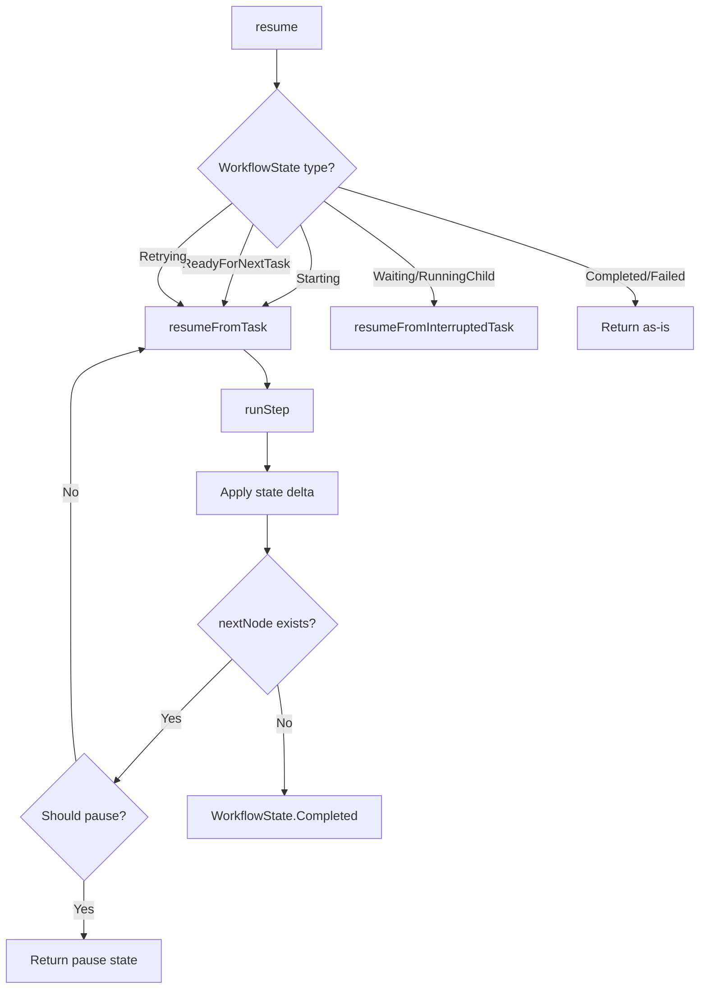
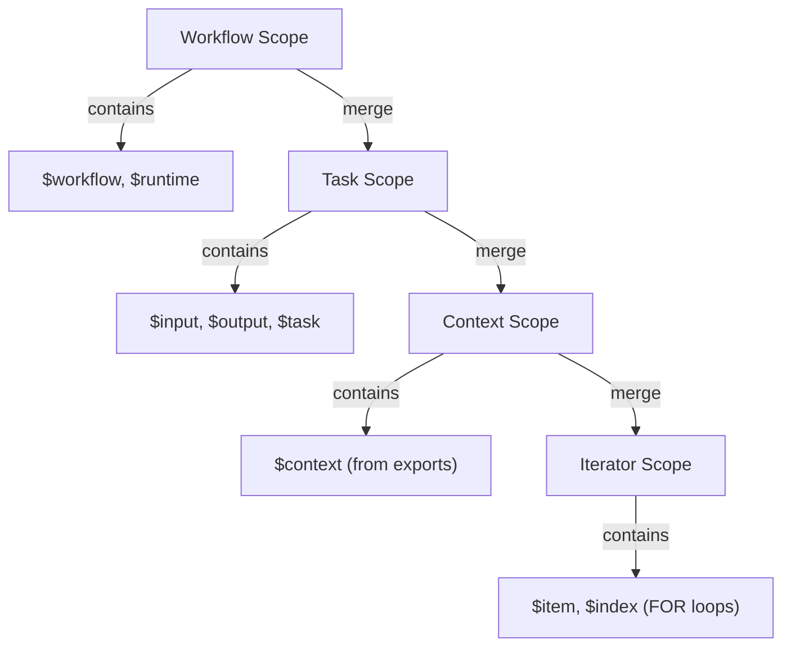
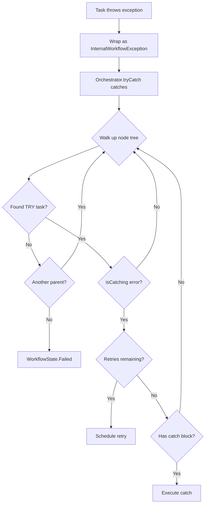
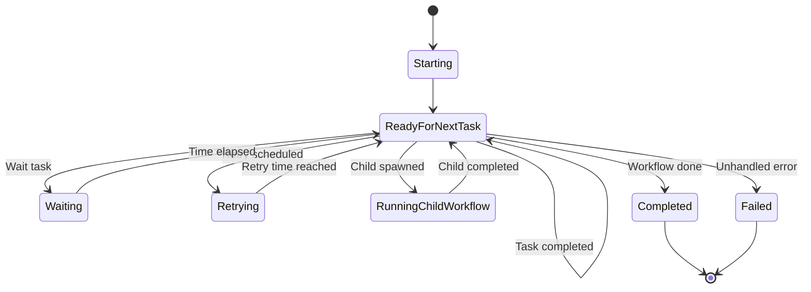

# Lemline Core: Workflow Orchestrator Architecture

This document describes how the `WorkflowOrchestrator` in `lemline-core` implements the [Serverless Workflow DSL v1.0](https://github.com/serverlessworkflow/specification) specification.

## Table of Contents

- [Overview](#overview)
- [Core Principles](#core-principles)
- [Task Flow](#task-flow)
- [Data Flow](#data-flow)
- [Runtime Expressions](#runtime-expressions)
- [Error Handling](#error-handling)
- [Architecture Components](#architecture-components)
- [File Structure Reference](#file-structure-reference)

## Overview

The `WorkflowOrchestrator` is the execution engine for Serverless Workflow definitions. It interprets workflow definitions, manages state transitions, executes tasks, and handles data transformations according to the specification.

**Implementation Approach**:
- **Pure functional model** - State is external and immutable; execution steps return new state
- **Exception-driven control flow** - Pause points (wait, retry, child workflows) signaled via exceptions
- **Position-based navigation** - Unique path-based addressing for nodes in the workflow tree
- **Pausable execution** - Support for both synchronous (testing) and asynchronous (distributed) modes

**Specification Alignment**:
- Implements all [12 official task types](https://github.com/serverlessworkflow/specification/blob/main/dsl-reference.md#task)
- Follows the [data flow pipeline](https://github.com/serverlessworkflow/specification/blob/main/dsl.md#data-flow)
- Supports [runtime expressions](https://github.com/serverlessworkflow/specification/blob/main/dsl.md#runtime-expressions) with standard arguments
- Complies with [error handling](https://github.com/serverlessworkflow/specification/blob/main/dsl-reference.md#error-handling) semantics

**Main Entry Point**:

```kotlin
// lemline-core/src/main/kotlin/com/lemline/core/orchestrator/WorkflowOrchestrator.kt
object WorkflowOrchestrator {
    suspend fun resume(
        workflow: Workflow,
        state: WorkflowState,
        executionMode: ExecutionMode
    ): WorkflowState
}
```

## Core Principles

### 1. Pure Functional Model

Per the specification's emphasis on deterministic execution, Lemline models workflow execution as pure functions:

**External State**:
- State is stored in `TaskStates = Map<NodePosition, TaskState>`
- Orchestrator is stateless - any worker can resume from any position
- State changes returned as deltas: `Map<NodePosition, TaskState?>`

**Atomic Updates**:
```kotlin
// Apply state delta atomically
states = applyDelta(states, stepResult.stateUpdates)
// null value = remove from map
```

**Immutability**:
- Node tree is immutable - shared across all workflow executions
- No node cloning or mutation during execution
- Failed steps leave original state untouched

### 2. Dataset Flow

Aligned with the specification's [data flow model](https://github.com/serverlessworkflow/specification/blob/main/dsl.md#data-flow):

- Dataset flows as a parameter through the execution chain
- Not stored in state - passed between tasks functionally
- Transformed at task boundaries via `input.from` and `output.as` expressions
- In sequential tasks (DO), previous output becomes next input

### 3. Exception-Driven Control Flow

Lemline uses exceptions to signal workflow pause points:

- **`WaitWorkflowException`** - Wait task needs time delay
- **`ChildWorkflowException`** - Child workflow must be spawned
- **`InternalWorkflowException`** - Task execution error (caught by TRY)

This pattern separates workflow logic (orchestrator) from infrastructure concerns (runner).

## Task Flow

Per the [specification's task flow model](https://github.com/serverlessworkflow/specification/blob/main/dsl.md#task-flow), each task completes with one of three outcomes: **continue**, **fault**, or **end**.

### Task Execution Outcomes

**1. Continue** - Proceed to next task:
```kotlin
// Implicit: next task in DO sequence
StepResult(nextNode = doState.nextChild(), ...)

// Explicit: SWITCH redirects via FlowDirective
StepResult(flowDirective = FlowDirective(targetPosition, targetName), ...)
```

**2. Fault** - Uncaught error halts execution:
```kotlin
throw InternalWorkflowException(error)
// If no TRY catches error → WorkflowState.Failed
```

**3. End** - Graceful termination:
```kotlin
// Root task returns null for nextNode
StepResult(nextNode = null, ...) → WorkflowState.Completed
```

### Flow Directives

Aligned with spec: "Flow directives can only redirect to tasks declared within their own scope."

**Implementation**:
- **DO**: Sequential execution, implicit ordering
- **SWITCH**: Conditional branching to named sibling via `FlowDirective`
- **FOR**: Iterative execution over collection
- **FORK**: Concurrent execution of branches (Note: Not yet fully implemented in orchestrator)

### Execution Loop



### Processor Pattern

Each task type has a `NodeProcessor<T, S>` implementing a **template method pattern**:

**Entry Points**:
1. `enterFromParent(rawInput, scope)` - First entry from parent task
2. `enterFromChild(state, dataset, scope)` - Re-entry after child completes (flow tasks)
3. `continueTo(state, input, scope)` - Resume after pause (wait, retry)

**Standard Pipeline**:
```
Input → If Check → Validate → Transform → Execute → Complete → Output
```

### ExecutionMode

Controls when orchestrator pauses:

- **CONTINUOUS** - Run to completion (testing, single-node)
- **TASK_BY_TASK** - Pause after each task (distributed execution)
- **ACTIVITY_BY_ACTIVITY** - Pause only after activities (HTTP, shell, etc.)

## Data Flow

Lemline implements the specification's [data transformation pipeline](https://github.com/serverlessworkflow/specification/blob/main/dsl.md#data-flow), which defines a structured flow for data validation and transformation at workflow and task boundaries.

### Transformation Pipeline

```mermaid
graph LR
    A[Workflow Input] --> B[Validate workflow input schema]
    B --> C[input.from transformation]
    C --> D[Task Input]
    D --> E[Validate task input schema]
    E --> F[Task input.from transformation]
    F --> G[Execute Task]
    G --> H[Task output.as transformation]
    H --> I[Validate task output schema]
    I --> J[export.as to context]
    J --> K[Next Task Input]
    K --> L[Workflow Output]
    L --> M[Validate workflow output schema]
```



### Input Transformation

**Location**: `NodeProcessor.enterFromParent()`

**Pipeline**:
1. **Conditional Execution**: Evaluate `if` expression - skip if false
2. **Input Validation**: Validate against `input.schema` if defined
3. **Input Transformation**: Apply `input.from` expression
4. **State Creation**: Create processor-specific state with transformed input

**Example**:
```yaml
validateOrder:
  input:
    schema:
      type: object
      required: [orderId, customerId]
    from: .request.body  # Extract from nested property
  call: http
  with:
    uri: https://api.example.com/validate
```

### Output Transformation

**Location**: `NodeProcessor.completeTask()`

**Pipeline**:
1. **Output Transformation**: Apply `output.as` expression
2. **Output Validation**: Validate against `output.schema` if defined
3. **Context Export**: Apply `export.as` expressions, merge into workflow context
4. **Flow to Next**: Transformed output becomes next task's input

**Example**:
```yaml
fetchUser:
  call: http
  with:
    uri: https://api.example.com/users/123
  output:
    as: .body  # Extract body from response
  export:
    as:
      currentUser: .
      userId: .id
```

### Context Management

**RootState** maintains workflow-level context:
```kotlin
data class RootState(
    val context: JsonObject,  // Merged exports
    val exports: List<Export> // Export configurations
)
```

**Export Merging**:
- Each task's exports merge into `RootState.context`
- Context available in all child tasks via `$context` in expressions
- Hierarchical scope merging ensures child tasks inherit parent context

### Sequential Data Flow (DO)

In DO tasks, output chains through children:

```
Task1 input: {}
Task1 output: {x: 1}

Task2 input: {x: 1}         ← Previous output
Task2 output: {x: 1, y: 2}

Task3 input: {x: 1, y: 2}   ← Previous output
Task3 output: {sum: 3}
```

**Implementation**:
```kotlin
// DoProcessor.enterFromChild()
val nextChild = children[state.index + 1]
StepResult(
    nextNode = nextChild,
    rawInput = datasetFromChild  // Previous output
)
```

### Iterative Data Flow (FOR)

FOR tasks inject scope variables for each iteration:

**ForTaskState**:
```kotlin
data class ForTaskState(
    val collection: List<JsonElement>,  // Remaining items
    val index: Int                       // Current iteration
) {
    val scope: Scope  // Adds $item and $index
}
```

**Iteration**:
```yaml
processItems:
  for:
    each: item  # Configurable name
    in: .items
    at: index   # Configurable name
  do:
    - transform:
        set:
          value: ${ .item * 2 }
          position: ${ .index }
```

**Scope Variables**:
- `$item` (or configured name) - Current collection item
- `$index` (or configured name) - Current iteration index (0-based)

## Runtime Expressions

Lemline implements the specification's [runtime expression model](https://github.com/serverlessworkflow/specification/blob/main/dsl.md#runtime-expressions) using JQ as the expression language.

### Expression Language

**Default**: JQ (JSONPath Query)
**Evaluator**: `ExpressionEvaluator.kt` wraps JQ engine

**Expression Syntax**:
```yaml
# Simple path
value: .input.userId

# Runtime expression (must be wrapped in ${})
value: ${ .context.currentUser.name }

# Complex transformation
value: ${ .items | map(.price) | add }
```

### Standard Arguments

Per the [specification's runtime expression arguments](https://github.com/serverlessworkflow/specification/blob/main/dsl.md#runtime-expressions):

**Scope Variables** (available in expressions):

| Variable | Description | Type | Availability |
|----------|-------------|------|--------------|
| `$input` | Current task's input data | JsonElement | Task expressions |
| `$output` | Current task's output data | JsonElement | `output.as`, `export.as` |
| `$task` | Task metadata (name, startedAt, etc.) | TaskDescriptor | Task expressions |
| `$context` | Workflow context from exports | JsonObject | All task expressions |
| `$workflow` | Workflow metadata (namespace, name, version) | WorkflowDescriptor | All expressions |
| `$runtime` | Runtime information | JsonObject | All expressions (currently empty in core) |

**Task-Specific Variables**:
- `$item` - Current item in FOR loop (name configured via `each`)
- `$index` - Current index in FOR loop (name configured via `at`)
- `$error` - Error details in CATCH blocks

### Scope Hierarchy

Scopes are hierarchical - child scopes merge with parent scopes:



**Implementation**:
```kotlin
// Scope = JsonObject (type alias)
val scope = parentScope.deepMerge(taskContext.toScope(node))
```

### TaskContext

Encapsulates runtime state for expression evaluation:

```kotlin
data class TaskContext(
    val startedAt: Instant,
    val rawInput: JsonElement?,
    val transformedInput: JsonElement?,
    val rawOutput: JsonElement?,
    val transformedOutput: JsonElement?
) {
    fun toScope(node: Node<*>): Scope  // Builds $task, $input, $output
}
```

**TaskDescriptor** (exposed as `$task`):
```kotlin
data class TaskDescriptor(
    val name: String,
    val reference: String,        // Position reference
    val startedAt: Instant,
    val input: JsonElement?,
    val output: JsonElement?
)
```

### Expression Evaluation Contexts

**Where expressions are evaluated**:

1. **`if` condition** - Task conditional execution
   - Scope: `$input`, `$context`, `$workflow`, `$runtime`

2. **`input.from`** - Input transformation
   - Scope: `$input`, `$context`, `$workflow`, `$runtime`

3. **`output.as`** - Output transformation
   - Scope: `$output`, `$input`, `$task`, `$context`, `$workflow`, `$runtime`

4. **`export.as`** - Context export
   - Scope: `$output`, `$input`, `$task`, `$context`, `$workflow`, `$runtime`

5. **Task-specific** (e.g., SWITCH `when`, FOR `in`/`while`)
   - Scope varies by task type

## Error Handling

Lemline implements the specification's [error handling model](https://github.com/serverlessworkflow/specification/blob/main/dsl-reference.md#error-handling) with structured errors, retry strategies, and catch blocks.

### Error Structure

Per the [specification](https://github.com/serverlessworkflow/specification/blob/main/dsl-reference.md#error-handling):

```kotlin
data class Error(
    val type: String,        // URI: "https://serverlessworkflow.io/spec/1.0.0/errors/communication"
    val status: Int,         // HTTP-style status code
    val instance: String,    // JSON pointer to failed node
    val title: String?,
    val details: String?
)
```

**Standard Error Types**:
- `COMMUNICATION` - Network/HTTP errors
- `TIMEOUT` - Operation timeout
- `VALIDATION` - Schema validation failed
- `EXPRESSION` - Expression evaluation failed
- `CONFIGURATION` - Invalid task configuration

### Exception Hierarchy

```kotlin
sealed class WorkflowException : Exception()

// Task execution errors (caught by TRY)
data class InternalWorkflowException(
    val error: Error
) : WorkflowException()

// Pause points (infrastructure)
data class WaitWorkflowException(waitUntil: Instant) : WorkflowException()
data class ChildWorkflowException(...) : WorkflowException()
```

### Error Propagation



**Error Matching**:

TryProcessor evaluates error filters per spec:

```yaml
errors:
  with:                               # Error type URIs
    - https://serverlessworkflow.io/spec/1.0.0/errors/communication
  when: .status >= 500                # JQ expression (must be truthy)
  exceptWhen: .status == 503          # JQ expression (must be falsy)
```

**Matching Logic**:
1. If `with` specified → error type must match URI
2. If `when` specified → expression must evaluate to true
3. If `exceptWhen` specified → expression must evaluate to false
4. All conditions must pass to catch error

### Retry Strategies

Per the [retry specification](https://github.com/serverlessworkflow/specification/blob/main/dsl-reference.md#retry):

**TryTaskState** tracks retry attempts:
```kotlin
data class TryTaskState(
    val transformedInput: JsonElement,  // Saved for retries
    val attemptIndex: Int,              // 0-based attempt count
    val error: Error?
)
```

**Backoff Strategies**:
- **Constant**: Fixed delay
- **Exponential**: `delay = initial * (multiplier ^ attemptIndex)`
- **Linear**: `delay = initial + (increment * attemptIndex)`

**Example**:
```yaml
try:
  do:
    - callAPI: ...
errors:
  retry:
    strategy: exponential
    limit:
      attempt:
        count: 3
    backoff:
      multiplier: 2
      initial: PT1S
      max: PT30S
```

**Retry Flow**:
1. Task fails → `InternalWorkflowException`
2. TryProcessor catches, checks limits
3. Calculate backoff delay
4. Return `StepResult` with `retryAt: Instant`
5. Orchestrator → `WorkflowState.Retrying`
6. Runner schedules retry, resumes with saved `transformedInput`

### Catch Blocks

If retries exhausted or no retry configured:

```kotlin
// TryProcessor.executeCatch()
val catchScope = scope.deepMerge(buildJsonObject {
    put("error", errorToJson(state.error))
})

StepResult(
    nextNode = catchNode,  // catch.do block
    rawInput = state.transformedInput,
    stateUpdates = mapOf(position to state.copy(runningCatch = true))
)
```

**Catch block** has access to error via `$error` in scope:
```yaml
catch:
  do:
    - logError:
        set:
          errorType: ${ .error.type }
          errorStatus: ${ .error.status }
```

## Architecture Components

### Node Structure

**Node Tree**: Workflow definition represented as immutable tree of `Node<T>` objects.

```kotlin
data class Node<T : TaskBase>(
    val position: NodePosition,      // Unique path in tree
    val task: T,                      // Task from DSL
    val name: String,                 // Task name
    val parent: Node<*>?              // Parent node
) {
    val children: List<Node<*>>?     // Lazy-loaded children
}
```

**Characteristics**:
- Immutable - created once, shared across executions
- Lazy children via `parseChildren()` extensions
- Cached in `DefinitionCache` with `Map<NodePosition, Node<*>>`

### NodePosition System

**Position**: Unique path-based identifier for nodes.

```kotlin
typealias NodePosition = List<Any>  // Mix of tokens, indices, names
```

**Components**:
1. **Tokens** (structural markers): `DO`, `TRY`, `CATCH`, `FORK`, `BRANCHES`, etc.
2. **Integer indices**: Child position (0-based)
3. **Task names**: Actual task name from DSL

**Examples**:
```kotlin
[do]                                           // Root DO
[do, 0, "validateInput"]                      // First task
[do, 1, "callAPI", try, do, 0, "httpCall"]   // Nested in try block
[do, 2, "parallel", fork, branches, 0, "branch1"]  // Parallel branch
```

**Benefits**:
- O(1) state lookup via `TaskStates` map
- Any worker can resume from any position
- Supports navigation (parent, children, siblings)

### TaskState Hierarchy

**TaskState**: Runtime state for tasks (stored in `Map<NodePosition, TaskState>`).

```kotlin
sealed class TaskState {
    // Workflow-level
    data class RootState(id, rawInput, context, exports)

    // Flow tasks
    data class DoTaskState(index: Int)  // Current child index
    data class ForTaskState(collection, index)  // Remaining items, iteration
    data class TryTaskState(transformedInput, attemptIndex, error)  // For retries

    // Leaf tasks
    data object SimpleTaskState  // Empty marker
}
```

**State Delta Pattern**:
```kotlin
StepResult(stateUpdates = mapOf(
    position1 to newState,
    position2 to null  // null = remove from map
))
```

### WorkflowState

**WorkflowState**: Represents execution pause points or completion.



**States**:
- `Starting` - Initial workflow trigger
- `ReadyForNextTask` - Intermediate (for task-by-task mode)
- `Waiting` - Wait task pause
- `Retrying` - Retry scheduled
- `RunningChildWorkflow` - Child workflow spawned
- `Completed` - Terminal success
- `Failed` - Terminal failure

### Definition Cache

**DefinitionCache**: Singleton managing workflow definitions and node trees.

```kotlin
object DefinitionCache {
    fun parseAndPut(definition: String): Workflow
    fun getWorkflow(namespace, name, version): Workflow?
    fun getNodesMap(workflow): Map<NodePosition, Node<*>>
    fun getRootNode(workflow): Node<RootTask>
}
```

**Caching Strategy**:
- Parse workflow YAML/JSON once
- Build complete node tree with positions
- Cache `Map<NodePosition, Node<*>>` for O(1) lookups
- Reuse across all workflow executions

## File Structure Reference

```
lemline-core/src/main/kotlin/com/lemline/core/
├── orchestrator/
│   ├── WorkflowOrchestrator.kt          ← Main entry point, execution loop
│   ├── ExecutionMode.kt                 ← CONTINUOUS, TASK_BY_TASK, ACTIVITY_BY_ACTIVITY
│   ├── StepResult.kt                    ← Step execution result with deltas
│   └── context/
│       ├── scope.kt                     ← Scope merging, type alias
│       └── TaskContext.kt               ← Runtime state for expressions
│
├── nodes/
│   ├── Node.kt                          ← Node tree structure, lazy children
│   ├── NodePosition.kt                  ← Position type and utilities
│   └── Token.kt                         ← Position tokens (task types + structural)
│
├── states/
│   ├── WorkflowState.kt                 ← Pause/completion states
│   ├── TaskState.kt                     ← Runtime state hierarchy
│   ├── RootState.kt                     ← Workflow context
│   ├── DoTaskState.kt                   ← Sequential execution
│   ├── ForTaskState.kt                  ← Loop iteration
│   ├── TryTaskState.kt                  ← Error handling with retry
│   ├── SimpleTaskState.kt               ← Leaf task marker
│   └── TaskStates.kt                    ← Map<NodePosition, TaskState>
│
├── processors/
│   ├── NodeProcessor.kt                 ← Template method base class
│   ├── RootProcessor.kt                 ← Workflow entry
│   ├── DoProcessor.kt                   ← Sequential tasks
│   ├── ForProcessor.kt                  ← Iteration
│   ├── TryProcessor.kt                  ← Error handling
│   ├── SwitchProcessor.kt               ← Conditional branching
│   ├── SetProcessor.kt                  ← Variable assignment
│   ├── EmitProcessor.kt                 ← Event emission
│   ├── RaiseProcessor.kt                ← Raise errors
│   ├── CallHttpProcessor.kt             ← HTTP calls
│   ├── RunWorkflowProcessor.kt          ← Child workflows
│   ├── RunShellProcessor.kt             ← Shell commands
│   ├── RunScriptProcessor.kt            ← Script execution
│   └── WaitProcessor.kt                 ← Time delays
│
├── errors/
│   ├── WorkflowException.kt             ← Exception hierarchy
│   └── WorkflowErrorType.kt             ← Standard error URIs
│
├── definitions/
│   └── DefinitionCache.kt               ← Workflow parsing and caching
│
├── expressions/
│   ├── ExpressionEvaluator.kt           ← JQ engine wrapper
│   └── JQExpression.kt                  ← Expression type
│
└── tasks/
    ├── calls/
    │   └── HttpCall.kt                  ← HTTP implementation
    └── runs/
        ├── Shell.kt                     ← Shell execution
        ├── Script.kt                    ← Script execution
        └── ProcessResult.kt             ← Process result wrapper
```

**Key Entry Points**:
- `WorkflowOrchestrator.resume()` - Execute or resume workflow
- `DefinitionCache.parseAndPut()` - Parse workflow definition
- `NodeProcessor` subclasses - Task-specific execution logic

---

## Summary

The Lemline `WorkflowOrchestrator` implements the Serverless Workflow DSL specification with:

**Task Flow**:
- Three task outcomes: continue, fault, end
- Flow directives for conditional branching (switch)
- Sequential (DO), iterative (FOR), and error handling (TRY) execution
- Pausable execution via WorkflowState

**Data Flow**:
- Transformation pipeline: validate → transform → execute → transform → validate
- Input/output transformations via `input.from` and `output.as`
- Context export via `export.as` for cross-task data sharing
- Functional dataset flow between tasks

**Runtime Expressions**:
- JQ-based expression evaluation
- Standard arguments: `$input`, `$output`, `$task`, `$context`, `$workflow`, `$runtime`
- Hierarchical scope merging for nested tasks
- Task-specific variables (`$item`, `$index`, `$error`)

**Architecture**:
- Pure functional model with external state
- Position-based navigation for stateless execution
- Exception-driven control flow for pause points
- Template method pattern for task processors

The orchestrator handles workflow logic; the runner (lemline-runner) handles infrastructure (messaging, persistence, scheduling).
