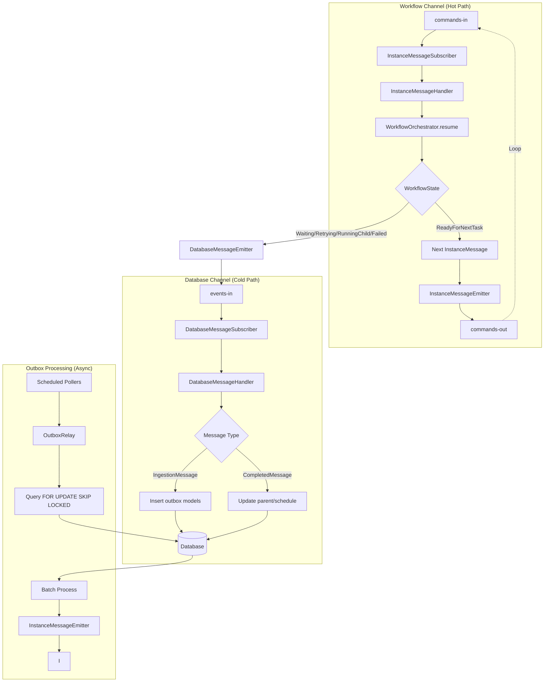
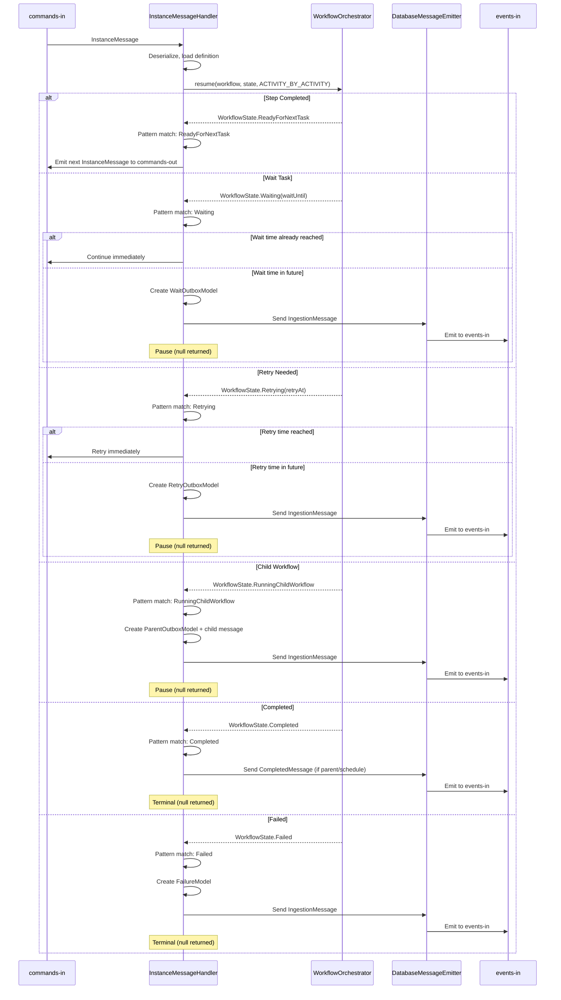

# Lemline Runner Architecture

This document describes the `lemline-runner` module, which provides the distributed execution infrastructure for the
pure functional `WorkflowOrchestrator` from `lemline-core`.

## Table of Contents

- [Overview](#overview)
- [Architecture Principles](#architecture-principles)
- [Dual-Channel Design](#dual-channel-design)
- [Message Processing](#message-processing)
- [Outbox Pattern](#outbox-pattern)
- [Pause Point Handling](#pause-point-handling)
- [Component Reference](#component-reference)

## Overview

The `lemline-runner` is a **stateless, horizontally-scalable Quarkus application** that bridges distributed
infrastructure (message brokers, databases) with the pure functional `WorkflowOrchestrator` from `lemline-core`.

**Core Responsibilities**:

- Consume workflow state messages from message broker
- Execute workflow steps using `WorkflowOrchestrator`
- Handle pause points (wait, retry, child workflows) via outbox pattern
- Emit next workflow state or persist for scheduled resumption

**Design Philosophy**:

- **Stateless workers** - No in-memory workflow state; any worker can process any message
- **Event-driven** - Message broker as state carrier (hot path) and coordinator
- **Database for pauses** - Only write to DB when workflow must pause (timers, retries, parent tracking)
- **Horizontal scaling** - Add workers to increase throughput; no coordination needed

**Technology Stack**:

- **Quarkus** - Reactive, lightweight runtime
- **Mutiny** - Reactive programming with backpressure
- **SmallRye Reactive Messaging** - Kafka/RabbitMQ integration
- **Reactive SQL Client** - Non-blocking database access
- **Flyway** - Database migrations

## Architecture Principles

### 1. Dual-Channel Separation

Lemline uses **two distinct message channels** with different characteristics:

**Workflow Channel** (`commands-in` → `commands-out`):

- **Purpose**: High-throughput, stateless workflow state flow
- **Message**: `InstanceMessage` (compressed workflow state + metadata)
- **Processing**: Fast, in-memory execution of single workflow step
- **Database**: No writes - pure message transformation
- **Latency**: ~milliseconds (message broker + compute)

**Database Channel** (`events-in` → Database):

- **Purpose**: Durable operations requiring transactional guarantees
- **Message**: `IngestionMessage` or `CompletedMessage`
- **Processing**: Transactional database writes
- **Use cases**: Timers (wait), retries, parent-child tracking, failures
- **Latency**: ~tens of milliseconds (database I/O)

**Why separate?**

- Workflow execution (hot path) never blocked by database latency
- Database writes batched and processed asynchronously
- System remains responsive even during database degradation
- Clear separation of concerns: execution vs. persistence

### 2. State Carried in Messages

Per
the [Serverless Workflow specification's stateless execution model](https://github.com/serverlessworkflow/specification/blob/main/dsl.md),
workflow state is externalized:

**InstanceMessage** structure:

```kotlin
data class InstanceMessage(
    val workflowInfo: WorkflowInfo,        // namespace, name, version, id
    val workflowState: WorkflowState,      // Sealed class from lemline-core
    val parentId: IDV7? = null             // Parent reference
)

// WorkflowState is a sealed class with variants representing execution states
sealed class WorkflowState {
    abstract val taskStates: TaskStates          // Map<NodePosition, TaskState>
    abstract val nodePosition: NodePosition      // Where in workflow tree

    // Workflow just started
    data class Starting(val startedAt: Instant, val input: JsonElement) : WorkflowState()

    // Ready to execute next task
    data class ReadyForNextTask(..., val rawInput: JsonElement, ...) : WorkflowState()

    // Paused states (require database persistence)
    data class Waiting(... val waitUntil: Instant) : WorkflowState()
    data class Retrying(..., val retryAt: Instant) : WorkflowState()
    data class RunningChildWorkflow(..., val childConfig: Config) : WorkflowState()

    // Terminal states
    data class Completed(val output: JsonElement) : WorkflowState()
    data class Failed(..., val error: Error) : WorkflowState()
}
```

**Benefits**:

- Any worker can resume any workflow (no session affinity needed)
- Workflow state compressed and serialized in single message
- Database only stores pauses - active workflows live in message flow
- Natural backpressure via message broker

### 3. Outbox Pattern for Reliability

All database writes use the **Transactional Outbox Pattern**:

1. Write to outbox table with `status=PENDING`
2. Commit transaction
3. Scheduled poller queries: `FOR UPDATE SKIP LOCKED`
4. Process batch concurrently
5. Update `status=SENT` on success
6. Exponential backoff on failure
7. Cleanup old SENT records

**Tables**: `lemline_waits`, `lemline_retries`, `lemline_parents`, `lemline_schedules`, `lemline_failures`

## Dual-Channel Design



### Channel Characteristics

| Aspect           | Workflow Channel       | Database Channel             |
|------------------|------------------------|------------------------------|
| **Throughput**   | Very High (10k+ msg/s) | Lower (100s msg/s)           |
| **Latency**      | Low (~ms)              | Higher (~10s ms)             |
| **Database**     | No writes              | Transactional writes         |
| **Purpose**      | Active execution       | Pause/resume coordination    |
| **Scaling**      | Add workers            | Add workers + DB connections |
| **Failure Mode** | Retry via broker       | Outbox ensures delivery      |

## Message Processing

### Workflow Channel Processing

**File**: `lemline-runner/src/main/kotlin/com/lemline/runner/messaging/instances/`

**Flow**:

```kotlin
// 1. Subscribe with backpressure
InstanceMessageSubscriber.onNext(message: Message<String>) {
    scope.launch {
        try {
            instanceMessageHandler.handleMessage(message)
            message.ack()
            requestNext()  // Backpressure control
        } catch (e: Exception) {
            message.nack()
            retryOrDlq(message)
        }
    }
}

// 2. Handle message
InstanceMessageHandler.handleMessage(message: Message<String>) {
    val instanceMessage = deserialize(message.payload)
    val workflow = findWorkflowDefinition(instanceMessage.workflowInfo)

    // Execute one step using WorkflowOrchestrator
    val nextState = WorkflowOrchestrator.resume(
        workflow = workflow,
        state = instanceMessage.workflowState,
        executionMode = ExecutionMode.ACTIVITY_BY_ACTIVITY
    )

    // Pattern match on WorkflowState to determine next action
    val nextMessage = handleWorkflowState(instanceMessage, nextState)

    if (nextMessage != null) {
        instanceMessageEmitter.send(nextMessage)  // Continue execution
    }
    // else: workflow paused or completed
}

// 3. Handle workflow state outcomes
fun handleWorkflowState(msg: InstanceMessage, state: WorkflowState): InstanceMessage? {
    return when (state) {
        is WorkflowState.ReadyForNextTask -> {
            // Activity completed - continue execution
            msg.copy(workflowState = state)
        }

        is WorkflowState.Waiting -> {
            // Check if wait time already reached
            if (state.waitUntil <= Clock.System.now()) {
                msg.copy(workflowState = state)  // Continue immediately
            } else {
                // Create wait outbox and pause
                val waitOutbox = WaitOutboxModel(...)
                databaseEmitter.send(IngestionMessage(listOf(waitOutbox)))
                null  // Paused
            }
        }

        is WorkflowState.Retrying -> {
            // Similar time check and outbox creation
            if (state.retryAt <= Clock.System.now()) {
                msg.copy(workflowState = state)  // Retry immediately
            } else {
                val retryOutbox = RetryOutboxModel.from(...)
                databaseEmitter.send(IngestionMessage(listOf(retryOutbox)))
                null  // Paused for retry
            }
        }

        is WorkflowState.RunningChildWorkflow -> {
            // Create parent outbox and start child
            val parentOutbox = ParentOutboxModel(...)
            val childMessage = starter.getStartingMessages(...)
            databaseEmitter.send(IngestionMessage(
                instanceModels = listOf(parentOutbox),
                instanceMessages = listOf(childMessage)
            ))
            null  // Paused until child completes
        }

        is WorkflowState.Completed -> {
            // Workflow completed - notify parent/schedule if needed
            if (msg.parentId != null || isScheduledAfter) {
                val completedMessage = CompletedMessage(...)
                databaseEmitter.send(completedMessage)
            }
            null  // Terminal
        }

        is WorkflowState.Failed -> {
            // Workflow failed - create failure record
            val failureModel = FailureModel.from(...)
            databaseEmitter.send(IngestionMessage(listOf(failureModel)))
            null  // Terminal
        }

        is WorkflowState.Starting -> {
            error("Orchestrator should not return Starting when resuming")
        }
    }
}

// 4. Emit next state
InstanceMessageEmitter.send(instanceMessage: InstanceMessage) {
    val json = serialize(instanceMessage)
    channel.send(Message(json))
}
```

**Reactive Backpressure**:

- Subscriber requests N messages (configured via `maxConcurrency`)
- Processes each message asynchronously
- Requests next only after ack/nack
- Graceful shutdown waits for active messages with timeout

### Database Channel Processing

**File**: `lemline-runner/src/main/kotlin/com/lemline/runner/messaging/database/`

**Flow**:

```kotlin
DatabaseMessageHandler.handle(message: DatabaseMessage) {
    withTransaction {
        when (message) {
            is IngestionMessage -> {
                // Insert outbox models
                message.models.forEach { model ->
                    when (model) {
                        is WaitOutboxModel -> waitRepository.insert(model)
                        is RetryOutboxModel -> retryRepository.insert(model)
                        is ParentOutboxModel -> parentRepository.insert(model)
                        is ScheduleOutboxModel -> scheduleRepository.insert(model)
                        is FailureModel -> failureRepository.insert(model)
                    }
                }

                // Emit child workflows immediately (don't wait for outbox)
                message.messages.forEach { child ->
                    instanceMessageEmitter.send(child)
                }
            }

            is CompletedMessage -> {
                // Child workflow completed - update parent
                message.parentId?.let { parentId ->
                    val parent = parentRepository.findById(parentId)
                    if (parent != null) {
                        // Validate parent is in expected state
                        val currentState = parent.instanceMessage.workflowState
                        require(currentState is WorkflowState.RunningChildWorkflow) {
                            "Parent in unexpected state $currentState"
                        }

                        // Preserve RunningChildWorkflow state, update rawOutput
                        val updatedParent = parent.copy(
                            instanceMessage = parent.instanceMessage.copy(
                                workflowState = currentState.copy(
                                    rawOutput = message.output!!
                                )
                            ),
                            outBoxStatus = OutBoxStatus.SENT,
                            outboxScheduledFor = Clock.System.now()
                        )

                        // Direct send then update database
                        instanceMessageEmitter.send(updatedParent.instanceMessage)
                        parentRepository.update(updatedParent)
                    }
                }

                // Scheduled workflow completed - update schedule
                if (message.isScheduledAfter) {
                    val schedule = scheduleRepository.findByWorkflowId(message.workflowId)
                    schedule?.let {
                        it.scheduleAfterCompletion()
                        scheduleRepository.update(it)
                    }
                }
            }
        }
    }
}
```

## Outbox Pattern

### Base Architecture

**OutboxRelay** (`OutboxRelay.kt`):

- Generic outbox processor using repository pattern
- Batch processing with configurable size
- `FOR UPDATE SKIP LOCKED` prevents concurrent processing
- Exponential backoff with jitter for retries
- Metrics tracking (processed, failed, duration)

**AbstractOutbox** (`AbstractOutbox.kt`):

- Scheduled executor (process + cleanup jobs)
- Graceful shutdown support
- Delegates to OutboxRelay for actual processing

### Concrete Implementations

#### WaitOutbox (Timers)

**File**: `lemline-runner/src/main/kotlin/com/lemline/runner/outbox/wait/WaitOutbox.kt`

**Purpose**: Resume workflows after time delay (wait tasks)

**Table**: `lemline_waits`

**Processing**:

```sql
SELECT * FROM lemline_waits
WHERE outbox_status = 'PENDING'
  AND outbox_scheduled_for <= NOW()
  AND outbox_attempt_count < :maxAttempts
ORDER BY outbox_scheduled_for
FOR UPDATE SKIP LOCKED
LIMIT :batchSize
```

**Flow**:

1. Wait task encountered → Orchestrator returns `WorkflowState.Waiting(waitUntil)`
2. InstanceMessageHandler pattern matches on Waiting state
3. Create `WaitOutboxModel(scheduledFor = waitUntil)`
4. Emit `IngestionMessage` to `events-in`
5. DatabaseMessageHandler inserts to `lemline_waits`
6. WaitOutbox poller queries due waits
7. Emit `InstanceMessage` to `commands-in`
8. Update `status = SENT`

**Cleanup**: Deletes SENT records older than retention period

#### RetryOutbox (Error Handling)

**File**: `lemline-runner/src/main/kotlin/com/lemline/runner/outbox/retry/RetryOutbox.kt`

**Purpose**: Retry failed tasks with backoff (try/catch with retry policy)

**Table**: `lemline_retries`

**Two Types**:

1. **Workflow-defined retries**: From TRY task retry configuration
2. **Infrastructure retries**: Message processing failures

**Processing**: Same query pattern as WaitOutbox

**Flow**:

1. Task fails within TRY block → Orchestrator returns `WorkflowState.Retrying(retryAt)`
2. InstanceMessageHandler pattern matches on Retrying state
3. Create `RetryOutboxModel(scheduledFor = retryAt, ...)`
4. Emit `IngestionMessage` to `events-in`
5. DatabaseMessageHandler inserts to `lemline_retries`
6. RetryOutbox poller queries due retries
7. Emit `InstanceMessage` to `commands-in` (retry attempt)
8. Update `status = SENT`

**Backoff Calculation**:

```kotlin
fun calculateBackoff(attempt: Int, policy: RetryPolicy): Duration {
    return when (policy.strategy) {
        CONSTANT -> policy.backoff.initial
        EXPONENTIAL -> min(
            policy.backoff.initial * policy.backoff.multiplier.pow(attempt),
            policy.backoff.max
        )
        LINEAR -> min(
            policy.backoff.initial + (policy.backoff.increment * attempt),
            policy.backoff.max
        )
    }
}
```

#### ParentOutbox (Child Workflows)

**File**: `lemline-runner/src/main/kotlin/com/lemline/runner/outbox/parent/ParentOutbox.kt`

**Purpose**: Store parent workflow state while child executes

**Table**: `lemline_parents`

**Special Behavior**: **No scheduled processing** - parent resumed by `CompletedMessage`

**Flow**:

1. RunWorkflow task encountered → Orchestrator returns `WorkflowState.RunningChildWorkflow(childConfig)`
2. InstanceMessageHandler pattern matches on RunningChildWorkflow state
3. Create `ParentOutboxModel` (parent state, no schedule)
4. Create child `InstanceMessage` using Starter
5. Emit `IngestionMessage(models=[parent], messages=[child])` to `events-in`
6. DatabaseMessageHandler:
    - Inserts parent to `lemline_parents`
    - Emits child to `commands-in` immediately
7. Child executes independently
8. On child completion: `CompletedMessage(parentId, output)` → `events-in`
9. DatabaseMessageHandler:
    - Finds parent in `lemline_parents`
    - Validates parent is in RunningChildWorkflow state
    - Updates parent's RunningChildWorkflow state with `rawOutput = child output`
    - Emits parent to `commands-in` (direct send)
    - Updates `status = SENT`

**Cleanup**: Only cleanup job (deletes old SENT records)

#### ScheduleOutbox (Scheduled Execution)

**File**: `lemline-runner/src/main/kotlin/com/lemline/runner/outbox/schedule/ScheduleOutbox.kt`

**Purpose**: Execute workflows on schedule (cron-like)

**Table**: `lemline_schedules`

**Processing**: Queries schedules due for execution

**Flow**:

1. Schedule created (via API or configuration)
2. ScheduleOutbox poller finds due schedules
3. Creates new workflow instance
4. Emits `InstanceMessage` to `commands-in`
5. Updates `lastRunAt`, calculates `nextRunAt`

### Outbox Table Schema

All outbox tables share common structure:

```sql
CREATE TABLE lemline_waits (
    id                     UUID PRIMARY KEY,
    workflow_id            UUID NOT NULL,
    workflow_namespace     VARCHAR NOT NULL,
    workflow_name          VARCHAR NOT NULL,
    workflow_version       VARCHAR NOT NULL,
    instance_message       JSONB NOT NULL,        -- Serialized InstanceMessage
    outbox_status          VARCHAR NOT NULL,      -- PENDING, SENT, FAILED
    outbox_scheduled_for   TIMESTAMP NOT NULL,    -- When to process
    outbox_attempt_count   INT NOT NULL DEFAULT 0,
    outbox_error_message   VARCHAR,
    outbox_error_details   TEXT,
    created_at             TIMESTAMP NOT NULL DEFAULT NOW(),
    updated_at             TIMESTAMP NOT NULL DEFAULT NOW()
);

CREATE INDEX idx_waits_processing
ON lemline_waits (outbox_status, outbox_scheduled_for, outbox_attempt_count);
```

## Pause Point Handling

The runner uses pattern matching on `WorkflowState` sealed class variants to identify pause points. The
`WorkflowOrchestrator` from `lemline-core` returns different state variants to signal the runner what action to take.

### WorkflowState Variants

```kotlin
sealed class WorkflowState {
    // Continue execution states
    data class Starting(...)        // Workflow just started
    data class ReadyForNextTask(...)  // Activity completed, ready for next

    // Pause states (require database persistence)
    data class Waiting(val waitUntil: Instant, ...)    // Timer delay
    data class Retrying(val retryAt: Instant, ...)     // Retry with backoff
    data class RunningChildWorkflow(val childConfig: Config, ...)  // Child workflow

    // Terminal states
    data class Completed(val output: JsonElement)  // Workflow succeeded
    data class Failed(val error: Error, ...)       // Workflow failed
}
```

### Pause Point Flow



### Wait Task Example

```yaml
do:
  - startProcess:
      set:
        status: started

  - waitForCompletion:
      wait: PT5M  # Wait 5 minutes

  - finalizeProcess:
      set:
        status: completed
```

**Execution**:

1. `startProcess` executes → emits next InstanceMessage
2. Message consumed, `waitForCompletion` task reached
3. WorkflowOrchestrator returns `WorkflowState.Waiting(waitUntil = now + 5 min)`
4. InstanceMessageHandler pattern matches on Waiting state
5. Creates `WaitOutboxModel`, emits `IngestionMessage` to `events-in`
6. DatabaseMessageHandler inserts to `lemline_waits`
7. WaitOutbox scheduler polls every N seconds
8. After 5 minutes, finds due wait
9. Emits InstanceMessage to `commands-in`
10. Workflow resumes at `finalizeProcess` task

### Retry Task Example

```yaml
do:
  - callAPI:
      try:
        do:
          - httpRequest:
              call: http
              with:
                uri: https://api.example.com/data
      errors:
        with:
          - https://serverlessworkflow.io/spec/1.0.0/errors/communication
        retry:
          strategy: exponential
          limit:
            attempt:
              count: 3
          backoff:
            multiplier: 2
            initial: PT1S
            max: PT30S
```

**Execution**:

1. `httpRequest` fails → Orchestrator catches error in TRY block
2. Orchestrator checks retry policy and calculates backoff
3. WorkflowOrchestrator returns `WorkflowState.Retrying(retryAt = now + 1s)` (attempt 0)
4. InstanceMessageHandler pattern matches on Retrying state
5. Creates `RetryOutboxModel`, emits `IngestionMessage` to `events-in`
6. DatabaseMessageHandler inserts to `lemline_retries`
7. RetryOutbox scheduler finds due retry
8. Emits InstanceMessage to `commands-in` (attempt 1)
9. If fails again: `retryAt = now + 2s` (exponential backoff)
10. If fails 3rd time: enters catch block or fails workflow

### Child Workflow Example

```yaml
do:
  - processOrder:
      run:
        workflow:
          namespace: ecommerce
          name: payment-processor
          version: 1.0.0
      with:
        orderId: ${ .orderId }
        amount: ${ .total }
```

**Execution**:

1. `processOrder` task reached
2. WorkflowOrchestrator returns `WorkflowState.RunningChildWorkflow(childConfig)`
3. InstanceMessageHandler pattern matches on RunningChildWorkflow state
4. Creates:
    - `ParentOutboxModel` (parent state with RunningChildWorkflow)
    - Child `InstanceMessage` (new workflow instance) via Starter
5. Emits `IngestionMessage(models=[parent], messages=[child])` to `events-in`
6. DatabaseMessageHandler:
    - Inserts parent to `lemline_parents`
    - Emits child to `commands-in` immediately
7. Child workflow executes independently
8. On child completion:
    - Child emits `CompletedMessage(parentId, output)` to `events-in`
9. DatabaseMessageHandler:
    - Finds parent in `lemline_parents`
    - Validates state is RunningChildWorkflow
    - Updates `rawOutput` field with child's output
    - Emits parent to `commands-in` (direct send)
10. Parent resumes from RunningChildWorkflow state with child output

## Component Reference

### Application Entry Point

**LemlineApplication** (`LemlineApplication.kt`)

- Quarkus main application
- CLI via Picocli (listen, config, definition, instance, migrate commands)
- Configures logging, enables/disables consumers

### Message Subscribers

**MessageSubscriber** (`MessageSubscriber.kt`)

- Abstract base for reactive message consumers
- Backpressure via request(N) pattern
- Graceful shutdown with timeout
- Error handling with retry/DLQ

**InstanceMessageSubscriber** (`InstanceMessageSubscriber.kt`)

- Consumes from `commands-in` channel
- Delegates to `InstanceMessageHandler`
- Configurable concurrency

**DatabaseMessageSubscriber** (`DatabaseMessageSubscriber.kt`)

- Consumes from `events-in` channel
- Delegates to `DatabaseMessageHandler`
- Transactional processing

### Message Handlers

**InstanceMessageHandler** (`InstanceMessageHandler.kt`)

- Deserializes `InstanceMessage`
- Loads workflow definition (cached)
- Calls `WorkflowOrchestrator.resume()` for step-by-step execution
- Pattern matches on `WorkflowState` sealed class variants
- Emits next state or creates outbox for pause points

**DatabaseMessageHandler** (`DatabaseMessageHandler.kt`)

- Handles `IngestionMessage`: inserts outbox models
- Handles `CompletedMessage`: updates parent/schedule
- Transactional database writes
- Can emit instance messages

### Message Emitters

**InstanceMessageEmitter** (`InstanceMessageEmitter.kt`)

- Emits to `commands-out` channel
- Serializes `InstanceMessage` to JSON

**DatabaseMessageEmitter** (`DatabaseMessageEmitter.kt`)

- Emits to `events-in` channel
- Serializes `DatabaseMessage` to JSON

### Outbox Components

**OutboxRelay** (`OutboxRelay.kt`)

- Generic outbox processor
- Batch queries with `FOR UPDATE SKIP LOCKED`
- Exponential backoff retry logic
- Cleanup old SENT records

**AbstractOutbox** (`AbstractOutbox.kt`)

- Scheduled execution framework
- Process job + cleanup job
- Graceful shutdown

**Concrete Outboxes**:

- `WaitOutbox` - Timer delays
- `RetryOutbox` - Error retries with backoff
- `ParentOutbox` - Child workflow coordination (cleanup only)
- `ScheduleOutbox` - Scheduled workflow execution

### Repositories

All repositories extend `Repository<T>` base class:

**Pattern**:

```kotlin
interface WaitRepository : Repository<WaitOutboxModel> {
    fun insert(model: WaitOutboxModel): Uni<Void>
    fun update(model: WaitOutboxModel): Uni<Void>
    fun findEntitiesToProcess(maxAttempts: Int, batchSize: Int): Uni<List<WaitOutboxModel>>
    fun findEntitiesToDelete(cutoff: Instant, batchSize: Int): Uni<List<WaitOutboxModel>>
}
```

**Implementations**:

- `WaitRepository` - `lemline_waits` table
- `RetryRepository` - `lemline_retries` table
- `ParentRepository` - `lemline_parents` table
- `ScheduleRepository` - `lemline_schedules` table
- `FailureRepository` - `lemline_failures` table
- `WorkflowDefinitionRepository` - `lemline_workflow_definitions` table

### Configuration

**LemlineConfiguration** (`LemlineConfiguration.kt`)

- User configuration model (YAML/environment)
- Database, messaging, outbox settings
- Converts to Quarkus properties

**Key Settings**:

```yaml
lemline:
  database:
    type: postgresql
    postgresql:
      host: localhost
      port: 5432

  messaging:
    type: kafka
    kafka:
      brokers: localhost:9092
      topic: lemline

  outbox:
    wait:
      process:
        interval: PT10S
        batchSize: 100
      cleanup:
        interval: PT1H
        retention: P7D
```

## File Structure Reference

```
lemline-runner/src/main/kotlin/com/lemline/runner/
├── cli/
│   └── LemlineApplication.kt           ← Main entry point, CLI
│
├── messaging/
│   ├── MessageSubscriber.kt            ← Reactive subscriber base
│   ├── instances/
│   │   ├── InstanceMessageSubscriber.kt   ← commands-in consumer
│   │   ├── InstanceMessageHandler.kt      ← Workflow execution (⚠️ incomplete)
│   │   └── InstanceMessageEmitter.kt      ← commands-out producer
│   └── database/
│       ├── DatabaseMessageSubscriber.kt   ← events-in consumer
│       ├── DatabaseMessageHandler.kt      ← Database writes
│       └── DatabaseMessageEmitter.kt      ← events-out producer
│
├── outbox/
│   ├── OutboxRelay.kt                  ← Generic outbox processor
│   ├── AbstractOutbox.kt               ← Scheduled execution base
│   ├── wait/
│   │   ├── WaitOutbox.kt
│   │   └── WaitRepository.kt
│   ├── retry/
│   │   ├── RetryOutbox.kt
│   │   └── RetryRepository.kt
│   ├── parent/
│   │   ├── ParentOutbox.kt
│   │   └── ParentRepository.kt
│   └── schedule/
│       ├── ScheduleOutbox.kt
│       └── ScheduleRepository.kt
│
├── repositories/
│   ├── Repository.kt                   ← Base repository
│   ├── OutboxRepository.kt            ← Outbox query patterns
│   ├── WorkflowDefinitionRepository.kt
│   └── FailureRepository.kt
│
├── config/
│   ├── LemlineConfiguration.kt        ← User configuration model
│   └── LemlineConfigConstants.kt      ← Property keys
│
└── models/
    ├── InstanceMessage.kt             ← Workflow state message
    ├── DatabaseMessage.kt             ← Database channel messages
    └── outbox/
        ├── WaitOutboxModel.kt
        ├── RetryOutboxModel.kt
        ├── ParentOutboxModel.kt
        └── ScheduleOutboxModel.kt
```

## Summary

The Lemline runner provides distributed execution infrastructure with:

**Architecture**:

- **Dual-channel design** - Separate hot path (execution) and cold path (persistence)
- **Stateless workers** - State carried in messages, any worker can process any message
- **Outbox pattern** - Reliable, asynchronous database writes with retry
- **Reactive streams** - Backpressure and resilience built-in

**Components**:

- **Message subscribers** - Consume from workflow and database channels
- **Message handlers** - Execute workflows or write to database
- **Outbox processors** - Scheduled polling with batch processing
- **Repositories** - Reactive SQL with `FOR UPDATE SKIP LOCKED`

**Pause Points**:

- **Wait** - Timer delays via scheduled outbox
- **Retry** - Error handling with exponential backoff
- **Child workflows** - Parent-child coordination via outbox and CompletedMessage
- **Scheduled execution** - Cron-like execution via scheduled outbox

**Status**:

- ✅ Message infrastructure complete
- ✅ Outbox pattern implemented
- ✅ Database handling functional
- ✅ WorkflowOrchestrator integration complete
- ✅ Pattern matching on WorkflowState sealed class variants

The runner separates infrastructure concerns (messaging, persistence, scheduling) from workflow logic (handled by
`WorkflowOrchestrator` in `lemline-core`). The integration uses pattern matching on `WorkflowState` variants instead of
exception-driven control flow, providing clearer semantics and better type safety.
