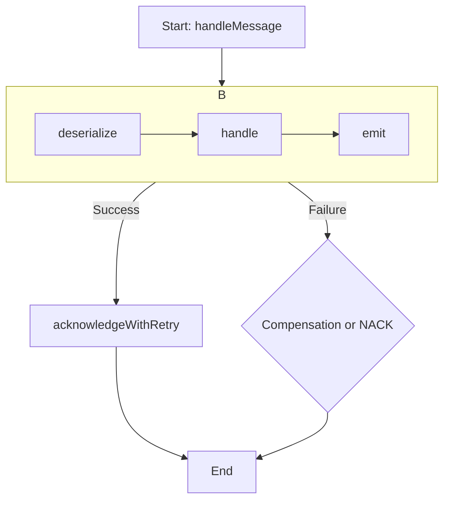

# `MessageHandler` Architecture

The `MessageHandler.kt` file defines a generic and resilient interface for processing messages consumed from a message broker. It establishes a robust pipeline that includes deserialization, processing, error handling, and message acknowledgment, ensuring that messages are handled in a reliable and fault-tolerant manner.

## Overview

`MessageHandler` is an interface, not a concrete implementation. It standardizes the processing flow for any message consumed by the Lemline runner. Its primary goal is to abstract away the boilerplate of message handling, such as error handling, retries, metrics, and acknowledgment, allowing concrete implementations to focus solely on the business logic.

## Core Processing Pipeline

The central function is `handleMessage`, which orchestrates a sequence of steps for every incoming message:

1.  **Deserialize**: The raw message payload is converted from a string into a specific, typed Kotlin object (defined by the generic type `T`). This is handled by the `deserialize()` function, which must be implemented by concrete classes.

2.  **Process**: The core business logic is executed on the deserialized message object. This is done within the `handle()` function. This function can optionally return a new message object, which represents the next state or a subsequent action to be taken.

3.  **Emit**: If the `handle()` step produces a result (a new message), the `emit()` function is called to serialize and send this new message to the appropriate outgoing channel.

4.  **Acknowledge**: Once the message has been successfully processed (and any resulting message has been emitted), the original message is acknowledged (`ACK`). This signals to the message broker that the message has been handled and can be safely removed from the queue.

## Error Handling & Resilience

A key feature of the `MessageHandler` is its sophisticated error handling and resilience mechanisms.

### `tryWithCompensation`

All processing steps are wrapped in a `tryWithCompensation` block. This is the primary error-handling mechanism.

-   **Success Path**: If the block executes without error, the message is acknowledged via `acknowledgeWithRetry`.
-   **Compensation Path**: The business logic can throw a special `CompensationException`. This exception contains a `reason` string and a `run` lambda. When this exception is caught, the `run` lambda is executed (e.g., to write the failed message to a database table), and the original message is **acknowledged (ACKed)**. This is a controlled failure path that prevents the message from being re-processed or sent to a dead-letter queue.
-   **Failure Path**: If any other unexpected exception occurs, the error is logged, and the message is **negatively acknowledged (NACKed)** via `negAcknowledgeWithRetry`, which typically instructs the broker to move the message to a Dead-Letter Queue (DLQ) for manual inspection.

### Resilient Acknowledgment (ACK/NACK)

The `MessageHandler` does not assume that communication with the message broker will always succeed.

-   The `acknowledgeWithRetry` and `negAcknowledgeWithRetry` functions contain an internal retry loop with exponential backoff and jitter.
-   If an attempt to ACK/NACK a message fails due to a transient issue (e.g., a network blip), the handler will automatically retry several times before giving up.
-   This resilience is crucial for preventing duplicate message processing, which could occur if a message was successfully processed but the final ACK failed.
-   The retry mechanism is integrated with the runner's health checks, signaling to a container orchestrator like Kubernetes if the runner is unable to communicate with the broker.

## Implementation

This interface is intended to be implemented by classes that handle specific types of messages. For example, `InstanceMessageHandler` is a concrete implementation that provides the logic for handling messages related to workflow instances, defining how to `deserialize` them, how to `handle` them by calling the `StepByStepRunner`, and how to `emit` the resulting state.
